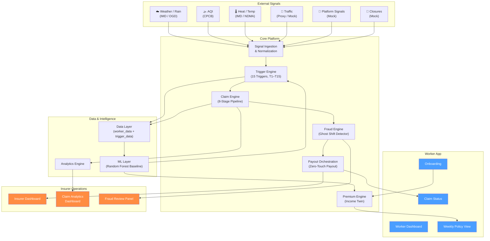
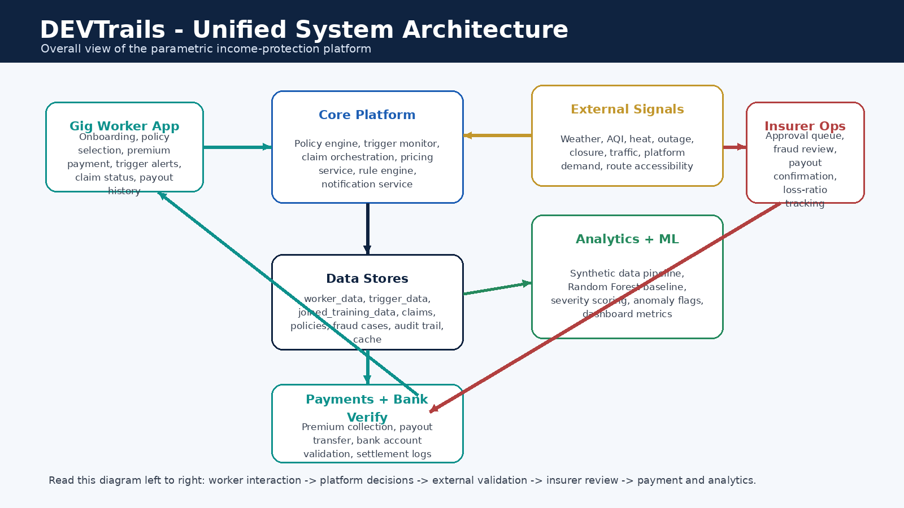
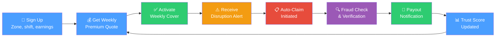
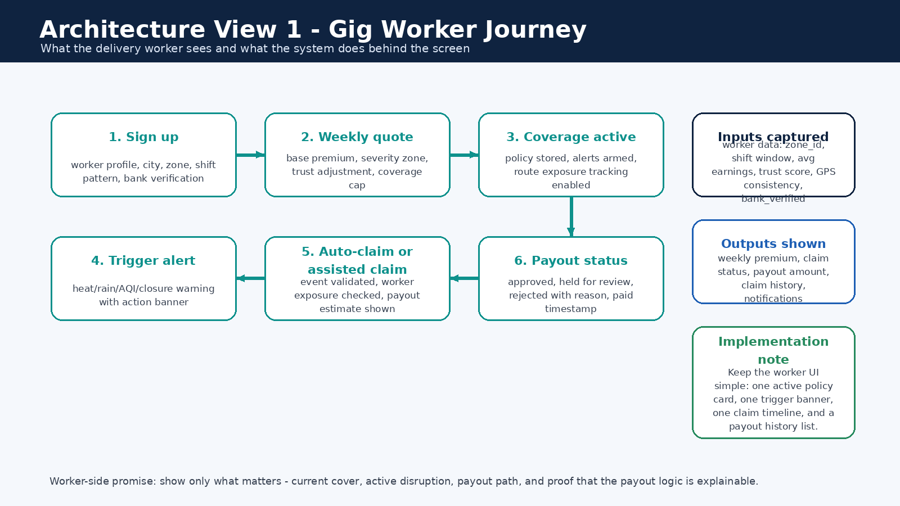

# DEVTrails 2026 — AI-Powered Parametric Income Protection for Gig Workers

> A hyperlocal, weekly income-protection engine for food-delivery workers that pays only when verified disruption overlaps real earning exposure.

---

## What This Project Is

DEVTrails is an AI-assisted **parametric insurance platform** that protects delivery workers' **weekly income** — not health, life, vehicle repair, or accident damage. The system monitors external disruption signals (heavy rain, severe AQI, heatwaves, outages, closures, traffic collapse), estimates whether a worker's earning ability was genuinely affected during a covered shift, and can automatically initiate claims when conditions are met.

### Core Product Pillars

| Module | Purpose |
|--------|---------|
| **Income Twin** | Continuously estimate expected weekly and shift-level earnings |
| **Streetwise Cover** | Hyperlocal underwriting at zone / route / hotspot level |
| **Disruption DNA** | Composite disruption scoring from multiple signal sources |
| **Ghost Shift Detector** | Fraud and anomaly detection layer |
| **Zero-Touch Payout** | Claims and payout orchestration for auto-initiated claims |
| **Trust Pass** *(optional)* | Loyalty / trust program for premium discounts and fast-lane claim decisions |

### The Idea Is Simple

1. The worker buys weekly coverage
2. The system monitors public trigger conditions
3. The platform matches the event to the worker's zone and shift
4. A claim can be initiated automatically
5. Fraud checks run before payout
6. The insurer dashboard tracks the full lifecycle

---

## Current Repository State

> [!NOTE]
> This repository contains a **functional early-stage scaffold** of the DEVTrails platform — a working FastAPI backend, a working Next.js 16 frontend, a complete Supabase SQL schema with RLS, and real integration between all layers.
>
> **What you will find:**
> - A running **Next.js 16 frontend** with worker dashboard (earnings chart, zone alerts, policy quote), claim submission with GPS + photo evidence, admin review queue with AI-assisted decisions, and admin trigger engine
> - A running **FastAPI backend** with auth, claims, policies, triggers, zones, workers, and analytics endpoints
> - **14-table Supabase SQL schema** with Row-Level Security, auth triggers, and storage policies
> - **8-stage claim pipeline** with severity scoring, pricing engine, fraud scoring, payout recommendation, and Gemini AI explanation
> - Google OAuth + email/password auth via Supabase Auth with role-based routing
> - CLI seed system + Excel import utility
> - 10 module-level READMEs with inputs, outputs, and downstream flows
> - 7 architecture and data-science visuals (PNGs)
> - 5 standalone Mermaid diagram source files
> - Clean review zip script (`scripts/zip_review_repo.ps1`)
>
> **What is scaffolded (works but incomplete):** Policy activation (mock — returns success token, no DB persistence), ML integration (Random Forest p=0.15 is hardcoded), trigger overlap matching (implemented but not called).
>
> **What is documented but not yet implemented:** Redis caching layer, ML training pipeline, most external integrations, SQLAlchemy ORM.

---

## Challenge Alignment

The DEVTrails 2026 challenge requires:

| Requirement | Our approach |
|-------------|-------------|
| Gig-worker income protection | Food-delivery workers in urban India, loss-of-income only |
| Weekly pricing | Dynamic weekly premium based on zone risk, shift exposure, trust score |
| AI-powered risk assessment | Hybrid rules + Random Forest ML + feedback adaptation |
| Intelligent fraud detection | 4-layer Ghost Shift Detector pipeline |
| Parametric trigger automation | 15-trigger library with public-threshold anchoring |
| Payout processing | Zero-Touch Payout with severity-proportional compensation |
| Analytics dashboards | Worker dashboard + Insurer dashboard + Claim analytics dashboard |

---

## Delivery Persona and Coverage Boundary

**Chosen persona:** Food-delivery workers in disruption-prone urban zones (India)

**Covered risk:** Temporary loss of earning opportunity caused by external disruption

**Not covered:**
- Health or hospitalization
- Life insurance
- Accident insurance
- Vehicle repair
- Personal theft unrelated to the disruption trigger

---

## Implementation Status

> [!IMPORTANT]
> This table separates what is **currently visible** in the repository from what is **documented as target architecture**. Each module README contains its own detailed status.

| Area | Status | Notes |
|------|--------|-------|
| Repository structure & README system | ✅ Current | 10 folder-level READMEs with inputs/outputs/downstream |
| Product framing & scope boundaries | ✅ Current | Consistent across all documentation |
| 15-trigger library (thresholds & logic) | ✅ Implemented | Trigger engine with live feed + mock injection |
| Premium & payout formulas | ✅ Implemented | Internal calibration engine with actuarial formulas |
| Parametric product (Essential / Plus) | ✅ Designed | Two-plan weekly benefit ladder with pre-agreed payout bands |
| Data schemas & seed dataset | ✅ Present | 14-table Supabase SQL schema with RLS + seed CSVs |
| Backend API — full services | ✅ Implemented | Auth, claims, policies, triggers, zones, workers, analytics endpoints |
| Worker dashboard | ✅ Implemented | Profile, earnings chart, zone alerts, policy quote, claim submission |
| Insurer dashboard | ✅ Implemented | KPI cards, trigger mix chart, review queue with AI-assisted decisions |
| Claim pipeline | ✅ Implemented | 8-stage pipeline: severity → pricing → fraud → payout → Gemini AI |
| Fraud detection engine | ✅ Implemented | 5-layer scoring with anti-spoofing, cluster intelligence, and fraud bands |
| Adversarial defense & anti-spoofing | ✅ Designed | Multi-signal verification, coordinated-ring detection, liquidity circuit-breaker |
| Supabase Auth & RLS | ✅ Implemented | Google OAuth, role-based routing, Row-Level Security |
| Integrations (weather, AQI, traffic) | ✅ Designed | OpenWeather, TomTom, NewsAPI mapped; connectors planned |
| Caching layer | 📋 Planned | Strategy and TTL policy defined; implementation pending |
| ML training pipeline | 📋 Planned | Random Forest baseline hardcoded at p=0.15 |

**Legend:** ✅ Current Implementation / Design — 📝 Documented Formula / Design Logic — 📋 Planned / Target Architecture

---

## System Architecture

### Unified System Architecture



> **📋 Status:** This diagram represents the **target architecture**. The repository currently contains the documentation and specification layer; module implementations are planned.



---

### Gig Worker Journey





---

## End-to-End Logic

| Step | What happens | Output |
|------|-------------|--------|
| 1. Onboarding | Worker enters delivery type, zones, shift window, earning band, payout preference | Persona profile and coverage context |
| 2. Weekly pricing | Risk engine combines zone risk, shift exposure, prior claims, trust score | Weekly premium and payout cap |
| 3. Coverage activation | Worker accepts weekly plan; policy becomes active | System starts monitoring disruptions |
| 4. Signal monitoring | Weather, AQI, traffic, closure, platform signals ingested | Structured events for decision engine |
| 5. Trigger scoring | Disruption DNA calculates severity; checks zone/shift overlap | Trigger score and exposure score |
| 6. Fraud check | Ghost Shift Detector validates worker exposure and behavior | Fraud / confidence score |
| 7. Claim decision | If trigger + exposure + confidence thresholds met → auto-create claim | Explainable decision and payout amount |
| 8. Payout simulation | Zero-Touch Payout sends simulated UPI / gateway response | Worker sees status; admin sees audit log |
| 9. Learning loop | Reviewed outcomes feed back into pricing, thresholds, fraud models | Improved accuracy over time |

---

## The 15-Trigger Library

The platform uses a **3-tier trigger architecture**: early warning → claim trigger → severe escalation.

### Environmental Triggers

| ID | Trigger | Threshold | Tier | Action |
|----|---------|-----------|------|--------|
| T1 | Rain Watch | 24h rain ≥ 48 mm | Early Warning | Raise risk score, notify worker |
| T2 | Heavy Rain Claim | 24h rain ≥ 64.5 mm | Claim Trigger | Open claim candidate if zone + shift overlap |
| T3 | Extreme Rain Escalation | 24h rain ≥ 115.6 mm | Severe Escalation | Escalate severity band and payout cap |
| T5 | AQI Caution | AQI 201–300 | Early Warning | Warn worker, raise premium sensitivity |
| T6 | AQI Severe Exposure | AQI ≥ 301 + active shift | Claim Trigger | Open claim candidate |
| T7 | Heat Wave | Temp ≥ 45°C or IMD heat-wave | Claim Trigger | Open claim candidate |
| T8 | Severe Heat | Temp ≥ 47°C | Severe Escalation | Escalated claim severity |
| T9 | Heat Persistence | 2 consecutive hot-risk days | Early Warning | Raise weekly risk loading |

### Operational and Civic Triggers

| ID | Trigger | Threshold | Tier | Action |
|----|---------|-----------|------|--------|
| T4 | Waterlogging Mobility | Accessibility score ≤ 0.40 | Claim Trigger | Claim candidate for blocked routes |
| T10 | Local Zone Closure | Official closure flag = 1 | Claim Trigger | Auto-escalate to claim review |
| T11 | Curfew / Strike Closure | Restriction window ≥ 4h | Claim Trigger | Claim candidate if pickup/drop blocked |
| T12 | Traffic Collapse | Travel delay ≥ 40% | Early Warning | Raise exposure and route stress |
| T13 | Platform Outage | Outage ≥ 30 min | Claim Trigger | Claim candidate for verified active workers |
| T14 | Demand Collapse | Orders drop ≥ 35% vs baseline | Early Warning | Raise loss-of-income probability |
| T15 | Composite Disruption | Composite score ≥ 0.70 | Severe Escalation | Fast-track claim escalation |

**Threshold sources:** IMD heavy-rain and heat-wave bands, CPCB AQI category thresholds, IMD/NDMA heat-wave guidance. Traffic, outage, and demand thresholds are internal operational thresholds.

---

## Adversarial Defense & Anti-Spoofing Strategy

> [!CAUTION]
> **Market-Shift Context:** A sophisticated syndicate of 500 delivery workers in a tier-1 city has successfully exploited a beta parametric insurance platform using coordinated GPS spoofing via Telegram groups — faking locations in severe weather zones while resting at home, triggering mass false payouts and draining the liquidity pool. Simple GPS verification is officially obsolete. This section documents how DEVTrails defends against this exact attack vector.

### 1. The Differentiation: Genuine Worker vs. Bad Actor

DEVTrails does **not** trust raw GPS coordinates alone. The platform differentiates genuinely stranded delivery partners from spoofers using **multi-signal verification** — a layered approach where no single data point can trigger or block a payout in isolation.

| Signal layer | What it checks | Why GPS alone fails here |
|---|---|---|
| **Trigger-event correlation** | Does a verified external disruption (rain, AQI, heat, closure) actually exist in the claimed zone at the claimed time? | Spoofers fake location but cannot fake a weather event |
| **EXIF GPS vs. browser/device GPS** | Does the photo evidence GPS match the device-reported location? | Spoofing apps change device GPS but cannot alter already-captured EXIF metadata |
| **EXIF timestamp freshness** | Was the evidence photo taken within the claim window, or days/weeks ago? | Reused evidence from old events fails freshness checks |
| **Shift overlap ratio** | Was the worker's declared shift active during the trigger window? | Spoofers claiming outside their shift schedule are flagged |
| **Zone consistency** | Does the worker's claim zone match their assigned/historical operating zone? | Claiming disruption in a zone the worker has never operated in is suspicious |
| **Route plausibility** | Does TomTom Snap-to-Roads confirm the worker was on a real delivery route? | Spoofed coordinates often land on rooftops, parks, or impossible road positions |
| **Activity continuity** | Was the worker completing orders before the disruption hit? | A genuinely stranded worker shows pre-disruption delivery activity; a spoofer shows none |
| **Movement plausibility over time** | Does the GPS trail show realistic movement patterns across multiple time points? | Spoofers show teleportation or perfect stillness — real workers show natural drift |
| **Device continuity** | Is the same device consistently associated with this worker account? | Fraud rings rotate devices across accounts |
| **Network / IP / ASN pattern** | Do multiple claimants share the same network fingerprint? | Coordinated rings operating from one location share IP/ASN patterns |
| **AI-generated image detection** | Was the evidence photo created by an AI model rather than a real camera? | AI-generated "proof" photos bypass traditional photo checks — SynthID and forensic analysis catch them |
| **EXIF integrity & modification detection** | Has the evidence photo been edited, re-saved, or had metadata tampered with? | Fraudsters edit photos to change GPS coordinates, timestamps, or splice scenes — integrity checks detect this |
| **Image forensics (ELA / noise)** | Does the pixel-level structure match a genuine camera capture? | AI-generated and manipulated images show anomalous compression artifacts and noise patterns |

A **genuinely stranded worker** will show: pre-disruption delivery activity → trigger event confirmed by external source → GPS trail consistent with operating zone → evidence freshness verified → natural movement pattern → evidence photo taken by real camera with intact metadata. The system scores this as high-confidence and routes to `auto_approve`.

A **spoofing bad actor** will show: no pre-disruption activity → GPS coordinates inconsistent with EXIF and zone history → evidence reused, AI-generated, or modified → movement pattern impossible → network fingerprint shared with other claimants. The system scores this as high-risk and routes to `hold_for_fraud` or `reject_spoof_risk`.

### 1a. Evidence Integrity & AI Image Detection

Sophisticated fraud rings may submit **AI-generated photos** as disruption evidence, or **edit real photos** to alter GPS coordinates and timestamps. DEVTrails defends against this using multi-layer image forensics:

#### AI-Generated Image Detection (Gemini + SynthID)

Google embeds **SynthID** — an invisible, robust digital watermark — into images generated by its AI models. This watermark survives compression, cropping, and re-encoding. DEVTrails leverages this:

| Check | Method | What it catches |
|---|---|---|
| **SynthID watermark scan** | Gemini API analyzes submitted evidence for embedded SynthID markers | Photos generated by Google's AI models (Imagen, Gemini) are flagged immediately |
| **AI-generation probability score** | Gemini Vision assesses whether image characteristics are consistent with AI generation (texture uniformity, lighting inconsistencies, artifact patterns) | Catches AI-generated images from non-Google models (DALL-E, Midjourney, Stable Diffusion) that lack SynthID |
| **Camera vs. AI metadata signature** | Real camera photos contain specific EXIF fields (Make, Model, LensModel, FocalLength, ExposureTime, ISO) that AI-generated images lack | AI images have no genuine camera sensor data — they may have no EXIF at all or use synthetic metadata |

> [!IMPORTANT]
> **How DEVTrails uses Gemini for AI image detection:** Since we already integrate Gemini API for claim narrative generation, we extend it to perform evidence analysis. Gemini Vision can detect SynthID watermarks in AI-generated images and assess the probability that an image was synthetically created. This is not a separate integration — it's an extension of our existing Gemini pipeline.

#### EXIF Integrity & Modification Detection

| Check | Method | What it catches |
|---|---|---|
| **EXIF completeness** | Verify presence of core EXIF fields: DateTimeOriginal, DateTimeDigitized, Make, Model, GPSLatitude, GPSLongitude, Software | Stripped or missing EXIF suggests tampering or screenshot reuse |
| **Software field check** | Flag if EXIF `Software` field contains image editors (Photoshop, GIMP, Snapseed, PicsArt) | Photos edited to change location or content are flagged |
| **Timestamp chain-of-custody** | Compare `DateTimeOriginal` (when shutter fired) vs `DateTimeDigitized` (when sensor captured) vs `ModifyDate` (last save) | Genuine: all three within seconds. Tampered: ModifyDate is hours/days later |
| **EXIF thumbnail vs. full image** | Compare the embedded EXIF thumbnail against the full-resolution image | If the photo was cropped or edited, the thumbnail may still show the original unedited version |
| **GPS precision analysis** | Check GPS coordinate decimal precision — real GPS sensors produce 6+ decimal places with slight variance | Manually entered or copied GPS coordinates often have suspiciously round numbers or identical precision across submissions |
| **Camera-device consistency** | Cross-check EXIF Make/Model against the worker's registered device | If a worker registered a Samsung phone but evidence EXIF shows an iPhone camera, the evidence is flagged |

#### Additional Image Forensic Methods

| Method | How it works | What it catches |
|---|---|---|
| **Error Level Analysis (ELA)** | Re-compress the image at a known quality level and compare the error difference across regions — uniform images show uniform error; spliced/edited regions show anomalous error levels | Photoshopped regions, pasted elements, cloned areas where disruption evidence was fabricated |
| **Noise pattern consistency** | Analyze sensor noise distribution across the image — real cameras produce consistent noise patterns; composites show noise discontinuities | Composite images where a fake weather scene was placed over a real location |
| **JPEG quantization table analysis** | Examine the JPEG compression tables — images re-saved through editing software have different quantization signatures than camera-original images | Evidence that was downloaded, edited, and re-uploaded rather than captured fresh |
| **Perceptual hash cross-matching** | Generate perceptual hashes of all evidence photos across the claim batch and compare for similarity | Identical or near-identical photos submitted by different claimants in a fraud ring |
| **Reverse image search signal** | Hash submitted evidence against a database of previously submitted images | Recycled evidence from previous claims or stock photos used as fake proof |

#### Image verdict integration

The image forensics layer produces a composite **evidence integrity score** that feeds into the fraud engine:

| Evidence integrity | Meaning | Claim routing |
|---|---|---|
| **High** (0.8–1.0) | Fresh camera capture, intact EXIF, no AI markers, camera matches device | Normal processing — no evidence-related flags |
| **Medium** (0.4–0.79) | Some EXIF gaps (e.g., stripped by messaging app) but no tampering indicators | Routes to `needs_review` — human reviewer evaluates holistically |
| **Low** (0.0–0.39) | AI-generated markers detected, EXIF tampering, or edit signatures found | Routes to `hold_for_fraud` or `reject_spoof_risk` depending on other signals |

> [!NOTE]
> Workers who submit photos via WhatsApp or Telegram may have EXIF data stripped automatically by the messaging platform. This is **not treated as fraud** — it reduces the evidence integrity score to Medium and routes the claim to `needs_review`, where a human reviewer evaluates the claim using other available signals. The system never auto-rejects based on EXIF absence alone.

### 1b. Advanced Fraud Vectors & Threat Model

GPS spoofing is only one attack surface. DEVTrails defends against a full spectrum of fraud vectors, classified by severity and sophistication:

#### Tier 1 — Direct Spoofing (Technology-Based)

| Vector | How the attack works | DEVTrails defense |
|---|---|---|
| **GPS spoofing apps** | Worker uses a mock-location app (e.g., Fake GPS, iSpoofer) to fake device coordinates in a red-alert zone | EXIF cross-check, TomTom Snap-to-Roads plausibility, movement plausibility over time, impossible-travel velocity checks |
| **VPN / proxy routing** | Worker routes traffic through a VPN server or proxy located in the disruption zone, masking their real IP | VPN / datacenter / TOR IP detection against known ranges; carrier-IP expectation (Jio, Airtel, Vi); **treated as a supporting fraud signal, not a standalone rejection trigger** |
| **Emulator / app hooking** | Worker runs the app inside an Android emulator (BlueStacks, Nox) or hooks the app to inject fake sensor data | Rooted-device detection, emulator fingerprint markers, mock-location permission enabled flag, sensor inconsistency (accelerometer/gyroscope absent or static), developer-mode detection |

#### Tier 2 — Identity Misuse (Social-Based)

| Vector | How the attack works | DEVTrails defense |
|---|---|---|
| **Buddy login (account handoff)** | Worker A (safe zone) shares OTP/password with Worker B (red-alert zone); Worker B logs into Worker A's app and files a claim using real local conditions | First-login-on-new-device during red-alert triggers liveness check (selfie); device fingerprint history mismatch; session continuity break detection; historical zone affinity — Worker A never operated in this zone before |
| **Account sharing ring** | Multiple people rotate one account to file claims from different zones | Device-account binding detects multiple unique device fingerprints per account; IP/ASN pattern clustering reveals multi-location access |
| **Credential farming** | Fraudsters create bulk accounts using purchased identities and file claims across many accounts | KYC verification gaps flagged; unusually low historical activity on account; bank verification anomaly; rapid account-to-first-claim interval |

#### Tier 3 — Coordinated / Systemic Abuse

| Vector | How the attack works | DEVTrails defense |
|---|---|---|
| **Weather chaser (pre-emptive zone squatting)** | Worker sees a red-alert forecast, travels to the zone without working, waits in a café during the storm, and claims "stranded on delivery" | Pre-trigger presence requirement: must show work activity in/near the zone before or during the trigger window; historical zone affinity check; evidence of active work intent, not just physical presence |
| **Activity continuity anomaly (operational mismatch)** | Suspicious claims tied to weak or absent activity continuity — worker claims stranding but has no verifiable pre-disruption delivery trail, or shows unusual acceptance/delivery patterns inconsistent with genuine work | Historical order completion cross-check; shift-activity gap analysis; repeated localized claim bursts with low operational evidence |
| **Fraud ring cluster behavior** | 50–500+ workers coordinate via Telegram to submit synchronized claims from near-identical coordinates during a trigger event | DBSCAN clustering on timestamps + coordinates; shared payout destinations; evidence similarity scoring; network/IP clustering; circuit-breaker controls |

### 1c. Signal Confidence Hierarchy

Not all verification signals are equally trustworthy. DEVTrails evaluates claims using a **weighted signal hierarchy** — higher-trust signals carry more weight in the fraud decision:

| Rank | Signal | Trust level | Rationale |
|:---:|---|---|---|
| 1 | **Verified trigger event** | Highest | External source (OpenWeather, IMD, CPCB) — cannot be spoofed by the worker |
| 2 | **Historical work pattern** | High | Long-term behavioral baseline — extremely difficult to fabricate |
| 3 | **Shift / order continuity** | High | Platform-verified delivery activity before disruption — requires real work |
| 4 | **Pre-trigger presence** | High | Worker must show presence in/near the zone before the trigger window opened |
| 5 | **Device continuity** | Medium-High | Hardware-bound — harder to spoof than software signals |
| 6 | **EXIF evidence integrity** | Medium | Strong when present, but can be stripped by messaging apps — absence ≠ fraud |
| 7 | **AI image detection** | Medium | Catches AI-generated evidence, but sophisticated fakes evolve rapidly |
| 8 | **Browser / device GPS** | Medium-Low | Easily spoofed by mock-location apps — never trusted alone |
| 9 | **IP / network context** | Low | Supporting signal only — VPN use increases suspicion but mobile networks can produce unusual IPs |

**Why this hierarchy matters:** If GPS (rank 8) is spoofed but the verified trigger event (rank 1), historical work pattern (rank 2), and shift continuity (rank 3) all fail, the system has strong grounds for fraud detection. Conversely, a worker with intact high-trust signals but missing EXIF (rank 6) is routed to review, not rejected.

### 1d. Behavioral Identity & Region Controls

These controls detect fraud that bypasses location spoofing by targeting identity, behavior, and regional anomalies:

| Control | What it detects | How it works |
|---|---|---|
| **Impossible travel (velocity check)** | Worker appearance in two distant locations within an impossible timeframe | If Worker A completes an order in Zone 1 at 10:00 AM and files a claim from Zone 2 (50 km away) at 10:05 AM, the system flags mathematically impossible travel speed |
| **Historical zone affinity** | First-ever appearance in a red-alert zone exactly during a trigger event | If 99% of a worker's deliveries are in South City, and their first-ever login in North City coincides with a flood warning, the claim is held — genuine workers don't randomly switch zones during storms |
| **Pre-trigger presence requirement** | Sudden appearance at exactly the moment a trigger fires | Worker must demonstrate presence or work continuity in/near the affected zone *before or during* the trigger window — a sudden first appearance exactly at event time is treated as suspicious |
| **VPN / datacenter IP detection** | Claims routed through non-mobile IP infrastructure | Real gig workers use mobile carrier IPs (Jio, Airtel, Vi). Claims from known VPN endpoints, TOR exit nodes, or cloud datacenter IPs (AWS, Azure, GCP) are flagged as supporting fraud signals |
| **Device-account binding** | Login from an unregistered device during a trigger event | App bonds to a primary hardware ID. New-device login during a red-alert event triggers biometric liveness check (selfie) — only for high-risk escalated cases, not for all claims |
| **Emulator / root detection** | App running in a simulated or compromised environment | Detect rooted devices, emulator fingerprints (BlueStacks, Nox), mock-location permission enabled, developer-mode active, and sensor inconsistency (no accelerometer/gyroscope data) |
| **Dynamic trust score penalties** | Accumulated behavioral anomalies across claims | Sudden IP switches, improbable zone hops, VPN usage, and failed liveness checks feed back into the worker's `trust_score` — lowered trust increases premium at renewal and defaults future claims to `needs_review` |
| **Region-based claim volume monitoring** | Abnormal claim spikes from specific geographic zones | Per-zone real-time claim rate tracking with dynamic thresholds based on historical patterns and current trigger severity |

> [!IMPORTANT]
> **Biometric / selfie liveness checks are triggered only for high-risk escalated cases** (new device + red-alert zone + zone affinity mismatch). They are NOT required for normal claims. This prevents unnecessary friction for honest workers.

### 2. The Data: Detecting Coordinated Fraud Rings

Beyond individual spoof detection, DEVTrails analyzes **cross-claimant patterns** to identify organized fraud rings:

| Data point | What it reveals | Detection method |
|---|---|---|
| **Synchronized claim submission timing** | Multiple workers filing claims within a narrow time window suggests coordination | Statistical clustering (DBSCAN) on submission timestamps |
| **Repeated identical / near-identical coordinates** | Spoofers using shared GPS-spoofing coordinates | Coordinate density analysis — flag when N+ claims share coordinates within a 50m radius |
| **Shared payout destinations** | Multiple worker accounts routing payouts to the same bank/UPI endpoint | Graph analysis on payout destination overlap |
| **Shared device fingerprints** | One physical device used across multiple accounts | Device ID and browser fingerprint cross-matching |
| **Evidence similarity scoring** | Identical or near-identical photos/videos across claimants | Perceptual hash comparison across batch submissions |
| **Network / IP / ASN overlap** | Coordinated claims from the same physical network suggest co-location | ASN and IP subnet clustering across claim batch |
| **Low evidence variety** | Fraud rings often submit templated or minimal evidence | Evidence type diversity scoring per claimant |
| **Weak or absent route continuity** | No verifiable delivery activity before the disruption | Historical order completion cross-check |
| **Prior suspicious claim rate** | Repeat offenders with elevated fraud history | Bayesian prior weighting on individual fraud scores |
| **Trigger presence / absence mismatch** | Claims filed for a zone where no trigger event was independently verified | Trigger correlation score: was the disruption real? |

### 3. The UX Balance: Protecting Honest Workers

Anti-spoofing must not punish honest gig workers who experience genuine disruptions with poor network conditions, stripped photo metadata, or imperfect GPS signals.

**Core principle:** No single anomaly auto-rejects a claim unless it is extremely high-confidence fraud. Most signals increase review severity rather than immediately denying a claim.

#### Fraud Decision Matrix

| Signal pattern | Outcome | Action |
|---|---|---|
| Trigger match + shift continuity + zone match + anti-spoofing pass + low fraud | **`auto_approve`** | Instant payout via parametric ladder |
| Trigger match + missing EXIF + moderate geo uncertainty | **`needs_review`** | Human-assisted review (Gemini AI explanation) — no penalty |
| Missing trigger match + weak activity continuity + moderate spoof signals | **`needs_review`** | Extended review with additional evidence request |
| New device + red-alert login + zone anomaly + VPN detected | **`hold_for_fraud`** | Held pending investigation — liveness check triggered |
| Spoof indicators + cluster anomaly + evidence mismatch | **`hold_for_fraud`** | Held with cluster-level screening |
| Mass identical claims + weak activity continuity + high spoof-risk cluster | **`batch_hold`** | Entire cluster held — individual claims reviewed separately |
| No valid trigger + high spoof confidence + strong fraud-ring pattern | **`reject_spoof_risk`** | Rejected — 48-hour appeal/resubmit window |

#### False-Positive / Honest Worker Protection

| Scenario that catches honest workers | Why it happens | How DEVTrails protects them |
|---|---|---|
| **New device** | Worker upgraded their phone or factory-reset | New device alone only triggers review, not rejection; liveness check only during red-alert coincidence |
| **Missing EXIF metadata** | Photo sent via WhatsApp/Telegram, which strip metadata | Never auto-rejected — routed to `needs_review` with other signals evaluated |
| **GPS inconsistency** | Bad weather and network drops cause GPS drift/jumps | System recognizes weather-correlated network degradation — not treated as spoofing |
| **IP range anomaly** | Mobile carrier uses unusual or dynamic IP ranges | IP is a low-trust supporting signal only — never standalone rejection |
| **City switch** | Worker reassigned to a new zone by platform | If delivery platform data confirms reassignment, zone affinity check is overridden |
| **Cluster proximity** | Worker happens to be near a fraud ring cluster during a real event | Individual multi-signal evaluation separates genuine from fraudulent within the batch |

**Fairness guarantees:**
- **Escalation requires convergence**: at least 3+ independent signals must align before a claim is held for fraud
- Workers can **appeal and resubmit** evidence within a 48-hour grace window from the worker dashboard
- The system tracks **false-positive rates** per zone and adjusts thresholds to minimize honest-worker friction
- Biometric / selfie checks are triggered **only for high-risk escalated cases**, not normal claims
- Trust score penalties are **gradual and reversible** — clean claim history restores the score over time

### 4. Liquidity Protection & Circuit-Breaker Controls

The 500-worker syndicate attack is fundamentally a **liquidity drain** attack. DEVTrails defends the payout pool with automated circuit-breakers:

| Control | Trigger condition | Action |
|---|---|---|
| **Mass-claim throttling** | > 50 claims from a single zone within 1 hour | All new claims from that zone enter `needs_review` automatically |
| **Batch hold on anomaly spike** | Cluster analysis detects coordinated submission pattern | Entire batch held pending cluster-level fraud screening |
| **Payout release gate** | Extreme events (Band 3 severity in 3+ zones simultaneously) | Payouts released only after cluster-level fraud screening completes |
| **Post-trigger fraud-ring screening** | Any bulk payout release from a single trigger event | Cluster-level review before funds leave the pool |
| **Emergency admin override** | Manual insurer/admin intervention | Admin can freeze, release, or escalate any claim batch from the operations dashboard |
| **Daily zone payout cap** | Cumulative zone payouts exceed 3× historical daily average | Remaining claims queued for next-day release after review |
| **Spoof-risk payout throttling** | Zone-level spoof-risk score rises sharply | Payout velocity reduced; high-confidence claims still release, uncertain ones queued |

These controls protect the liquidity pool without blocking legitimate claims — genuine mass-disruption events (e.g., city-wide flooding) are still processed, but with an additional verification layer.

### 5. Fraud-Ring Scenario: The 500-Worker Syndicate

To demonstrate the system's defense capability, consider the exact attack described in the market-shift briefing:

| Step | What happens | DEVTrails response |
|---|---|---|
| 1. **Coordination** | 500 workers in one zone coordinate via Telegram to spoof GPS during a red-alert weather warning | — |
| 2. **Mass submission** | Claims flood in within a 20-minute window, all from near-identical coordinates | **Circuit-breaker fires**: mass-claim throttling activates for the zone |
| 3. **Cluster detection** | DBSCAN clustering identifies the batch: 500 claims, < 100m coordinate spread, synchronized timing | **Entire batch moved to `hold_for_fraud`** |
| 4. **Individual screening** | Each claim is cross-checked: no pre-disruption delivery activity, no route plausibility, EXIF missing or inconsistent, shared IP/ASN patterns | **490 claims flagged as `reject_spoof_risk`** |
| 5. **Genuine workers preserved** | 10 workers in the batch had real delivery activity, valid EXIF, and unique network patterns | **10 claims routed to `needs_review`** for human verification |
| 6. **Liquidity protected** | Zero unauthorized payouts released; pool remains intact | **Admin dashboard shows the full audit trail** |

The key insight: even within a coordinated fraud ring, the system preserves genuine workers by evaluating each claim on multi-signal evidence, not batch-level assumptions.

### 6. Basis-Risk Acknowledgment

As a parametric insurance product, DEVTrails explicitly acknowledges **basis risk** — the gap between trigger activation and individual impact:

- A trigger may fire (e.g., 72mm rain in a zone) but not every worker in that zone suffers equally — some may have already completed their shift
- A worker may suffer genuine disruption even when the trigger value is borderline (e.g., 63mm rain, just below the 64.5mm threshold)
- The system mitigates basis risk through:
  - **Tiered trigger thresholds** (watch → claim → escalation) that capture a range of severity
  - **Exposure matching** that verifies individual shift/zone overlap with the event
  - **Anti-spoofing verification** that validates genuine presence
  - **Review routing** that escalates uncertain cases for human judgment rather than auto-rejecting

This acknowledgment is critical for regulatory defensibility and insurer credibility.

---

## What ML Does vs. What ML Does Not Do

> ML supports classification, anomaly ranking, and review routing, but does not independently authorize payout.

| ML does | ML does not |
|---|---|
| Estimate claim probability `p` | Directly authorize or block payout |
| Support fraud / spoofing risk ranking | Set the final payout amount |
| Anomaly and cluster scoring | Replace the parametric payout ladder |
| Zone-level trend detection | Replace underwriting judgment |
| Power `needs_review` classification | Act as a black-box decision engine |

**Correct architecture:**
- **Parametric payout ladder** = public-facing insurance logic (trigger band → pre-agreed benefit)
- **Formula engine** = internal premium and benefit calibration
- **ML model** = supporting signal for probability estimation, anomaly detection, and review routing

---

## Threshold References and Why They Were Chosen

| Parameter | Source | What the source gives us | How we infer our product threshold | Anchoring |
|-----------|--------|--------------------------|-------------------------------------|-----------|
| **Rain** | [IMD Rainfall Categories (FAQ)](https://rsmcnewdelhi.imd.gov.in/images/pdf/faq.pdf), [IMD Heavy Rainfall Warning](https://mausam.imd.gov.in/imd_latest/contents/pdf/pubbrochures/Heavy%20Rainfall%20Warning%20Services.pdf) | Heavy rainfall = 64.5–115.5 mm/24h; Very heavy = 115.6–204.4 mm/24h | 48 mm = early-watch product threshold (pre-claim risk monitoring). 64.5 mm = claim-trigger anchor (official heavy-rain band). 115.6 mm = escalation (very-heavy-rain category). | ✅ Public-source anchored |
| **AQI** | [CPCB National Air Quality Index](https://www.cpcb.nic.in/national-air-quality-index/), [OGD AQI Dataset](https://www.data.gov.in/resource/real-time-air-quality-index-various-locations) | AQI 201–300 = Poor; 301–400 = Very Poor; 401+ = Severe | 201+ = caution threshold (poorer air likely to impair outdoor delivery). 301+ = claim threshold (very poor, significant health/work disruption). | ✅ Public-source anchored |
| **Heat** | [IMD Heat Wave Warning Services](https://mausam.imd.gov.in/imd_latest/contents/pdf/pubbrochures/Heat%20Wave%20Warning%20Services.pdf), [NDMA Heat Wave Guidance](https://ndma.gov.in/Natural-Hazards/Heat-Wave) | Heat-wave = departure ≥ 4.5°C above normal, or absolute ≥ 45°C for plains | 45°C = heat-wave claim threshold (IMD/NDMA criteria). 47°C = severe-heat escalation. | ✅ Public-source anchored |
| **Traffic** | Internal product threshold | No single public standard for delivery-impairment delay | ≥ 40% travel-time delay = route stress threshold. Based on operational assumption that 40%+ delay significantly reduces deliverable orders per shift. | ⚙️ Internal operational |
| **Platform Outage** | Internal product threshold | Platform outage data is not publicly available | ≥ 30 min outage = claim threshold for verified active workers. Based on the assumption that 30+ minutes of downtime causes material earning loss during a shift. | ⚙️ Internal operational |
| **Demand Collapse** | Internal product threshold | Platform order volume is not publicly available | ≥ 35% order drop vs baseline = loss-of-income indicator. Based on the assumption that 35%+ drop pushes earning opportunity below viable thresholds. | ⚙️ Internal operational |

Environmental thresholds (rain, AQI, heat) are anchored to official Indian government sources that define hazard categories independently of this project. Operational thresholds (traffic, outage, demand) are product-engineering decisions based on estimated earning-disruption impact — they are not sourced from external standards and may be refined as real operating data becomes available.

## Data Split

The dataset is split into two major entities and joined only after exposure matching.

### worker_data
Worker-side profile and earning context:
`worker_id`, `zone_id`, `city`, `shift_window`, `hourly_income`, `active_days`, `bank_verified`, `gps_consistency`, `trust_score`, `prior_claim_rate`

### trigger_data
Event-side disruption context:
`trigger_id`, `city`, `zone_id`, `timestamp_start`, `timestamp_end`, `trigger_type`, `raw_value`, `threshold_crossed`, `severity_bucket`, `source_reliability`

### joined_training_data
Created only after matching `worker_data` ↔ `trigger_data` on `zone_id` + shift/time overlap.
Used for EDA, ML experiments, and premium/payout calculations.

---

## Pricing, Thresholds, and References

Environmental thresholds (rain, AQI, heat) are anchored to official Indian government classifications — IMD, CPCB, and NDMA. Pricing and payout derivation follow expected-loss premium principles grounded in actuarial literature. The repo separates hazard classification from pricing methodology by design.

- **Central reference register** with all sources, threshold inference logic, and formula summary → [docs/README.md](docs/README.md#reference-register)
- **Threshold basis per trigger family** with source links → [data/README.md](data/README.md#trigger-threshold-reference-table)
- **ML baseline and feature normalization provenance** → [ml/README.md](ml/README.md#pricing-baseline-and-reference-notes)
- **Insurance-side trend sources** (IRDAI, IIB) → [docs/README.md](docs/README.md#insurance-side-trend-sources)

---

## Parametric Product: Weekly Benefit Plans

> DEVTrails uses an internal weekly risk-and-pricing model to calibrate fair premiums and benefit levels, while the final worker-facing product remains parametric: once a pre-agreed trigger band is hit and both exposure matching and anti-spoofing verification pass, the payout is released according to the selected weekly benefit plan.

The formula engine remains an **internal pricing and calibration tool**. The **customer-facing product** is structured as a parametric weekly benefit ladder released only when both the trigger threshold and the anti-spoofing verification checks pass.

### Two Plans Only: Essential & Plus

DEVTrails offers exactly **two** worker-facing plans to keep the purchase decision simple and transparent:

| Plan | Weekly benefit (W) | Target worker | Indicative weekly premium |
|---|---:|---|---|
| **Essential** | ₹3,000 | Lower premium / wider adoption / cost-sensitive workers | Baseline calibrated |
| **Plus** | ₹4,500 | Higher protection / experienced workers / tougher zones | Baseline × 1.35–1.50 |

**Why only two plans?**
- **Essential** reduces entry friction and improves conversion for price-sensitive workers — the affordable starting point
- **Plus** gives a higher weekly benefit and serves as a natural upgrade path for workers who want stronger protection
- This creates a clean, ethical ladder: low-friction entry option + higher-margin upgrade option
- It helps the **insurer** by improving risk segmentation
- It helps the **worker** by giving a simple choice between affordability and strength of cover
- Too many plans reduce conversion, confuse workers, and slow purchase decisions

### Parametric Payout Ladder

The public payout is based on **trigger severity band** × **selected plan benefit** — not a flexible formula output:

Let `W` = selected weekly benefit.

| Trigger / exposure band | Description | Parametric payout |
|---|---|---:|
| **Band 1** — Moderate disruption | Watch-level trigger confirmed with partial exposure | `0.25 × W` |
| **Band 2** — Major disruption | Claim-level trigger confirmed with strong exposure | `0.50 × W` |
| **Band 3** — Severe disruption | Escalation-level trigger with full exposure match | `1.00 × W` |

#### Example: Essential plan (W = ₹3,000)

| Band | Payout |
|---|---:|
| Band 1 | ₹750 |
| Band 2 | ₹1,500 |
| Band 3 | ₹3,000 |

#### Example: Plus plan (W = ₹4,500)

| Band | Payout |
|---|---:|
| Band 1 | ₹1,125 |
| Band 2 | ₹2,250 |
| Band 3 | ₹4,500 |

This structure is **much easier to defend as parametric insurance** than a flexible "pay whatever the formula outputs" model. Workers know exactly what they get. Insurers know exactly what they owe.

### Internal Calibration Engine (Not Public-Facing)

The existing formula engine is retained for internal use only:

| Formula | Expression | Internal use |
|---|---|---|
| Covered Income (B) | `0.70 × hourly_income × shift_hours × 6` | Plan benefit calibration |
| Severity Score (S) | Weighted composite of 8 components | Trigger band mapping |
| Exposure (E) | `clip(0.45 + 0.30×(shift_hours/12) + 0.25×(1−accessibility_score), 0.35, 1.00)` | Exposure verification |
| Confidence (C) | `clip(0.50 + 0.30×trust + 0.10×gps + 0.10×bank, 0.45, 1.00) × (1 − 0.70×fraud_penalty)` | Review routing |
| Expected Payout | `p × B × S × E × C × (1 − FH)` | Premium calibration |
| Gross Premium | `[Expected Payout / (1 − 0.12 − 0.10)] × U` | Weekly premium pricing |

These formulas calibrate whether Essential and Plus benefit amounts are appropriately sized for the worker segment, whether weekly premiums are actuarially reasonable, and whether synthetic data scenarios produce realistic outcomes. They do **not** determine the worker-facing payout — the parametric ladder does.

### Sample Scenario (Parametric)

**Worker:** Plus plan (W = ₹4,500), shift = 11h, zone = MU-WE-01, trust = 0.82, GPS consistency = 0.91

**Trigger:** rain = 72mm in zone MU-WE-01, AQI = 240, temp = 41°C, traffic delay = 48%

**Decision flow:**
1. Rain 72mm exceeds 64.5mm threshold → **T2 fires** (claim-level trigger)
2. AQI 240 → T5 fires (caution-level, contributing to composite severity)
3. Composite severity maps to **Band 2** (major disruption)
4. Anti-spoofing: EXIF GPS matches zone, shift overlap confirmed, route plausibility verified ✅
5. Fraud score: low (0.12) → `auto_approve`
6. **Payout: ₹2,250** (0.50 × ₹4,500)

---

## Repository Map

```
Celestius_DEVTrails_P1/
├── .gitignore
├── README.md                        ← You are here
├── requirements.txt                 ← Python dependencies
├── backend/
│   ├── README.md                    ← API layer, services, endpoints
│   ├── app/
│   │   ├── main.py                  ← FastAPI app entry point
│   │   ├── config.py                ← Environment configuration
│   │   ├── dependencies.py          ← Auth guards (get_current_user, require_*)
│   │   ├── supabase_client.py       ← Supabase admin client
│   │   ├── seed.py                  ← CLI database seeder
│   │   ├── routers/                 ← API route handlers
│   │   │   ├── auth.py              ← Login, signup, profile endpoints
│   │   │   ├── claims.py            ← Claim submission, listing, review
│   │   │   ├── policies.py          ← Premium quotes, policy activation
│   │   │   ├── triggers.py          ← Live trigger feed, mock injection
│   │   │   ├── workers.py           ← Worker profile & stats
│   │   │   └── zones.py             ← Zone lookup
│   │   └── services/                ← Business logic
│   │       ├── claim_pipeline.py    ← 8-stage claim orchestration
│   │       ├── severity.py          ← Severity scoring
│   │       ├── pricing.py           ← Premium & payout calculations
│   │       ├── fraud_engine.py      ← Ghost Shift Detector
│   │       ├── evidence.py          ← EXIF metadata extraction
│   │       ├── manual_claim_verifier.py ← Manual claim validation
│   │       └── gemini_analysis.py   ← Gemini AI claim narratives
│   ├── sql/                         ← Supabase SQL schema
│   │   ├── 01_supabase_platform_schema.sql ← 14 tables
│   │   ├── 02_auth_triggers.sql     ← Auth event triggers
│   │   ├── 03_rls_policies.sql      ← Row-Level Security
│   │   ├── 04_storage_policies.sql  ← Storage bucket policies
│   │   ├── 05_rls_rollback.sql      ← RLS cleanup script
│   │   └── 06_synthetic_seed.sql    ← Demo users + comprehensive seed data
│   ├── mock_api.py                  ← Legacy 3-endpoint demo scaffold
│   └── openapi.yaml                 ← OpenAPI 3.0 contract
├── frontend/
│   ├── README.md                    ← Frontend architecture & pages
│   ├── src/app/                     ← Next.js 16 App Router pages
│   │   ├── layout.tsx               ← Root layout
│   │   ├── auth/callback/route.ts   ← OAuth callback handler
│   │   ├── worker/                  ← Worker-facing pages
│   │   │   ├── dashboard/page.tsx   ← Profile, chart, alerts, quote
│   │   │   ├── claims/page.tsx      ← Claim submission + history
│   │   │   ├── pricing/page.tsx     ← Coverage plans, mock payment
│   │   │   └── layout.tsx           ← Worker route guard
│   │   └── admin/                   ← Admin-facing pages
│   │       ├── dashboard/page.tsx   ← KPI cards, trigger mix chart
│   │       ├── reviews/page.tsx     ← Claim review queue + AI summary
│   │       ├── triggers/page.tsx    ← Live trigger feed + injection
│   │       ├── users/page.tsx       ← Worker search + profile viewer
│   │       └── layout.tsx           ← Admin route guard
│   └── src/lib/supabase.ts          ← Supabase browser client
├── caching/README.md                ← Cache strategy and TTL policies
├── claim-engine/
│   ├── README.md                    ← Trigger-to-claim pipeline
│   └── examples/                    ← Sample claim + JSON Schema
├── data/
│   ├── README.md                    ← Schemas, seed dataset, generation plan
│   └── samples/                     ← Seed CSV files
├── docs/
│   ├── README.md                    ← Documentation index + reference register
│   ├── diagrams/                    ← Mermaid source files (.mmd)
│   └── assets/                      ← Architecture & data-science PNGs
├── fraud/README.md                  ← Ghost Shift Detector, 4-layer fraud engine
├── integrations/README.md           ← External connectors & mock integrations
├── ml/README.md                     ← Data science pipeline, models, experiments
└── scripts/
    ├── zip_review_repo.ps1          ← Clean review zip exporter
    ├── seed_test_users.py           ← Test user seeder
    └── force_sync_users.py          ← User sync utility
```

Each folder README follows a consistent structure:
- **Goal** — what the module does
- **Inputs** — what data flows in
- **Outputs** — what data flows out
- **Downstream** — where the output goes next
- **Implementation Status** — current vs. planned

---

## Tech Stack

| Layer | Technology | Why |
|-------|-----------|-----|
| **Frontend** | React / Next.js 16 | Fast UI iteration, component-based dashboards, clean demo experience |
| **Backend** | Python (FastAPI) | Transparent REST endpoint design, strong data-science ecosystem integration |
| **Database** | PostgreSQL (Supabase) | Relational storage with built-in auth, RLS, real-time subscriptions, and storage |
| **Styling** | Tailwind CSS v4 | Utility-first CSS with glassmorphism design system, zero-config setup |
| **Charts** | Recharts | React-native charting for analytics dashboards, trigger mix, severity distribution |
| **State** | Zustand | Lightweight client-side state management for auth and UI state |
| **Cache** | Redis *(planned)* | Fast key-value caching for trigger feeds, dashboard summaries, simulation outputs |
| **Data Science** | pandas, numpy, scikit-learn | Bootstrap EDA, Random Forest baseline, boxplot outlier analysis |

### Why a Web Application Over a Mobile App

We deliberately chose a **responsive web application** over a native mobile app for the following reasons:

1. **Instant accessibility** — Gig workers across India use a wide variety of Android devices with limited storage. A web app requires no install, no app-store approval, and no device-specific builds. Workers can access their dashboard from any browser.

2. **Cross-platform from day one** — A single Next.js codebase serves both desktop (admin/insurer dashboards) and mobile (worker-facing views) without maintaining separate iOS and Android codebases or hiring platform-specific developers.

3. **Faster iteration cycle** — Insurance product logic evolves rapidly during early-stage validation. Web deployments are instant (push to deploy), while mobile apps require app-store review cycles (24-72 hours per update). For a prototype in active development, this speed advantage is critical.

4. **Admin-side complexity** — The insurer dashboard involves data tables, split-pane review queues, pipeline breakdowns, and chart-heavy analytics views that are better suited to wider screens with a browser-based layout engine. Building this natively on mobile would add significant complexity for minimal benefit.

5. **Supabase integration** — Supabase Auth (Google OAuth, email/password) and Supabase Realtime work seamlessly with browser-based clients. The JavaScript SDK is mature and well-documented for web use cases.

6. **Progressive enhancement path** — The web app can be wrapped as a PWA (Progressive Web App) later to provide an app-like experience with offline support, push notifications, and home-screen installation — bridging the gap without the overhead of native development.

> **Future consideration:** Once the product reaches scale and requires hardware-level features (background GPS tracking, camera access for evidence capture in offline zones), a React Native or Flutter wrapper around the existing API layer would be the natural next step.

---

## Evaluator Quick-Start

> [!NOTE]
> This repository contains a **functional full-stack application** with a running FastAPI backend, a Next.js 16 frontend with glassmorphism UI, a 14-table Supabase schema with RLS, and comprehensive synthetic seed data. The README system provides complete product logic, formulas, and architecture documentation.

**To see the platform in action:**
1. Set up your `.env` files (see Supabase & Authentication Setup above)
2. Run `backend/sql/01` through `06` in your Supabase SQL editor
3. Start the backend: `cd backend && uvicorn app.main:app --reload --port 8000`
4. Start the frontend: `cd frontend && npm run dev`
5. Log in with `worker@demo.com` / `demo1234` to see the worker dashboard with pre-seeded earnings, claims, and alerts
6. Log in with `admin@demo.com` / `demo1234` to see the admin operations center with review queue, trigger engine, and user search

**To understand the platform:**
1. Read this README for the full product overview
2. Read [docs/README.md](docs/README.md) for the documentation index
3. Read each module README for inputs/outputs/downstream flow
4. Review the trigger library table above for parametric threshold logic
5. Review the premium/payout formula summary for insurance math
6. Check the architecture diagrams for system flow

---

## Supabase & Authentication Setup (Phase 2.9)

To run the full stack locally with functional Google OAuth and strict Role-Based Routing:

1. **Google OAuth Config:** 
   - Inside your Supabase Dashboard → Authentication → Providers → Google:
   - Enable Google, enter your `Client ID` and `Client Secret`.
2. **Redirect URIs:**
   - Supabase Dashboard → Authentication → URL Configuration:
   - Make sure your Site URL is `http://localhost:3000`.
   - Add `http://localhost:3000/auth/callback` to your **Redirect URIs** list.
3. **Database Security (RLS) & Triggers:**
   - Run `backend/sql/auth_triggers.sql` to automatically assign new Google logins to the safe `worker` role.
   - Run `backend/sql/rls_policies.sql` to secure the platform API boundaries.
4. **Storage Security:**
   - Run `backend/sql/storage_policies.sql` to secure the `claim-evidence` image bucket.
5. **Frontend .env:**
   - Need `NEXT_PUBLIC_SUPABASE_URL`, `NEXT_PUBLIC_SUPABASE_ANON_KEY`, and `NEXT_PUBLIC_API_URL=http://localhost:8000`.

*Note: The frontend architecture strictly isolates worker versus admin pages. New Google users securely default to `worker`. An administrator role (`insurer_admin`) can only be assigned by manually updating the `profiles.role` column directly in the Supabase database.*

---

## Demo Credentials

After running `backend/sql/06_synthetic_seed.sql` in your Supabase SQL editor, the following demo accounts are available with pre-seeded data:

| Role | Email | Password | What you'll see |
|------|-------|----------|-----------------|
| **Worker** | `worker@demo.com` | `demo1234` | Worker dashboard with 14-day earnings chart, zone alerts, claim history (1 approved rain claim, 1 held for review), coverage plan quotes with auto-renew toggle |
| **Admin** | `admin@demo.com` | `demo1234` | Admin operations center with KPI cards (including Needs Review + Fraud Detected), trigger distribution chart, full review queue with 10 claims (including 1 fraud-detected), user search across 7 workers |

**Or use your own Google account** — Sign in with Google OAuth and the system will automatically create a `worker` profile for you. Your dashboard will start empty and populate as you create shifts, submit claims, and interact with the platform.

> The demo accounts are isolated synthetic users. Logging in with `worker@demo.com` or `admin@demo.com` does not affect any other user's data. All seed data uses `ON CONFLICT DO NOTHING`, so re-running the seed SQL is safe.

---

## Folder Ownership

| Folder | Responsibility | Status |
|--------|---------------|--------|
| `frontend/` | UI flows, dashboards, user experience | ✅ Implemented (worker + admin dashboards) |
| `backend/` | API orchestration, services, business logic | ✅ Implemented (auth, claims, policies, triggers, workers, zones, analytics) |
| `claim-engine/` | Claim decision rules, 8-stage pipeline | ✅ Implemented (full pipeline in backend/app/services/) |
| `fraud/` | Ghost Shift Detector, anomaly logic, verification | ✅ Implemented (fraud_engine.py + manual_claim_verifier.py) |
| `ml/` | Severity modeling, pricing experiments, EDA | 📋 Planned (baseline p=0.15 hardcoded) |
| `data/` | Synthetic data generation, CSV assets, schemas | ✅ Present (14-table SQL schema + seed CSVs) |
| `caching/` | Cache rules, TTL behavior, invalidation | 📋 Planned |
| `integrations/` | External signal connectors, payment mocks | 📋 Planned (mock data used currently) |
| `docs/` | Diagrams, formula docs, pitch assets, references | 📝 Documented |

---

## What Judges Should Immediately Understand

- The project is about **income loss**, not generic insurance
- The platform uses **weekly pricing** matched to gig-worker earning cycles
- The system is **parametric** — two plans (Essential / Plus), three payout bands, pre-agreed benefits
- The claims pipeline is **automated** with multi-layer verification and anti-spoofing
- The fraud layer uses **real logic** (5-layer Ghost Shift Detector with anti-spoofing and cluster intelligence), not buzzwords
- The anti-spoofing strategy addresses the **coordinated GPS-spoofing syndicate** attack vector with multi-signal verification, circuit-breakers, and liquidity protection
- The trigger library has **15 thresholds** anchored to public government data
- The premium and payout math uses **documented internal calibration** while the public product is a **clean parametric benefit ladder**
- ML **supports** classification and anomaly detection but does **not** independently authorize payout
- The repo is **readable enough to evaluate quickly** without inspecting code
- Current state vs. target architecture is **honestly labeled throughout**

---

## Business Framing

DEVTrails is positioned as an **insurer-facing platform** or **embedded protection layer** — not as a fully licensed insurer. The product provides the parametric underwriting engine, claims orchestration, and fraud detection that a licensed insurer would embed into their distribution channel for gig-worker income protection.

Key business metrics the system tracks:
- Loss ratio by zone
- Claim automation rate
- Payout-to-premium ratio
- Trust-weight distribution
- Fraud leakage rate

---

## 📦 Creating a Clean Evaluation Package

It is critical to exclude `.git/` and heavy development artifacts to maintain a clean evaluation payload.

To generate a clean package, run:

```powershell
.\scripts\zip_review_repo.ps1
```

This creates a `Celestius_DEVTrails_P1_review.zip` artifact at the repository root. This package deliberately omits dependencies like `.git/`, `node_modules/`, `__pycache__/`, and `.venv/` so that judges can immediately focus on the application source code and documentation.
