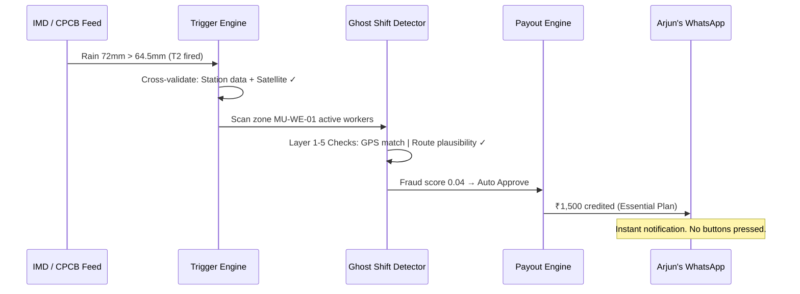

<!-- ═══════════════════════════════════════════════════════════════════════════ -->
<!--                            C O V A R A   O N E                           -->
<!--        AI-Powered Parametric Income Protection for Gig Workers            -->
<!-- ═══════════════════════════════════════════════════════════════════════════ -->

<div align="center">


**Team Celestius** — Bhrahmesh A · Chorko C · T Dharshini · T Ashwin · Shripriya Sriram

[](https://devtrails.guidewire.com)
[](#-technical-truth)
[](#)

<br>


---

*When the city drowns or the air turns toxic — your income doesn't stop. No forms. No calls. Zero waiting.*

**[Watch Demo Video](https://www.youtube.com/watch?v=TB0tV3Kcn80)** · **[View Technical Specs](docs/IMPLEMENTATION_STATUS.md)**

</div>

---

## 💡 The Vision

India's **12.7 million gig workers** are the backbone of the digital economy, yet **80% have zero savings**. When torrential rain, extreme heat, or toxic AQI hits, platforms pause and workers earn **₹0**. 

**Covara One** is the solution: A **fully parametric, AI-hardened insurance engine** that pays workers automatically the moment a climate disaster is verified. No adjusters, no paperwork—just liquidity when it's needed most.

---

## 👤 Our Persona — Arjun, the Monsoon Rider

<table>
<tr>
<td width="60%">

### Arjun, 29
**Swiggy Rider | Andheri West, Mumbai**
- 🛵 **Shift:** 5 PM – 1 AM (Late-night peak window)
- 💰 **Income:** ₹19,000/month (Zero savings)
- 🌩️ **The Crisis:** During the Oct '24 floods, Andheri saw 157mm in 6h. Platforms paused. **Arjun earned ₹0 for 3 days.** 

> *“₹1,900 lost is my entire fuel budget for the month gone.”*

</td>
<td width="40%" align="center">

**The Solution**
<br>
🪙 **Micro-Premium**<br>₹28/week — less than one delivery trip.
<br><br>
⚡ **Zero-Touch**<br>IMD logs rain → Money in UPI.
<br><br>
🛡️ **Trust Factor**<br>Verified via route-purity and EXIF data.

</td>
</tr>
</table>

---

## 🎬 Live Scenarios

### 1. 🌧️ The Automated Claim — 5 Minutes, Zero Forms
*Tuesday, 8:35 PM: High-intensity rain hits Mumbai. IMD reports 72mm.*



### 2. 🕵️ The Fraud Ring — Caught at the Edge
*Organized syndicate sitting at home tries to spoof locations into a "red zone" to drain the pool.*

```mermaid
flowchart LR
    A[500 Fake Claims] --> B{DBSCAN Clustering}
    B -->|High Density| C[Statistical Anomaly Logged]
    B --> D[Individual Verification]
    D --> E[TomTom Route Purity: GPS on Rooftops ✗]
    D --> F[EXIF Integrity: AI-synth Photo ✗]
    E & F --> G[🛑 Systematic Rejection]
    Note right of G: Pool protected. Zero fraud leakage.
```

---

## ⚡ The Technology Fortress

Covara One is built for production, using a **5-layer security architecture** we call the **Ghost Shift Detector**.

| Layer | Verification Method | Impact |
|:---|:---|:---|
| **L1: Event Truth** | IMD / CPCB / TomTom | Verification that a real disruption actually occurred. |
| **L2: Worker Truth** | Shift & Zone Intersection | Confirms the worker was actually intended to work in that zone. |
| **L3: Anti-Spoofing** | EXIF GPS + TomTom Snap-to-Road | Blocks GPS-spoofing apps and "impossible travel" hacks. |
| **L4: Image Forensics** | Gemini SynthID | Automatically detects AI-generated "monsoon" evidence photos. |
| **L5: Cluster Intelligence** | DBSCAN Clustering | Identifies organized fraud syndicates in real-time. |

---

## 🏆 Why Covara One Wins

| Feature | Standard Parametric | **Covara One** |
|:---|:---:|:---:|
| **Fraud Defense** | Raw GPS Only | 5-Layer Ghost Shift Support |
| **Regional Logic** | Flat Thresholds | City-Specific Baselines (Delhi vs Mumbai) |
| **ML Engine** | Hardcoded logic | Live Random Forest + DBSCAN Inference |
| **Payout** | 2-3 Days | **~5 Minutes (Zero-Touch)** |
| **Aesthetics** | Generic Table | Premium Glassmorphism Dashboard |

---

## 📑 Technical Truth

For deeper architectural details, visit our **Implementation Status & Service Inventory**.

- 📊 **[Full Service Inventory](docs/IMPLEMENTATION_STATUS.md#section-module-deep-dive)** — 27 specialized backend services.
- ⚡ **[The 15-Trigger Library](docs/IMPLEMENTATION_STATUS.md#15-trigger-library)** — Exact thresholds for Rain, AQI, Heat, and Outages.
- 📐 **[Calibration Formulas](docs/IMPLEMENTATION_STATUS.md#internal-calibration-engine)** — The math behind Premium and Severity.
- 💾 **[Database Schema](docs/IMPLEMENTATION_STATUS.md#data-split)** — 14-table RLS-hardened Supabase architecture.

---

## 🚀 Quick Start

**1. Clone & Env:**
```bash
git clone https://github.com/Chorko/Celestius_DEVTrails_P1.git
# Config .env in backend/ and frontend/ as per .env.example
```

**2. Seed & Run:**
```bash
# Run backend/sql/00_unified_migration.sql in Supabase
# Run backend/sql/09_master_consolidated_patch.sql in Supabase
pip install -r requirements.txt
python backend/app/main.py
```

**3. Demo Credentials:**
| Role | Email | Password |
|:---|:---|:---|
| **Worker** | `worker@demo.com` | `demo1234` |
| **Admin** | `admin@demo.com` | `demo1234` |

---

<div align="center">

### Built with conviction by Team Celestius
*Guidewire DEVTrails 2026 — Phase 2 Production Hardened*


</div>
