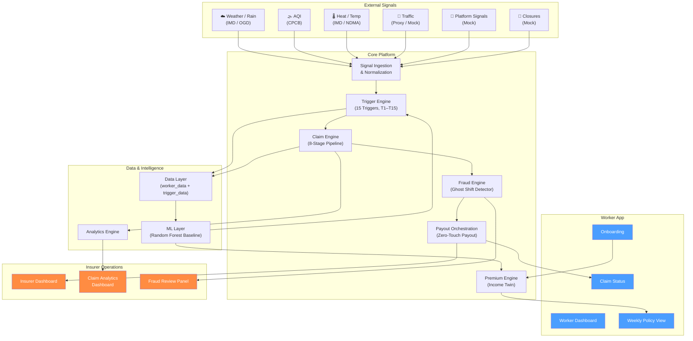
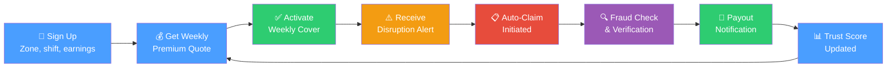

# DEVTrails 2026 — AI-Powered Parametric Income Protection for Gig Workers

> A hyperlocal, weekly income-protection engine for food-delivery workers that pays only when verified disruption overlaps real earning exposure.

---

## What This Project Is

DEVTrails is an AI-assisted **parametric insurance platform** that protects delivery workers' **weekly income** — not health, life, vehicle repair, or accident damage. The system monitors external disruption signals (heavy rain, severe AQI, heatwaves, outages, closures, traffic collapse), estimates whether a worker's earning ability was genuinely affected during a covered shift, and can automatically initiate claims when conditions are met.

### Core Product Pillars

| Module | Purpose |
|--------|---------|
| **Income Twin** | Continuously estimate expected weekly and shift-level earnings |
| **Streetwise Cover** | Hyperlocal underwriting at zone / route / hotspot level |
| **Disruption DNA** | Composite disruption scoring from multiple signal sources |
| **Ghost Shift Detector** | Fraud and anomaly detection layer |
| **Zero-Touch Payout** | Claims and payout orchestration for auto-initiated claims |
| **Trust Pass** *(optional)* | Loyalty / trust program for premium discounts and fast-lane claim decisions |

### The Idea Is Simple

1. The worker buys weekly coverage
2. The system monitors public trigger conditions
3. The platform matches the event to the worker's zone and shift
4. A claim can be initiated automatically
5. Fraud checks run before payout
6. The insurer dashboard tracks the full lifecycle

---

## Current Repository State

> [!NOTE]
> This repository contains a **functional early-stage scaffold** of the DEVTrails platform — a working FastAPI backend, a working Next.js 16 frontend, a complete Supabase SQL schema with RLS, and real integration between all layers.
>
> **What you will find:**
> - A running **Next.js 16 frontend** with worker dashboard (earnings chart, zone alerts, policy quote), claim submission with GPS + photo evidence, admin review queue with AI-assisted decisions, and admin trigger engine
> - A running **FastAPI backend** with auth, claims, policies, triggers, zones, workers, and analytics endpoints
> - **14-table Supabase SQL schema** with Row-Level Security, auth triggers, and storage policies
> - **8-stage claim pipeline** with severity scoring, pricing engine, fraud scoring, payout recommendation, and Gemini AI explanation
> - Google OAuth + email/password auth via Supabase Auth with role-based routing
> - CLI seed system + Excel import utility
> - 10 module-level READMEs with inputs, outputs, and downstream flows
> - 7 architecture and data-science visuals (PNGs)
> - 5 standalone Mermaid diagram source files
> - Clean review zip script (`scripts/zip_review_repo.ps1`)
>
> **What is scaffolded (works but incomplete):** Policy activation (mock — returns success token, no DB persistence), ML integration (Random Forest p=0.15 is hardcoded), trigger overlap matching (implemented but not called).
>
> **What is documented but not yet implemented:** Redis caching layer, ML training pipeline, most external integrations, SQLAlchemy ORM.

---

## Challenge Alignment

The DEVTrails 2026 challenge requires:

| Requirement | Our approach |
|-------------|-------------|
| Gig-worker income protection | Food-delivery workers in urban India, loss-of-income only |
| Weekly pricing | Dynamic weekly premium based on zone risk, shift exposure, trust score |
| AI-powered risk assessment | Hybrid rules + Random Forest ML + feedback adaptation |
| Intelligent fraud detection | 4-layer Ghost Shift Detector pipeline |
| Parametric trigger automation | 15-trigger library with public-threshold anchoring |
| Payout processing | Zero-Touch Payout with severity-proportional compensation |
| Analytics dashboards | Worker dashboard + Insurer dashboard + Claim analytics dashboard |

---

## Delivery Persona and Coverage Boundary

**Chosen persona:** Food-delivery workers in disruption-prone urban zones (India)

**Covered risk:** Temporary loss of earning opportunity caused by external disruption

**Not covered:**
- Health or hospitalization
- Life insurance
- Accident insurance
- Vehicle repair
- Personal theft unrelated to the disruption trigger

---

## Implementation Status

> [!IMPORTANT]
> This table separates what is **currently visible** in the repository from what is **documented as target architecture**. Each module README contains its own detailed status.

| Area | Status | Notes |
|------|--------|-------|
| Repository structure & README system | ✅ Current | 10 folder-level READMEs with inputs/outputs/downstream |
| Product framing & scope boundaries | ✅ Current | Consistent across all documentation |
| 15-trigger library (thresholds & logic) | ✅ Implemented | Trigger engine with live feed + mock injection |
| Premium & payout formulas | ✅ Implemented | Pricing engine with actuarial formulas |
| Data schemas & seed dataset | ✅ Present | 14-table Supabase SQL schema with RLS + seed CSVs |
| Backend API — full services | ✅ Implemented | Auth, claims, policies, triggers, zones, workers, analytics endpoints |
| Worker dashboard | ✅ Implemented | Profile, earnings chart, zone alerts, policy quote, claim submission |
| Insurer dashboard | ✅ Implemented | KPI cards, trigger mix chart, review queue with AI-assisted decisions |
| Claim pipeline | ✅ Implemented | 8-stage pipeline: severity → pricing → fraud → payout → Gemini AI |
| Fraud detection engine | ✅ Implemented | 4-layer scoring with fraud bands and holdback |
| Supabase Auth & RLS | ✅ Implemented | Google OAuth, role-based routing, Row-Level Security |
| Integrations (weather, AQI, traffic) | 📋 Planned | Categories and mock strategy defined; connectors pending |
| Caching layer | 📋 Planned | Strategy and TTL policy defined; implementation pending |
| ML training pipeline | 📋 Planned | Random Forest baseline hardcoded at p=0.15 |

**Legend:** ✅ Current Implementation — 📝 Documented Formula / Design Logic — 📋 Planned / Target Architecture

---

## System Architecture

### Unified System Architecture



> **📋 Status:** This diagram represents the **target architecture**. The repository currently contains the documentation and specification layer; module implementations are planned.


---

### Gig Worker Journey




---

## End-to-End Logic

| Step | What happens | Output |
|------|-------------|--------|
| 1. Onboarding | Worker enters delivery type, zones, shift window, earning band, payout preference | Persona profile and coverage context |
| 2. Weekly pricing | Risk engine combines zone risk, shift exposure, prior claims, trust score | Weekly premium and payout cap |
| 3. Coverage activation | Worker accepts weekly plan; policy becomes active | System starts monitoring disruptions |
| 4. Signal monitoring | Weather, AQI, traffic, closure, platform signals ingested | Structured events for decision engine |
| 5. Trigger scoring | Disruption DNA calculates severity; checks zone/shift overlap | Trigger score and exposure score |
| 6. Fraud check | Ghost Shift Detector validates worker exposure and behavior | Fraud / confidence score |
| 7. Claim decision | If trigger + exposure + confidence thresholds met → auto-create claim | Explainable decision and payout amount |
| 8. Payout simulation | Zero-Touch Payout sends simulated UPI / gateway response | Worker sees status; admin sees audit log |
| 9. Learning loop | Reviewed outcomes feed back into pricing, thresholds, fraud models | Improved accuracy over time |

---

## The 15-Trigger Library

The platform uses a **3-tier trigger architecture**: early warning → claim trigger → severe escalation.

### Environmental Triggers

| ID | Trigger | Threshold | Tier | Action |
|----|---------|-----------|------|--------|
| T1 | Rain Watch | 24h rain ≥ 48 mm | Early Warning | Raise risk score, notify worker |
| T2 | Heavy Rain Claim | 24h rain ≥ 64.5 mm | Claim Trigger | Open claim candidate if zone + shift overlap |
| T3 | Extreme Rain Escalation | 24h rain ≥ 115.6 mm | Severe Escalation | Escalate severity band and payout cap |
| T5 | AQI Caution | AQI 201–300 | Early Warning | Warn worker, raise premium sensitivity |
| T6 | AQI Severe Exposure | AQI ≥ 301 + active shift | Claim Trigger | Open claim candidate |
| T7 | Heat Wave | Temp ≥ 45°C or IMD heat-wave | Claim Trigger | Open claim candidate |
| T8 | Severe Heat | Temp ≥ 47°C | Severe Escalation | Escalated claim severity |
| T9 | Heat Persistence | 2 consecutive hot-risk days | Early Warning | Raise weekly risk loading |

### Operational and Civic Triggers

| ID | Trigger | Threshold | Tier | Action |
|----|---------|-----------|------|--------|
| T4 | Waterlogging Mobility | Accessibility score ≤ 0.40 | Claim Trigger | Claim candidate for blocked routes |
| T10 | Local Zone Closure | Official closure flag = 1 | Claim Trigger | Auto-escalate to claim review |
| T11 | Curfew / Strike Closure | Restriction window ≥ 4h | Claim Trigger | Claim candidate if pickup/drop blocked |
| T12 | Traffic Collapse | Travel delay ≥ 40% | Early Warning | Raise exposure and route stress |
| T13 | Platform Outage | Outage ≥ 30 min | Claim Trigger | Claim candidate for verified active workers |
| T14 | Demand Collapse | Orders drop ≥ 35% vs baseline | Early Warning | Raise loss-of-income probability |
| T15 | Composite Disruption | Composite score ≥ 0.70 | Severe Escalation | Fast-track claim escalation |

**Threshold sources:** IMD heavy-rain and heat-wave bands, CPCB AQI category thresholds, IMD/NDMA heat-wave guidance. Traffic, outage, and demand thresholds are internal operational thresholds.

---

## Threshold References and Why They Were Chosen

| Parameter | Source | What the source gives us | How we infer our product threshold | Anchoring |
|-----------|--------|--------------------------|-------------------------------------|-----------|
| **Rain** | [IMD Rainfall Categories (FAQ)](https://rsmcnewdelhi.imd.gov.in/images/pdf/faq.pdf), [IMD Heavy Rainfall Warning](https://mausam.imd.gov.in/imd_latest/contents/pdf/pubbrochures/Heavy%20Rainfall%20Warning%20Services.pdf) | Heavy rainfall = 64.5–115.5 mm/24h; Very heavy = 115.6–204.4 mm/24h | 48 mm = early-watch product threshold (pre-claim risk monitoring). 64.5 mm = claim-trigger anchor (official heavy-rain band). 115.6 mm = escalation (very-heavy-rain category). | ✅ Public-source anchored |
| **AQI** | [CPCB National Air Quality Index](https://www.cpcb.nic.in/national-air-quality-index/), [OGD AQI Dataset](https://www.data.gov.in/resource/real-time-air-quality-index-various-locations) | AQI 201–300 = Poor; 301–400 = Very Poor; 401+ = Severe | 201+ = caution threshold (poorer air likely to impair outdoor delivery). 301+ = claim threshold (very poor, significant health/work disruption). | ✅ Public-source anchored |
| **Heat** | [IMD Heat Wave Warning Services](https://mausam.imd.gov.in/imd_latest/contents/pdf/pubbrochures/Heat%20Wave%20Warning%20Services.pdf), [NDMA Heat Wave Guidance](https://ndma.gov.in/Natural-Hazards/Heat-Wave) | Heat-wave = departure ≥ 4.5°C above normal, or absolute ≥ 45°C for plains | 45°C = heat-wave claim threshold (IMD/NDMA criteria). 47°C = severe-heat escalation. | ✅ Public-source anchored |
| **Traffic** | Internal product threshold | No single public standard for delivery-impairment delay | ≥ 40% travel-time delay = route stress threshold. Based on operational assumption that 40%+ delay significantly reduces deliverable orders per shift. | ⚙️ Internal operational |
| **Platform Outage** | Internal product threshold | Platform outage data is not publicly available | ≥ 30 min outage = claim threshold for verified active workers. Based on the assumption that 30+ minutes of downtime causes material earning loss during a shift. | ⚙️ Internal operational |
| **Demand Collapse** | Internal product threshold | Platform order volume is not publicly available | ≥ 35% order drop vs baseline = loss-of-income indicator. Based on the assumption that 35%+ drop pushes earning opportunity below viable thresholds. | ⚙️ Internal operational |

Environmental thresholds (rain, AQI, heat) are anchored to official Indian government sources that define hazard categories independently of this project. Operational thresholds (traffic, outage, demand) are product-engineering decisions based on estimated earning-disruption impact — they are not sourced from external standards and may be refined as real operating data becomes available.

## Data Split

The dataset is split into two major entities and joined only after exposure matching.

### worker_data
Worker-side profile and earning context:
`worker_id`, `zone_id`, `city`, `shift_window`, `hourly_income`, `active_days`, `bank_verified`, `gps_consistency`, `trust_score`, `prior_claim_rate`

### trigger_data
Event-side disruption context:
`trigger_id`, `city`, `zone_id`, `timestamp_start`, `timestamp_end`, `trigger_type`, `raw_value`, `threshold_crossed`, `severity_bucket`, `source_reliability`

### joined_training_data
Created only after matching `worker_data` ↔ `trigger_data` on `zone_id` + shift/time overlap.
Used for EDA, ML experiments, and premium/payout calculations.

---

## Pricing, Thresholds, and References

Environmental thresholds (rain, AQI, heat) are anchored to official Indian government classifications — IMD, CPCB, and NDMA. Pricing and payout derivation follow expected-loss premium principles grounded in actuarial literature. The repo separates hazard classification from pricing methodology by design.

- **Central reference register** with all 9 sources, threshold inference logic, and formula summary → [docs/README.md](docs/README.md#reference-register)
- **Threshold basis per trigger family** with source links → [data/README.md](data/README.md#trigger-threshold-reference-table)
- **ML baseline and feature normalization provenance** → [ml/README.md](ml/README.md#pricing-baseline-and-reference-notes)

---

## Premium and Payout Logic Summary

> Full formula derivations and worked examples are documented in [docs/README.md](docs/README.md) and the insurance formula reference. For central documentation references, including threshold sources and premium/pricing reference notes, see [docs/README.md](docs/README.md#reference-register).

### Key Formulas

| Formula | Expression |
|---------|-----------|
| Covered Income (B) | `0.70 × hourly_income × shift_hours × 6` |
| Severity Score (S) | Weighted composite: rain 0.23, AQI 0.14, heat 0.14, outage 0.12, traffic 0.10, closure 0.10, access 0.10, demand 0.07 |
| Exposure (E) | `clip(0.45 + 0.30×(shift_hours/12) + 0.25×(1−accessibility_score), 0.35, 1.00)` |
| Confidence (C) | `clip(0.50 + 0.30×trust + 0.10×gps + 0.10×bank, 0.45, 1.00) × (1 − 0.70×fraud_penalty)` |
| Expected Payout | `p × B × S × E × C × (1 − FH)` |
| Gross Premium | `[Expected Payout / (1 − 0.12 − 0.10)] × U` |
| Payout Cap | `0.75 × B × U` |
| Final Payout | `min(Cap, B × S × E × C × (1 − FH))` |

Where: `p` = claim probability (Random Forest), `FH` = fraud holdback, `U` = outlier uplift factor.

### Sample Scenario

**Worker:** hourly income = ₹84, shift = 11h, 6 days/wk, trust = 0.82, GPS consistency = 0.91, bank verified = ✅

**Trigger:** rain = 72mm, AQI = 240, temp = 41°C, traffic delay = 48%, outage = 12 min

**Interpretation:**
- Rain exceeds both the 48mm watch and 64.5mm heavy-rain thresholds → T2 fires
- AQI 240 sits in the 201–300 caution band → T5 fires
- Exposure is high: long shift + weak accessibility
- Confidence stays high: strong trust score and GPS consistency
- Payout can be automated unless fraud score triggers review

---

## Repository Map

```
Celestius_DEVTrails_P1/
├── .gitignore
├── README.md                        ← You are here
├── requirements.txt                 ← Python dependencies
├── backend/
│   ├── README.md                    ← API layer, services, endpoints
│   ├── app/
│   │   ├── main.py                  ← FastAPI app entry point
│   │   ├── config.py                ← Environment configuration
│   │   ├── dependencies.py          ← Auth guards (get_current_user, require_*)
│   │   ├── supabase_client.py       ← Supabase admin client
│   │   ├── seed.py                  ← CLI database seeder
│   │   ├── routers/                 ← API route handlers
│   │   │   ├── auth.py              ← Login, signup, profile endpoints
│   │   │   ├── claims.py            ← Claim submission, listing, review
│   │   │   ├── policies.py          ← Premium quotes, policy activation
│   │   │   ├── triggers.py          ← Live trigger feed, mock injection
│   │   │   ├── workers.py           ← Worker profile & stats
│   │   │   └── zones.py             ← Zone lookup
│   │   └── services/                ← Business logic
│   │       ├── claim_pipeline.py    ← 8-stage claim orchestration
│   │       ├── severity.py          ← Severity scoring
│   │       ├── pricing.py           ← Premium & payout calculations
│   │       ├── fraud_engine.py      ← Ghost Shift Detector
│   │       ├── evidence.py          ← EXIF metadata extraction
│   │       ├── manual_claim_verifier.py ← Manual claim validation
│   │       └── gemini_analysis.py   ← Gemini AI claim narratives
│   ├── sql/                         ← Supabase SQL schema
│   │   ├── 01_supabase_platform_schema.sql ← 14 tables
│   │   ├── 02_auth_triggers.sql     ← Auth event triggers
│   │   ├── 03_rls_policies.sql      ← Row-Level Security
│   │   ├── 04_storage_policies.sql  ← Storage bucket policies
│   │   ├── 05_rls_rollback.sql      ← RLS cleanup script
│   │   └── 06_synthetic_seed.sql    ← Demo users + comprehensive seed data
│   ├── mock_api.py                  ← Legacy 3-endpoint demo scaffold
│   └── openapi.yaml                 ← OpenAPI 3.0 contract
├── frontend/
│   ├── README.md                    ← Frontend architecture & pages
│   ├── src/app/                     ← Next.js 16 App Router pages
│   │   ├── layout.tsx               ← Root layout
│   │   ├── auth/callback/route.ts   ← OAuth callback handler
│   │   ├── worker/                  ← Worker-facing pages
│   │   │   ├── dashboard/page.tsx   ← Profile, chart, alerts, quote
│   │   │   ├── claims/page.tsx      ← Claim submission + history
│   │   │   ├── pricing/page.tsx     ← Coverage plans, mock payment
│   │   │   └── layout.tsx           ← Worker route guard
│   │   └── admin/                   ← Admin-facing pages
│   │       ├── dashboard/page.tsx   ← KPI cards, trigger mix chart
│   │       ├── reviews/page.tsx     ← Claim review queue + AI summary
│   │       ├── triggers/page.tsx    ← Live trigger feed + injection
│   │       ├── users/page.tsx       ← Worker search + profile viewer
│   │       └── layout.tsx           ← Admin route guard
│   └── src/lib/supabase.ts          ← Supabase browser client
├── caching/README.md                ← Cache strategy and TTL policies
├── claim-engine/
│   ├── README.md                    ← Trigger-to-claim pipeline
│   └── examples/                    ← Sample claim + JSON Schema
├── data/
│   ├── README.md                    ← Schemas, seed dataset, generation plan
│   └── samples/                     ← Seed CSV files
├── docs/
│   ├── README.md                    ← Documentation index + reference register
│   ├── diagrams/                    ← Mermaid source files (.mmd)
│   └── assets/                      ← Architecture & data-science PNGs
├── fraud/README.md                  ← Ghost Shift Detector, 4-layer fraud engine
├── integrations/README.md           ← External connectors & mock integrations
├── ml/README.md                     ← Data science pipeline, models, experiments
└── scripts/
    ├── zip_review_repo.ps1          ← Clean review zip exporter
    ├── seed_test_users.py           ← Test user seeder
    └── force_sync_users.py          ← User sync utility
```

Each folder README follows a consistent structure:
- **Goal** — what the module does
- **Inputs** — what data flows in
- **Outputs** — what data flows out
- **Downstream** — where the output goes next
- **Implementation Status** — current vs. planned

---

## Tech Stack

| Layer | Technology | Why |
|-------|-----------|-----|
| **Frontend** | React / Next.js 16 | Fast UI iteration, component-based dashboards, clean demo experience |
| **Backend** | Python (FastAPI) | Transparent REST endpoint design, strong data-science ecosystem integration |
| **Database** | PostgreSQL (Supabase) | Relational storage with built-in auth, RLS, real-time subscriptions, and storage |
| **Styling** | Tailwind CSS v4 | Utility-first CSS with glassmorphism design system, zero-config setup |
| **Charts** | Recharts | React-native charting for analytics dashboards, trigger mix, severity distribution |
| **State** | Zustand | Lightweight client-side state management for auth and UI state |
| **Cache** | Redis *(planned)* | Fast key-value caching for trigger feeds, dashboard summaries, simulation outputs |
| **Data Science** | pandas, numpy, scikit-learn | Bootstrap EDA, Random Forest baseline, boxplot outlier analysis |

### Why a Web Application Over a Mobile App

We deliberately chose a **responsive web application** over a native mobile app for the following reasons:

1. **Instant accessibility** — Gig workers across India use a wide variety of Android devices with limited storage. A web app requires no install, no app-store approval, and no device-specific builds. Workers can access their dashboard from any browser.

2. **Cross-platform from day one** — A single Next.js codebase serves both desktop (admin/insurer dashboards) and mobile (worker-facing views) without maintaining separate iOS and Android codebases or hiring platform-specific developers.

3. **Faster iteration cycle** — Insurance product logic evolves rapidly during early-stage validation. Web deployments are instant (push to deploy), while mobile apps require app-store review cycles (24-72 hours per update). For a prototype in active development, this speed advantage is critical.

4. **Admin-side complexity** — The insurer dashboard involves data tables, split-pane review queues, pipeline breakdowns, and chart-heavy analytics views that are better suited to wider screens with a browser-based layout engine. Building this natively on mobile would add significant complexity for minimal benefit.

5. **Supabase integration** — Supabase Auth (Google OAuth, email/password) and Supabase Realtime work seamlessly with browser-based clients. The JavaScript SDK is mature and well-documented for web use cases.

6. **Progressive enhancement path** — The web app can be wrapped as a PWA (Progressive Web App) later to provide an app-like experience with offline support, push notifications, and home-screen installation — bridging the gap without the overhead of native development.

> **Future consideration:** Once the product reaches scale and requires hardware-level features (background GPS tracking, camera access for evidence capture in offline zones), a React Native or Flutter wrapper around the existing API layer would be the natural next step.

---

## Evaluator Quick-Start

> [!NOTE]
> This repository contains a **functional full-stack application** with a running FastAPI backend, a Next.js 16 frontend with glassmorphism UI, a 14-table Supabase schema with RLS, and comprehensive synthetic seed data. The README system provides complete product logic, formulas, and architecture documentation.

**To see the platform in action:**
1. Set up your `.env` files (see Supabase & Authentication Setup above)
2. Run `backend/sql/01` through `06` in your Supabase SQL editor
3. Start the backend: `cd backend && uvicorn app.main:app --reload --port 8000`
4. Start the frontend: `cd frontend && npm run dev`
5. Log in with `worker@demo.com` / `demo1234` to see the worker dashboard with pre-seeded earnings, claims, and alerts
6. Log in with `admin@demo.com` / `demo1234` to see the admin operations center with review queue, trigger engine, and user search

**To understand the platform:**
1. Read this README for the full product overview
2. Read [docs/README.md](docs/README.md) for the documentation index
3. Read each module README for inputs/outputs/downstream flow
4. Review the trigger library table above for parametric threshold logic
5. Review the premium/payout formula summary for insurance math
6. Check the architecture diagrams for system flow

---

## Supabase & Authentication Setup (Phase 2.9)

To run the full stack locally with functional Google OAuth and strict Role-Based Routing:

1. **Google OAuth Config:** 
   - Inside your Supabase Dashboard → Authentication → Providers → Google:
   - Enable Google, enter your `Client ID` and `Client Secret`.
2. **Redirect URIs:**
   - Supabase Dashboard → Authentication → URL Configuration:
   - Make sure your Site URL is `http://localhost:3000`.
   - Add `http://localhost:3000/auth/callback` to your **Redirect URIs** list.
3. **Database Security (RLS) & Triggers:**
   - Run `backend/sql/auth_triggers.sql` to automatically assign new Google logins to the safe `worker` role.
   - Run `backend/sql/rls_policies.sql` to secure the platform API boundaries.
4. **Storage Security:**
   - Run `backend/sql/storage_policies.sql` to secure the `claim-evidence` image bucket.
5. **Frontend .env:**
   - Need `NEXT_PUBLIC_SUPABASE_URL`, `NEXT_PUBLIC_SUPABASE_ANON_KEY`, and `NEXT_PUBLIC_API_URL=http://localhost:8000`.

*Note: The frontend architecture strictly isolates worker versus admin pages. New Google users securely default to `worker`. An administrator role (`insurer_admin`) can only be assigned by manually updating the `profiles.role` column directly in the Supabase database.*

---

## Demo Credentials

After running `backend/sql/06_synthetic_seed.sql` in your Supabase SQL editor, the following demo accounts are available with pre-seeded data:

| Role | Email | Password | What you'll see |
|------|-------|----------|-----------------|
| **Worker** | `worker@demo.com` | `demo1234` | Worker dashboard with 14-day earnings chart, zone alerts, claim history (1 approved rain claim, 1 pending), coverage plan quotes |
| **Admin** | `admin@demo.com` | `demo1234` | Admin operations center with KPI cards, trigger distribution chart, full review queue with 9 claims, user search across 7 workers |

**Or use your own Google account** — Sign in with Google OAuth and the system will automatically create a `worker` profile for you. Your dashboard will start empty and populate as you create shifts, submit claims, and interact with the platform.

> The demo accounts are isolated synthetic users. Logging in with `worker@demo.com` or `admin@demo.com` does not affect any other user's data. All seed data uses `ON CONFLICT DO NOTHING`, so re-running the seed SQL is safe.

---

## Folder Ownership

| Folder | Responsibility | Status |
|--------|---------------|--------|
| `frontend/` | UI flows, dashboards, user experience | ✅ Implemented (worker + admin dashboards) |
| `backend/` | API orchestration, services, business logic | ✅ Implemented (auth, claims, policies, triggers, workers, zones, analytics) |
| `claim-engine/` | Claim decision rules, 8-stage pipeline | ✅ Implemented (full pipeline in backend/app/services/) |
| `fraud/` | Ghost Shift Detector, anomaly logic, verification | ✅ Implemented (fraud_engine.py + manual_claim_verifier.py) |
| `ml/` | Severity modeling, pricing experiments, EDA | 📋 Planned (baseline p=0.15 hardcoded) |
| `data/` | Synthetic data generation, CSV assets, schemas | ✅ Present (14-table SQL schema + seed CSVs) |
| `caching/` | Cache rules, TTL behavior, invalidation | 📋 Planned |
| `integrations/` | External signal connectors, payment mocks | 📋 Planned (mock data used currently) |
| `docs/` | Diagrams, formula docs, pitch assets, references | 📝 Documented |

---

## What Judges Should Immediately Understand

- The project is about **income loss**, not generic insurance
- The platform uses **weekly pricing** matched to gig-worker earning cycles
- The system is **parametric** — claims triggered by objective conditions, not manual forms
- The claims pipeline is **automated** with multi-layer verification
- The fraud layer uses **real logic** (4-layer Ghost Shift Detector), not buzzwords
- The trigger library has **15 thresholds** anchored to public government data
- The premium and payout math is **formula-driven and explainable**
- The repo is **readable enough to evaluate quickly** without inspecting code
- Current state vs. target architecture is **honestly labeled throughout**

---

## Business Framing

DEVTrails is positioned as an **insurer-facing platform** or **embedded protection layer** — not as a fully licensed insurer. The product provides the parametric underwriting engine, claims orchestration, and fraud detection that a licensed insurer would embed into their distribution channel for gig-worker income protection.

Key business metrics the system tracks:
- Loss ratio by zone
- Claim automation rate
- Payout-to-premium ratio
- Trust-weight distribution
- Fraud leakage rate

---

## 📦 Creating a Clean Evaluation Package

It is critical to exclude `.git/` and heavy development artifacts to maintain a clean evaluation payload.

To generate a clean package, run:

```powershell
.\scripts\zip_review_repo.ps1
```

This creates a `Celestius_DEVTrails_P1_review.zip` artifact at the repository root. This package deliberately omits dependencies like `.git/`, `node_modules/`, `__pycache__/`, and `.venv/` so that judges can immediately focus on the application source code and documentation.
