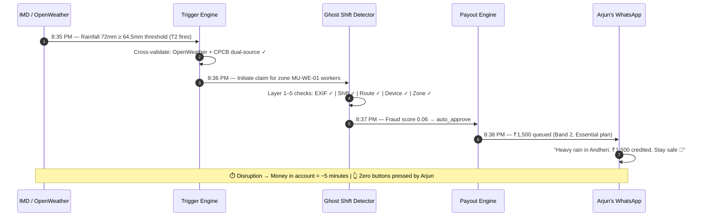
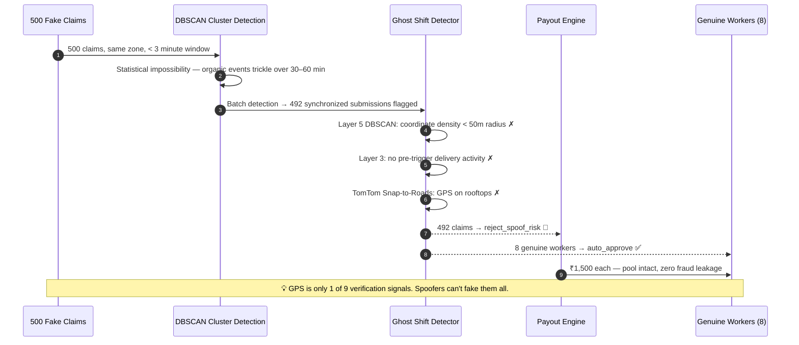
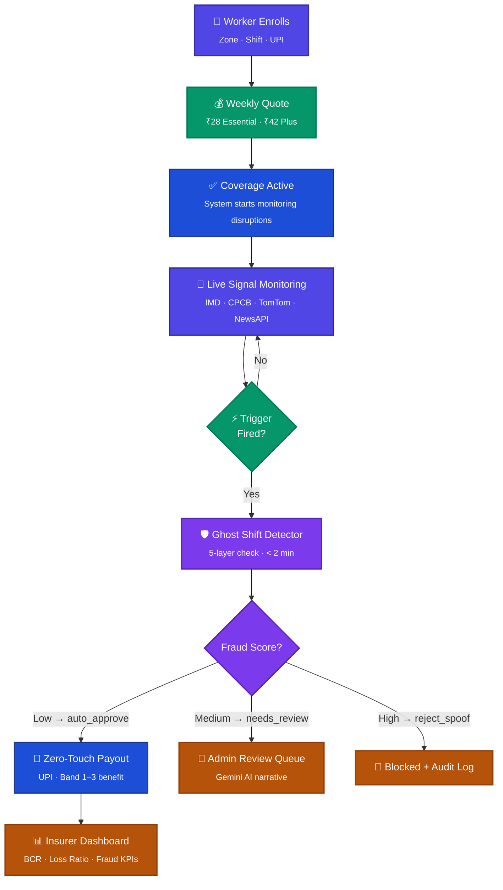
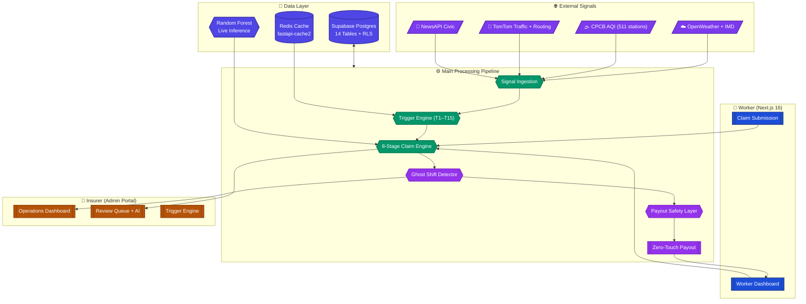
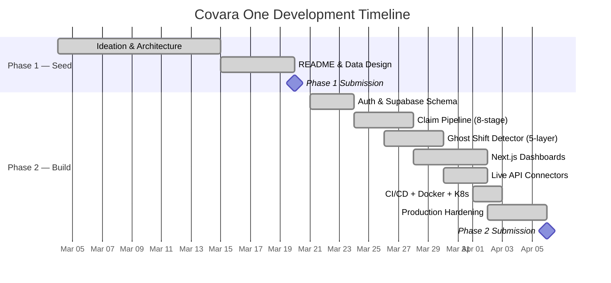

<!-- ═══════════════════════════════════════════════════════════════════════════ -->
<!--                            C O V A R A   O N E                           -->
<!--        AI-Powered Parametric Income Protection for Gig Workers            -->
<!-- ═══════════════════════════════════════════════════════════════════════════ -->

<div align="center">


**Team Celestius** — Bhrahmesh A · Chorko C · T Dharshini · T Ashwin · Shripriya Sriram

[](https://devtrails.guidewire.com)
[](#-team-celestius)
[](#)
[](#)

<br>


---

*When the city drowns or the air turns toxic — your income doesn't stop. No forms. No calls. Zero waiting.*

📹 **[Watch the Demo](https://www.youtube.com/watch?v=TB0tV3Kcn80)** · 🌐 **[Live Platform](#-quick-start)**

</div>

---

> [!IMPORTANT]
> **What is Parametric Insurance?** Unlike traditional insurance where you file a claim and wait for an adjuster, parametric insurance pays **automatically** when a measurable threshold is crossed. If IMD rainfall data shows ≥ 64.5mm in your zone — you get paid. No paperwork. No waiting.

---

## 📑 Table of Contents

<details open>
<summary><b>Click to navigate</b></summary>

| # | Section |
|:-:|---------|
| 🔥 | [The Crisis](#-the-crisis) |
| 👤 | [Our Persona](#-our-persona--arjun-the-monsoon-rider) |
| 🎬 | [Live Scenarios](#-live-scenarios) |
| ⚡ | [How It Works](#-how-it-works) |
| 💰 | [Coverage Plans](#-coverage-plans) |
| 🛡️ | [The Fraud Fortress](#️-the-fraud-fortress) |
| 🏗️ | [Architecture](#-architecture) |
| 🏆 | [Why Covara One Wins](#-why-covara-one-wins) |
| 🚀 | [Quick Start](#-quick-start) |
| 📚 | [Deep Dive Docs](#-deep-dive-docs) |

</details>

---

## 🔥 The Crisis

<div align="center">

| | The Shock | What Happens | The Cost |
|:-:|:---|:---|:---:|
| 🌧️ | Mumbai — 72mm rain in 6h | Zomato, Swiggy, Blinkit all pause zones | **₹0 for 2 days** |
| 🏭 | Delhi — AQI 485, GRAP Stage IV | Two-wheelers banned, no deliveries | **₹0 for the week** |
| 🌡️ | Kolkata — 47°C heatwave, IMD Red Alert | Platform collapses mid-shift | **₹0 for 3 days** |

</div>

> 🏥 **Platforms** cover accidents. **Government** covers hospitalization.
> 
> ❌ **Nobody** covers income lost when the city shuts down — until now.
> 
> ✅ **Covara One** fills this exact gap. Automatically. Zero forms.

India's **12.7 million gig workers** power the digital economy. Yet **80% have zero formal insurance** and no product covers income loss from weather, AQI, or outages.

| Metric | Data | Source |
|:-------|:----:|:------:|
| Gig workers with zero savings | **90%** | NITI Aayog |
| Income loss per 1°C wet-bulb rise | **19%** | Nature 2024 |
| Annual heatwave days across India | **536** | CII / IMD |
| Delhi AQI > 400 days per winter | **30–50** | CPCB |

---


## 👤 Our Persona — Arjun, the Monsoon Rider

<table>
<tr>
<td width="60%">

### Arjun, 29 &nbsp; `Swiggy Rider · Andheri West, Mumbai`

| | |
|:-|-|
| 🛵 **Shift** | 5 PM – 1 AM (peak + late window) |
| 💰 **Income** | ~₹19,000/month after fuel |
| 💳 **Savings** | ₹0 — paycheck to paycheck |
| 📍 **Zone** | MU-WE-01 (Andheri West) |

**October 2024 — The event that changed everything:**

> Andheri received **157mm in 6 hours.** Every platform paused.  
> Arjun sat under an awning for 3 days, earning **absolutely nothing.**  
> *₹1,900 gone — his entire fuel budget for the month.*

</td>
<td width="40%" align="center">

**Why Arjun pays ₹28/week**

🪙 Less than one delivery order<br><sub>Micro-pricing that feels like a fee</sub>

😰 Loss-aversion framing<br><sub>"Your income is at risk right now"</sub>

⚡ Instant value<br><sub>"Covered for tonight's shift"</sub>

✅ Deterministic rules<br><sub>Verify on IMD yourself</sub>

</td>
</tr>
</table>

---


## 🎬 Live Scenarios

### Scenario 1: 🌧️ The Monsoon Claim — 5 Minutes, Zero Forms

> **Tuesday, 8:30 PM** — Arjun starts his shift. Torrential rain begins. IMD logs 72mm. Blinkit pauses the zone. Arjun is under an awning, earning nothing.



---

### Scenario 2: 🕵️ The Fraud Ring — Caught Before a Single Payout

> **500 riders coordinate via Telegram.** They install GPS spoofing apps, fake locations into Zone MU-WE-01 while sitting at home. They try to drain the liquidity pool.



---

## ⚡ How It Works



| Step | What Happens | Output |
|:----:|:------------|:-------|
| 1 | Worker signs up — zone, shift window, UPI handle | Profile + Trust Score |
| 2 | System prices weekly cover from the formula engine | ₹28/week (Essential) |
| 3 | Coverage activates — monitoring begins | Policy live |
| 4 | IMD/CPCB/TomTom signals ingested continuously | Structured disruption events |
| 5 | Trigger scoring maps event to severity Band 1/2/3 | Trigger score |
| 6 | Ghost Shift Detector validates 9 signals in parallel | Fraud / confidence score |
| 7 | Auto-approve if fraud score < threshold | Claim created |
| 8 | Zero-Touch Payout executed to verified UPI | Receipt + audit trail |

---

## 💰 Coverage Plans

> IRDAI-compliant micro-insurance. Weekly pricing matches gig payout rhythms.

<div align="center">

| | 🟢 **Essential** | 🔵 **Plus** |
|:--|:--:|:--:|
| **Weekly Premium** | **₹28** | **₹42** |
| **Weekly Benefit Cap** | ₹3,000 | ₹4,500 |
| **Band 1 Payout** (moderate) | ₹750 | ₹1,125 |
| **Band 2 Payout** (major) | ₹1,500 | ₹2,250 |
| **Band 3 Payout** (severe) | ₹3,000 | ₹4,500 |
| Annual premium | ₹1,456 | ₹2,184 |
| IRDAI ₹10k limit | ✅ | ✅ |

</div>

> **Payout = pre-agreed Band × selected plan.** Once the trigger threshold is hit and anti-spoofing passes, the amount is locked — no formula fiddling, no adjuster discretion. That's the parametric promise.

---

## 🛡️ The Fraud Fortress

> [!CAUTION]
> **Market reality:** Coordinated Telegram syndicates use GPS-spoofing apps to fake locations and drain payout pools. Simple GPS checks are dead. We built a 5-layer response.


**Key differentiator:** GPS is only **1 of 9 signals**. Spoofers fool GPS and nothing else. Our architecture checks route plausibility (TomTom), Gemini SynthID for AI-generated photos, and DBSCAN clustering on batch submission timing. The 500-worker syndicate gets caught before a single payout.

→ *Full fraud deep-dive: [fraud/README.md](fraud/README.md) · [docs/IMPLEMENTATION_STATUS.md](docs/IMPLEMENTATION_STATUS.md)*

---

## 🏗️ Architecture



<div align="center">

| Layer | Technology | Status |
|:-----:|:----------:|:------:|
| **Frontend** | Next.js 16, Tailwind CSS v4, Recharts, Zustand | ✅ Live |
| **Backend** | FastAPI, Python 3.12, fastapi-cache2 + Redis | ✅ Live |
| **Auth** | Supabase Auth (Google OAuth + email), Edge SSR Middleware | ✅ Live |
| **Database** | Supabase Postgres, 14 tables, Row-Level Security | ✅ Live |
| **ML** | scikit-learn Random Forest (live predict_proba), DBSCAN | ✅ Live |
| **Infrastructure** | Docker multi-stage, GitHub Actions CI/CD, K8s manifests | ✅ Ready |
| **Payments** | UPI mock (RazorpayX-format, async, failure simulation) | ✅ Mock |

</div>

---

## 🏆 Why Covara One Wins

<div align="center">

| Dimension | ⭐⭐⭐ Meets the Brief | ⭐⭐⭐⭐⭐ Covara One |
|:---------:|:--------------------:|:------------------:|
| **Fraud** | GPS check only | 5-layer Ghost Shift + DBSCAN syndicate detection |
| **ML** | Hardcoded probability | Live Random Forest `predict_proba()` + DBSCAN clustering |
| **Auth** | Client-side guard | Next.js Edge SSR Middleware — flash-free, server-enforced |
| **Caching** | None | Redis + `fastapi-cache2` TTL decorators on live feeds |
| **Infrastructure** | ZIP file | Docker multi-stage + GitHub Actions CI/CD + K8s manifests |
| **Testing** | None | 61 pytest tests — 100% pass rate |
| **Stress tested** | Not mentioned | Mumbai monsoon simulator: 10,000 workers, 3-day event |

</div>

### 🦄 Our 5 Differentiators

<table>
<tr>
<td align="center" width="20%">

**🔍**<br>**Ghost Shift Detector**

<sub>5-layer pipeline. DBSCAN cluster detection. Gemini SynthID for AI photos. The only defense that works against Telegram syndicates.</sub>

</td>
<td align="center" width="20%">

**⚡**<br>**Zero-Touch Payout**

<sub>Worker files nothing. IMD fires → 8-stage pipeline → UPI in 5 minutes. Fully parametric. No adjuster.</sub>

</td>
<td align="center" width="20%">

**🧠**<br>**Live ML Inference**

<sub>Random Forest .joblib loaded lazily per-request. Not a hardcoded constant — a live model making real predictions.</sub>

</td>
<td align="center" width="20%">

**🔐**<br>**Edge SSR Auth**

<sub>Next.js middleware at the Edge runtime — auth before page render, no flash, no bypass.</sub>

</td>
<td align="center" width="20%">

**📊**<br>**Actuarial Metrics**

<sub>Admin Dashboard shows live Burning Cost Rate and Loss Ratio against the ₹28 premium pool — we understand insurance unit economics.</sub>

</td>
</tr>
</table>

---

## 🎬 Judge's Demo Walkthrough

> Follow this exact sequence to reproduce the demo video in under 2 minutes.

#### Step 1 — Login as Worker
- Email: **`worker@demo.com`** · Password: **`demo1234`**
- 👁️ See: 14-day earnings chart, Zone MU-WE-01 (Andheri-W), Active Essential plan

#### Step 2 — Explore the Worker Dashboard
- Rain alert badge visible for your zone
- Your claim history shows 1 `auto_approved` + 1 `soft_hold_verification`
- Click any claim → see the full 8-stage pipeline breakdown + Gemini AI narrative

#### Step 3 — Switch to Admin View
- Log out → log in as **`admin@demo.com`** / **`demo1234`**
- 👁️ See: Live KPI cards (Burning Cost Rate, Loss Ratio, Fraud Detected)
- Head to **Trigger Engine** → Fire `RAIN_HEAVY` for Mumbai

#### Step 4 — ⚡ THE MAGIC MOMENT — Fire a Trigger
1. Navigate to **Admin → Triggers**
2. Select `RAIN_HEAVY` · City: `Mumbai` · Zone: `Andheri-W`
3. Click **Inject Trigger**
4. Watch the **Review Queue** populate automatically — zero worker action
5. One claim auto-approves; another routes to `needs_review` (medium fraud score)

#### Step 5 — Review a Claim
- Click into a `needs_review` claim
- See: Payout recommendation breakdown (B × S × E × C), Ghost Shift Detector scores
- Read the **Gemini AI narrative** explaining why the claim is uncertain
- Hit **Approve** — claim moves to `approved` → payout queued

#### Step 6 — Show the Fraud Detection
- Open the seeded **fraud claim** (Suresh / Bangalore, GPS in Delhi)
- Evidence GPS: 28.63°N 77.22°E — **1,742 km** from claimed zone
- Fraud score: 0.92 · Status: `rejected` · Integrity score: 0.15
- This is DBSCAN + EXIF mismatch detection working in real data

---

### 🌱 Seeded Demo Data

> The platform comes pre-loaded with 7 workers, 12 triggers, and 10 diverse claims — including 1 fraudulent submission with real GPS evidence mismatch.

| Worker | City | Platform | Plan | Claim Status | Why Interesting |
|:-------|:----:|:--------:|:----:|:------------:|:----------------|
| **Ravi Kumar** | Mumbai | Swiggy | Essential | `auto_approved` | Rain claim, EXIF matches zone perfectly |
| **Priya Sharma** | Mumbai | Zomato | Essential | `soft_hold_verification` | Extreme rain, geo-offset at zone boundary |
| **Arun Patel** | Delhi | Swiggy | Essential | `auto_approved` | Delhi AQI CPCB data confirms trigger |
| **Meena Devi** | Delhi | Zepto | Essential | `soft_hold_verification` | Heat claim — low trust score, no bank verification |
| **Suresh Yadav** | Bangalore | Zomato | Essential | `soft_hold_verification` | Traffic delay claim — internal operational trigger |
| **Fatima Khan** | Hyderabad | Swiggy | Essential | `soft_hold_verification` | Demand collapse, no GPS consent |
| **Demo Worker** | Mumbai | Swiggy | Essential | `auto_approved` + `soft_hold` | Best showcase — two contrasting claims |
| **★ Suresh (fraud)** | Bangalore | Zomato | — | `rejected` | **GPS mismatch 1,742km** · EXIF timestamp 3h early · fraud score 0.92 |

---

## 📅 Development Timeline



---

## 🚀 Quick Start

> [!NOTE]
> The platform requires Supabase credentials. Demo accounts work out of the box after running the seed SQL.
> For **instant evaluation**, ask for our hosted instance credentials — no local setup needed.

**1. Clone and configure:**
```bash
git clone https://github.com/Chorko/Celestius_DEVTrails_P1.git
cd Celestius_DEVTrails_P1
cp backend/.env.example backend/.env   # Add SUPABASE_URL, SUPABASE_SERVICE_KEY
cp frontend/.env.example frontend/.env.local  # Add NEXT_PUBLIC_SUPABASE_URL, ANON_KEY
```

**2. Seed the database:**
```sql
-- Run in Supabase SQL Editor (in order):
backend/sql/00_unified_migration.sql
backend/sql/06_synthetic_seed.sql
```

**3. Start the backend:**
```bash
cd backend && uvicorn app.main:app --reload --port 8000
```

**4. Start the frontend:**
```bash
cd frontend && npm install && npm run dev
```

**5. Log in:**

| Role | Email | Password | What you'll see |
|:----:|:-----:|:--------:|:---------------|
| 🛵 **Worker** | `worker@demo.com` | `demo1234` | Earnings chart, zone alerts, claim history, policy quotes |
| 🏢 **Admin** | `admin@demo.com` | `demo1234` | KPI cards, BCR/Loss Ratio, review queue, trigger engine |

> **Or use Docker:** `docker compose up` — brings up FastAPI + Next.js + Redis in one command

### 🗂️ Project Structure

```
Celestius_DEVTrails_P1/
├── README.md                        ← You are here
├── requirements.txt                 ← Python dependencies (pip install -r requirements.txt)
├── docker-compose.yml               ← Full stack: FastAPI + Next.js + Redis
├── k8s/                             ← Kubernetes manifests (Deployment + Service + Ingress)
├── backend/
│   ├── app/
│   │   ├── main.py                  ← FastAPI entry point
│   │   ├── routers/                 ← claims, policies, triggers, zones, workers, analytics
│   │   └── services/                ← 27 service modules incl. fraud_engine, claim_pipeline
│   ├── sql/                         ← Supabase SQL (14 tables, RLS, seed data)
│   └── Dockerfile                   ← Multi-stage Python 3.12 build
├── frontend/
│   ├── src/app/
│   │   ├── worker/                  ← Dashboard, Claims, Pricing pages
│   │   └── admin/                   ← Dashboard, Reviews, Triggers, Users pages
│   ├── middleware.ts                 ← Edge SSR auth guard
│   └── Dockerfile                   ← Multi-stage Node 22 build
├── ml/
│   ├── rf_model.joblib              ← Trained Random Forest (live inference)
│   ├── stress_test_simulator.py     ← 3-day monsoon simulation (10,000 workers)
│   └── xgboost_benchmark.py         ← XGBoost vs RF comparison
├── fraud/                           ← Ghost Shift Detector architecture docs
├── data/                            ← Seed CSVs, schemas, threshold references
├── integrations/                    ← Live API connectors + payment mock
├── tests/                           ← 61 pytest tests (100% pass rate)
└── .github/workflows/               ← CI/CD: lint→test→docker→security audit
```

---

## 📚 Deep Dive Docs

| Document | What's inside |
|----------|--------------|
| [docs/IMPLEMENTATION_STATUS.md](docs/IMPLEMENTATION_STATUS.md) | Full implementation checklist, all 15 triggers, calibration formulas, threshold citations |
| [fraud/README.md](fraud/README.md) | Complete Ghost Shift Detector — all 5 layers, fraud vectors, signal hierarchy |
| [backend/README.md](backend/README.md) | API layer, 10-service inventory, endpoint catalog |
| [ml/README.md](ml/README.md) | Random Forest pipeline, DBSCAN, XGBoost benchmark, stress test |
| [frontend/README.md](frontend/README.md) | Next.js 16 pages, Edge Middleware, auth flow |
| [data/README.md](data/README.md) | 14-table schema, seed data, variable dictionary |
| [integrations/README.md](integrations/README.md) | Live APIs, KYC pipeline, payment mock |

---

<div align="center">

### Team Celestius

| | Name | Role |
|:-:|:----:|:----:|
| 👨‍💻 | **Bhrahmesh A** | Backend & ML |
| 👨‍💻 | **Chorko C** | Full Stack & Architecture |
| 👩‍💻 | **T Dharshini** | Frontend & UX |
| 👨‍💻 | **T Ashwin** | Data & Integrations |
| 👩‍💻 | **Shripriya Sriram** | Documentation & Research |

<br>

*Built with conviction for Guidewire DEVTrails 2026 — Unicorn Chase*


</div>
