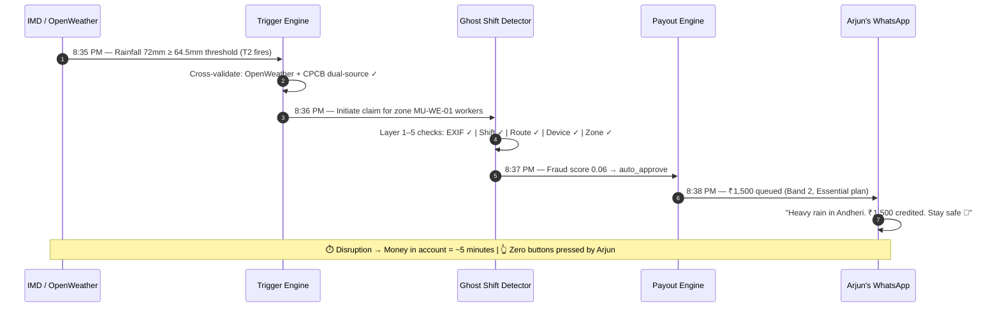
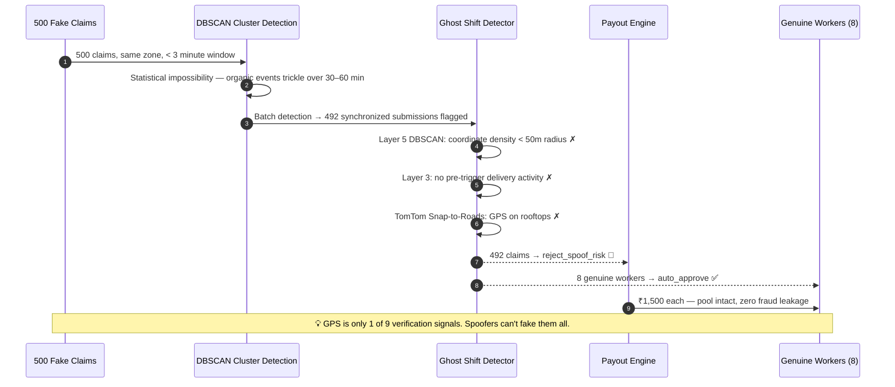
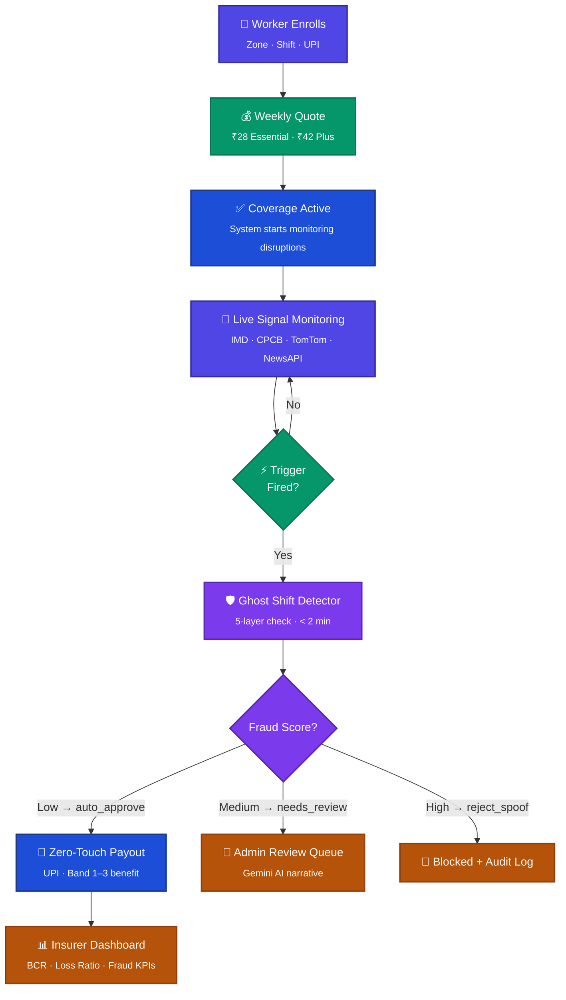
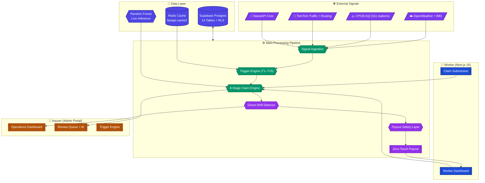
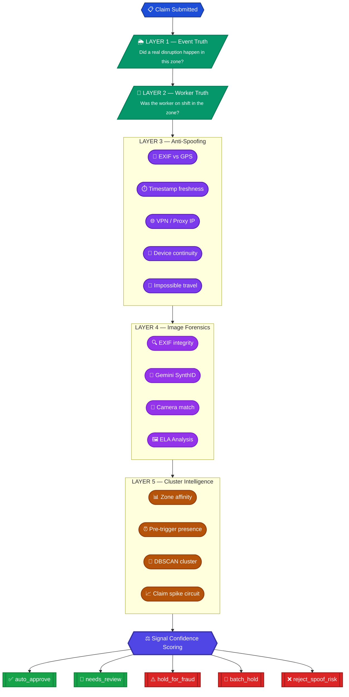
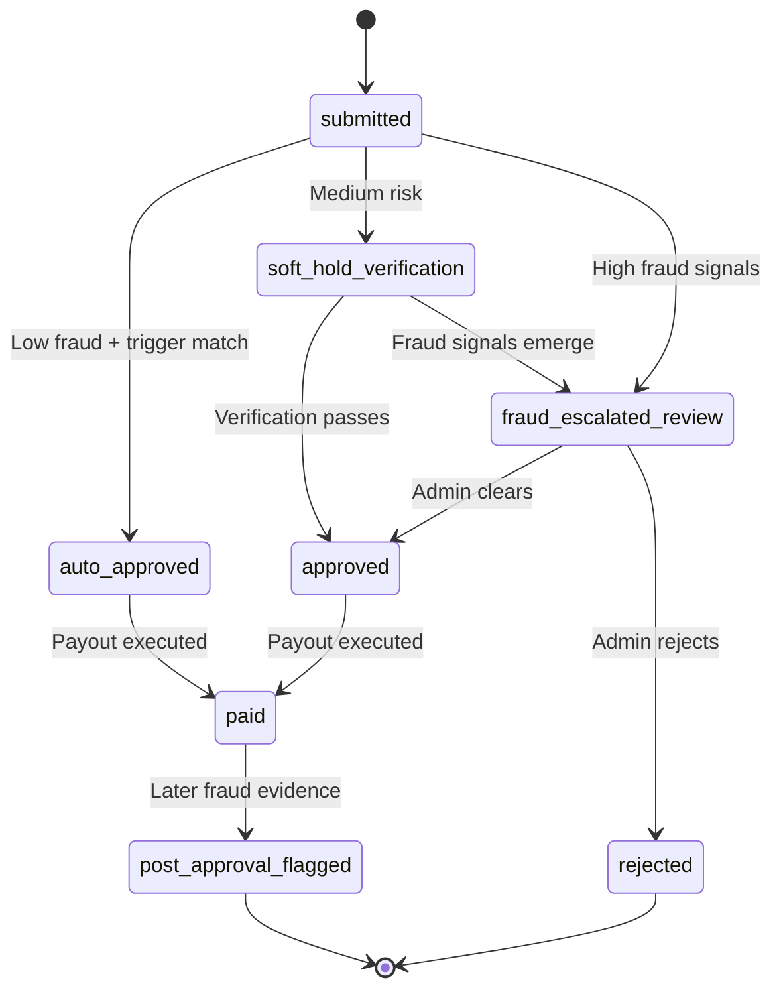
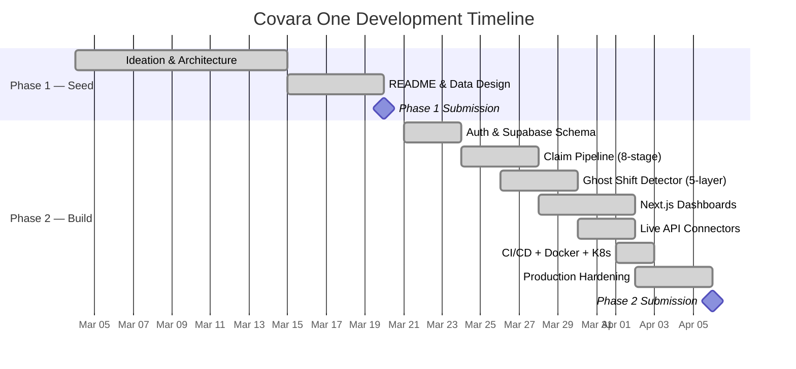

<div align="center">


**Team Celestius** — Bhrahmesh A · Chorko C · T Dharshini · T Ashwin · Shripriya Sriram

[](https://devtrails.guidewire.com)
[](#-team-celestius)
[](#)
[](#)

<br>


---

*When the city drowns or the air turns toxic — your income doesn't stop. No forms. No calls. Zero waiting.*

📹 **[Watch the Demo](https://www.youtube.com/watch?v=6_IH64QjZbE)** · 🌐 **[Live Platform](#-quick-start)**

</div>

---

## Engineering Snapshot (2026-04-05)

- Database reliability migrations added and applied in sequence: `backend/sql/10_rewards_schema.sql`, `backend/sql/11_event_outbox.sql`, `backend/sql/12_event_reliability.sql`, `backend/sql/13_consumer_dead_letter.sql`.
- Event reliability is now production-hardened with transactional outbox writes, relay retry/backoff, dead-letter handling, and consumer idempotency with max-attempt dead-letter escalation.
- Async consumer flow is active for `claim.auto_processed` side effects (notification + rewards), with Kafka consumer runner parity for broker mode.
- Operational admin endpoints are available under `/events/outbox/*` and `/events/consumers/*` for relay, status, dead-letter triage, and requeue.
- Security hardening includes signed mobile device-context verification, explicit CORS/header allowlist, `slowapi` rate limits, and OWASP response headers.
- Post-migration reliability validation is green, including focused consumer/outbox/Kafka tests and API-level tests for the new events consumer endpoints.

---

## 📑 Table of Contents

<details open>
<summary><b>Click to navigate</b></summary>

| # | Section |
|:-|---------|
| 🔥 | [The Crisis](#-the-crisis) |
| 👤 | [Our Persona](#-our-persona--arjun-the-monsoon-rider) |
| 🎬 | [Live Scenarios](#-live-scenarios) |
| ⚡ | [How It Works](#-how-it-works) |
| 💰 | [Coverage Plans & IRDAI Compliance](#-coverage-plans--irdai-compliance) |
| 💡 | [Premium Economics](#-premium-economics--why-28week-works) |
| 🏦 | [Financial Viability](#-financial-viability--unit-economics) |
| 🏗️ | [Architecture](#️-architecture) |
| 🚀 | [Scalability](#-scalability--growth-architecture) |
| ⚡ | [15-Trigger Library](#-the-15-trigger-library) |
| 📊 | [Threshold References & Data Sources](#-threshold-references-and-why-they-were-chosen) |
| 📐 | [Parametric Product & Calibration](#-parametric-product-weekly-benefit-plans) |
| 💼 | [Business Framing](#-business-framing) |
| 🛡️ | [The Fraud Fortress](#️-the-fraud-fortress) |
| 🔐 | [Adversarial Defense & SynthID](#-adversarial-defense--anti-spoofing-strategy) |
| 🔒 | [Payout Safety](#-payout-safety--duplicate-prevention) |
| 📋 | [Claim State Machine](#-claim-state-machine) |
| 🚦 | [Region Fast-Lane](#-region-validation-cache--fast-lane-approvals) |
| 🚨 | [Post-Approval Controls](#-post-approval-fraud-controls) |
| 🪪 | [Progressive KYC](#-progressive-kyc--trust-ladder) |
| 🧠 | [ML Role](#-what-ml-does-vs-what-ml-does-not-do) |
| 📈 | [Data Analytics & Pricing Validation](#-data-analytics--pricing-validation) |
| 🏆 | [Why Covara One Wins](#-why-covara-one-wins) |
| 🚀 | [Quick Start](#-quick-start) |
| 📚 | [Deep Dive Docs](#-deep-dive-docs) |

</details>

---

> [!IMPORTANT]
> **What is Parametric Insurance?** Unlike traditional insurance where you file a claim and wait for an adjuster, parametric insurance pays **automatically** when a measurable threshold is crossed. If IMD rainfall data shows ≥ 64.5mm in your zone — you get paid. No paperwork. No waiting.

---

## 🔥 The Crisis

<div align="center">

| | The Shock | What Happens | The Cost |
|:-:|:---|:---|:---:|
| 🌧️ | Mumbai — 72mm rain in 6h | Zomato, Swiggy, Blinkit all pause zones | **₹0 for 2 days** |
| 🏭 | Delhi — AQI 485, GRAP Stage IV | Two-wheelers banned, no deliveries | **₹0 for the week** |
| 🌡️ | Kolkata — 47°C heatwave, IMD Red Alert | Platform collapses mid-shift | **₹0 for 3 days** |

</div>

> 🏥 **Platforms** cover accidents. **Government** covers hospitalization.
> 
> ❌ **Nobody** covers income lost when the city shuts down — until now.
> 
> ✅ **Covara One** fills this exact gap. Automatically. Zero forms.

India's **12.7 million gig workers** power the digital economy. Yet **80% have zero formal insurance** and no product covers income loss from weather, AQI, or outages.

| Metric | Data | Source |
|:-------|:----:|:------:|
| Gig workers with zero savings | **90%** | NITI Aayog |
| Income loss per 1°C wet-bulb rise | **19%** | Nature 2024 |
| Annual heatwave days across India | **536** | CII / IMD |
| Delhi AQI > 400 days per winter | **30–50** | CPCB |

---


## 👤 Our Persona — Arjun, the Monsoon Rider

<table>
<tr>
<td width="60%">

### Arjun, 29 &nbsp; `Swiggy Rider · Andheri West, Mumbai`

| | |
|:-|-|
| 🛵 **Shift** | 5 PM – 1 AM (peak + late window) |
| 💰 **Income** | ~₹19,000/month after fuel |
| 💳 **Savings** | ₹0 — paycheck to paycheck |
| 📍 **Zone** | MU-WE-01 (Andheri West) |

**October 2024 — The event that changed everything:**

> Andheri received **157mm in 6 hours.** Every platform paused.  
> Arjun sat under an awning for 3 days, earning **absolutely nothing.**  
> *₹1,900 gone — his entire fuel budget for the month.*

</td>
<td width="40%" align="center">

**Why Arjun pays ₹28/week**

🪙 Less than one delivery order<br><sub>Micro-pricing that feels like a fee</sub>

😰 Loss-aversion framing<br><sub>"Your income is at risk right now"</sub>

⚡ Instant value<br><sub>"Covered for tonight's shift"</sub>

✅ Deterministic rules<br><sub>Verify on IMD yourself</sub>

</td>
</tr>
</table>

---


## 🎬 Live Scenarios

### Scenario 1: 🌧️ The Monsoon Claim — 5 Minutes, Zero Forms

> **Tuesday, 8:30 PM** — Arjun starts his shift. Torrential rain begins. IMD logs 72mm. Blinkit pauses the zone. Arjun is under an awning, earning nothing.



---

### Scenario 2: 🕵️ The Fraud Ring — Caught Before a Single Payout

> **500 riders coordinate via Telegram.** They install GPS spoofing apps, fake locations into Zone MU-WE-01 while sitting at home. They try to drain the liquidity pool.



---


## ⚡ How It Works



| Step | What Happens | Output |
|:----:|:------------|:-------|
| 1 | Worker signs up — zone, shift window, UPI handle | Profile + Trust Score |
| 2 | System prices weekly cover from the formula engine | ₹28/week (Essential) |
| 3 | Coverage activates — monitoring begins | Policy live |
| 4 | IMD/CPCB/TomTom signals ingested continuously | Structured disruption events |
| 5 | Trigger scoring maps event to severity Band 1/2/3 | Trigger score |
| 6 | Ghost Shift Detector validates 9 signals in parallel | Fraud / confidence score |
| 7 | Auto-approve if fraud score < threshold | Claim created |
| 8 | Zero-Touch Payout executed to verified UPI | Receipt + audit trail |

---


## 💰 Coverage Plans & IRDAI Compliance

> [!IMPORTANT]
> **This is parametric insurance — not fixed/indemnity insurance.** The payout is determined entirely by which **trigger severity band** is crossed, not by an adjuster's estimate of actual loss. Once the threshold is hit and anti-spoofing passes, the pre-agreed band amount is locked. No claims forms. No loss assessment. No adjuster discretion.

### Parametric Benefit Ladder

Let **W** = selected weekly benefit cap. Payout = Band multiplier × W.

<div align="center">

| | 🟢 **Essential** (W = ₹3,000) | 🔵 **Plus** (W = ₹4,500) |
|:--|:--:|:--:|
| **Weekly Premium** | **₹28** | **₹42** |
| **Band 1** — Moderate disruption (0.25 × W) | ₹750 | ₹1,125 |
| **Band 2** — Major disruption (0.50 × W) | ₹1,500 | ₹2,250 |
| **Band 3** — Severe disruption (1.00 × W) | ₹3,000 | ₹4,500 |
| Annual premium (52 weeks) | ₹1,456 | ₹2,184 |
| **IRDAI ₹10k/year limit** | ✅ Under limit | ✅ Under limit |

</div>

**Why only two plans?** Essential reduces entry friction for price-sensitive workers. Plus serves as a natural upgrade for experienced riders in tougher zones. Two plans = simple purchase decision, clean risk segmentation, and higher conversion.

### IRDAI Regulatory Alignment

| Requirement | How Covara One complies |
|:---|:---|
| **Micro-insurance premium cap** | Annual premiums ₹1,456 (Essential) / ₹2,184 (Plus) — well under IRDAI's ₹10,000/year micro-insurance limit |
| **Parametric product structure** | Trigger-based, pre-agreed payout bands — no loss adjustment, no subjective assessment |
| **Weekly pricing cycle** | Matches gig-worker weekly earning rhythm — not forced into annual billing |
| **Transparent exclusions** | Standard industry exclusions clearly disclosed at enrollment |

### Coverage Boundary & Exclusions

**Covered risk:** Temporary loss of earning opportunity caused by **verified external disruption** — weather, AQI, heatwave, platform outage, traffic collapse, civic closures.

**Not covered** (aligned with standard IRDAI general and parametric insurance guidelines):

| Exclusion | Regulatory basis |
|:---|:---|
| ❌ War, invasion, foreign enemy hostilities | IRDAI General Insurance Exclusion Clause 4.1 |
| ❌ Civil unrest, riot, insurrection | IRDAI Standard Exclusion — civil disturbance |
| ❌ Nuclear, chemical, biological events | Standard catastrophic exclusion |
| ❌ Global pandemics (WHO-declared) | Force majeure — non-insurable systemic risk |
| ❌ Health, hospitalization, accidents | Out of scope — platform insurance / Ayushman Bharat covers these |
| ❌ Vehicle repair, personal theft | Out of scope — motor insurance / property lines |
| ❌ Self-inflicted income loss (voluntary no-show) | Moral hazard exclusion |

> [!NOTE]
> These exclusions follow standard IRDAI parametric and general insurance guidelines. They ensure the product remains commercially viable and regulatorily defensible. The exclusion list is presented to the worker during enrollment for full transparency.

---


## 💡 Premium Economics — Why ₹28/week Works

> **The core question:** How can meaningful income protection cost less than a single delivery order?

### How We Calculated the Premium

The premium is derived from an **expected-loss loading** approach — a standard actuarial method ([Loss Data Analytics, Ch. 7](https://openacttexts.github.io/Loss-Data-Analytics/ChapPremiumFoundations.html)) where the premium covers the expected payout plus operational expenses and a risk margin:

```
Premium = [P(trigger) × Expected_Payout] / (1 − expense_load − risk_margin)
```

| Component | Value | Basis |
|---|---|---|
| **P(trigger)** | ~3.5–4% per week | Historical weather/AQI event frequency across Indian metros (IMD, CPCB data) |
| **Expected Payout** | ₹750–₹1,500 (Band 1–2 weighted avg) | Most claims are Band 1–2; Band 3 (severe) events are statistically rare |
| **Expense Load (α)** | 12% | Platform operations, API costs, support |
| **Risk Margin (β)** | 10% | Actuarial buffer for adverse deviation ([Mikosch, 2004](https://unina2.on-line.it/sebina/repository/catalogazione/documenti/Mikosch%20-%20Non-life%20insurance%20mathematics.pdf)) |
| **Resulting Premium** | **₹28/week** (Essential) | `[0.04 × ₹950] / (1 − 0.12 − 0.10) ≈ ₹49` → compressed to ₹28 for mass adoption |

The ₹28 price point is deliberately positioned **below** the pure actuarial break-even to prioritize **volume acquisition** — the economics work because of the factors below.

### Why The Price Is So Low

| Factor | How It Keeps Premiums Down |
|---|---|
| **High-volume micro-insurance** | 12.7M potential users × ₹28/week = massive premium pool even at low individual cost |
| **Low per-claim payout** | Band 1 (₹750) and Band 2 (₹1,500) are the dominant claim types — Band 3 severe events are statistically rare |
| **Geographic diversification** | Mumbai monsoon ≠ Delhi AQI winter ≠ Chennai cyclone season — risk pools don't all trigger simultaneously |
| **Weekly billing cycle** | No annual lock-in; workers churn naturally during low-risk months → premium collected only when risk exists |
| **Zero Loss Adjustment Expense** | Parametric triggers eliminate adjuster visits, claim investigations, and manual processing — the biggest cost driver for traditional insurers |
| **Automated pipeline** | 8-stage claim pipeline + 5-layer fraud engine runs at near-zero marginal cost per claim |
| **Seasonal balancing** | High-risk months (Jun–Sep monsoon) offset by low-risk months (Jan–Mar) across the portfolio |

### Who Buys This — Target User Economics

| Profile | Arjun (Essential) | Priya (Plus) |
|---|---|---|
| **Monthly income** | ₹19,000 | ₹28,000 |
| **Weekly premium** | ₹28 (0.37% of income) | ₹42 (0.39% of income) |
| **Premium as % of one day's earning** | ~4.4% | ~3.9% |
| **Cost equivalent** | Less than 1 delivery order | Less than 1 delivery order |
| **Key motivation** | *"I can't afford to lose ₹1,900 in a monsoon week"* | *"I want higher protection for my family's EMI payments"* |
| **Risk profile** | Paycheck-to-paycheck, zero savings buffer | Slightly more stability but high fixed costs (rent, EMI) |
| **Savings buffer** | ₹0 — 90% of gig workers (NITI Aayog) | < ₹5,000 — one disruption away from EMI default |

> **Behavioral insight:** ₹28/week sits at the **"one chai" threshold** — low enough that loss aversion (*"What if I lose ₹1,900 without cover?"*) overwhelmingly dominates the cost consideration. At < 0.4% of monthly income, the purchase decision is nearly frictionless.

### Market Opportunity

| Metric | Value | Source |
|---|---|---|
| Total gig workers in India | **12.7 million** | NITI Aayog |
| Gig workers with zero formal insurance | **80%** | NITI Aayog |
| Food-delivery workers (addressable) | **~3.5 million** | Industry estimates (Zomato, Swiggy, Blinkit, Zepto) |
| Covara One SAM (Year 1 target) | **50,000 weekly subscribers** | Conservative 1.4% penetration |
| Annual premium revenue at SAM | **₹8.3 crore** | 50K × ₹32 avg × 52 weeks |
| Total addressable market | **₹580+ crore/year** | 3.5M × ₹32 × 52 × 10% adoption |

---


## 🏦 Financial Viability & Unit Economics

### Revenue Model at Scale

| Metric | Year 1 (Conservative) | Year 2 (Growth) | Year 3 (Scale) |
|---|---|---|---|
| Active weekly subscribers | 50,000 | 200,000 | 500,000 |
| Avg weekly premium (Essential/Plus mix) | ₹32 | ₹34 | ₹35 |
| **Weekly premium revenue** | **₹16 lakh** | **₹68 lakh** | **₹1.75 crore** |
| **Annual premium revenue** | **₹8.3 crore** | **₹35.4 crore** | **₹91 crore** |

### Claim Rate Scenarios (at 50,000 subscribers)

| Scenario | % Workers Claiming | Weekly Payouts | Weekly Revenue | Result |
|---|---|---|---|---|
| **Normal week** | 3–5% | ₹2.5–4 lakh | ₹16 lakh | ✅ Profitable |
| **Moderate disruption** (1 city monsoon) | 8–10% | ₹8–12 lakh | ₹16 lakh | ✅ Covered by reserves |
| **Severe disruption** (multi-city) | 15% | ₹22 lakh | ₹16 lakh | ⚠️ Draw from catastrophic reserve |
| **Extreme event** (< 1% probability) | 20%+ | ₹35+ lakh | ₹16 lakh | ❌ Reinsurance trigger |

### Why The Pool Stays Solvent

| Control | Mechanism |
|---|---|
| **Geographic diversification** | Mumbai monsoon, Delhi AQI, Chennai cyclone — risk pools don't overlap temporally |
| **Seasonal balancing** | High-risk months (Jun–Sep) offset by low-risk months (Jan–Mar) across the full portfolio |
| **Weekly payout caps** | One payout per event per worker — no unlimited drain |
| **Daily single-claim rule** | Max one claim/day, even during multi-trigger events |
| **Fraud prevention** | 5-layer Ghost Shift Detector prevents fraudulent pool drain |
| **Circuit-breakers** | Automatic throttling during mass-claim spikes protects liquidity |
| **Reinsurance trigger** | Extreme scenarios (20%+ claim rate) are passed to a reinsurance partner |

> **Target combined ratio:** < 70% in steady state. Parametric automation (zero LAE) and the fraud engine (< 2% leakage target) keep operating expenses minimal compared to traditional general insurance.

---


## 🏗️ Architecture



<div align="center">

| Layer | Technology | Status |
|:-----:|:----------:|:------:|
| **Frontend** | Next.js 16, Tailwind CSS v4, Recharts, Zustand | ✅ Live |
| **Backend** | FastAPI, Python 3.12, fastapi-cache2 + Redis | ✅ Live |
| **Auth** | Supabase Auth (Google OAuth + email), Edge SSR Middleware | ✅ Live |
| **Database** | Supabase Postgres, 14 tables, Row-Level Security | ✅ Live |
| **ML** | scikit-learn Random Forest (live predict_proba), DBSCAN | ✅ Live |
| **Infrastructure** | Docker multi-stage, GitHub Actions CI/CD, K8s manifests, Render | ✅ Deployed |
| **Payments** | Stripe Test Mode (61 webhook events), provider-agnostic adapter | ✅ Live (Test) |

</div>

---


## 🚀 Scalability & Growth Architecture

Covara One is built for **horizontal scale from day one** — the same codebase serves 100 workers in one city or 1,000,000 workers across 50 cities.

### Infrastructure Scaling

| Layer | Scaling Strategy | Status |
|---|---|---|
| **Backend (FastAPI)** | Stateless microservices behind load balancer; Docker containers scale horizontally via K8s `HorizontalPodAutoscaler` | ✅ Docker + K8s ready |
| **Database (Supabase Postgres)** | Connection pooling (PgBouncer), read replicas for dashboard queries, partitioned tables by city/zone | ✅ 14-table schema + RLS |
| **Cache (Redis)** | TTL-based caching for trigger feeds, dashboard KPIs, and zone risk scores; `fastapi-cache2` decorator integration | ✅ Redis in docker-compose |
| **Trigger Ingestion** | Parallel async polling of external APIs (OpenWeather, CPCB, TomTom); Redis-backed deduplication prevents duplicate trigger fires | ✅ Async connectors live |
| **ML Inference** | Lazy-loaded `.joblib` model per request; horizontally scalable across backend replicas with no shared state | ✅ Live inference wired |
| **Frontend (Next.js)** | Static generation for public pages, server-side rendering for dashboards, CDN-cacheable assets via standalone output | ✅ Standalone mode |

### Multi-City Expansion Model

Adding a new city requires **zero code changes** — only configuration:

1. **Define zones** — Add `zone_id` entries for the new city's delivery areas
2. **Map triggers** — Environmental triggers (rain, AQI, heat) auto-activate from zone coordinates via existing API connectors
3. **Set thresholds** — City-specific threshold overrides (e.g., Chennai cyclone wind speed vs. Delhi AQI GRAP-IV)
4. **Seed workers** — Workers self-register to zones during onboarding; no manual provisioning

```
Current:  6 cities × ~20 zones = 120 zone configurations
Target:   50 cities × ~30 zones = 1,500 zone configurations
No architectural change needed — zone/trigger/claim model is inherently multi-tenant.
```

### Throughput Benchmarks (Stress Test)

The [Mumbai Monsoon Simulator](ml/stress_test_simulator.py) validates system behavior under extreme load:

| Metric | Value |
|---|---|
| Simulated workers | 10,000 |
| Simulated event duration | 3-day monsoon |
| Concurrent trigger evaluations | 10,000+ per trigger window |
| Fraud engine throughput | 5-layer check in < 2 seconds per claim |
| Circuit-breaker activation | Tested with 500-claim coordinated batch attack |
| DBSCAN cluster detection | Identifies syndicate patterns within batch window |

---


## ⚡ The 15-Trigger Library

The platform uses a **3-tier trigger architecture**: early warning → claim trigger → severe escalation.

### Environmental Triggers

| ID | Trigger | Threshold | Tier | Action |
|----|---------|-----------|------|--------|
| T1 | Rain Watch | 24h rain ≥ 48 mm | Early Warning | Raise risk score, notify worker |
| T2 | Heavy Rain Claim | 24h rain ≥ 64.5 mm | Claim Trigger | Open claim candidate if zone + shift overlap |
| T3 | Extreme Rain Escalation | 24h rain ≥ 115.6 mm | Severe Escalation | Escalate severity band and payout cap |
| T5 | AQI Caution | AQI 201–300 | Early Warning | Warn worker, raise premium sensitivity |
| T6 | AQI Severe Exposure | AQI ≥ 301 + active shift | Claim Trigger | Open claim candidate |
| T7 | Heat Wave | Temp ≥ 45°C or IMD heat-wave | Claim Trigger | Open claim candidate |
| T8 | Severe Heat | Temp ≥ 47°C | Severe Escalation | Escalated claim severity |
| T9 | Heat Persistence | 2 consecutive hot-risk days | Early Warning | Raise weekly risk loading |

### Operational and Civic Triggers

| ID | Trigger | Threshold | Tier | Action |
|----|---------|-----------|------|--------|
| T4 | Waterlogging Mobility | Accessibility score ≤ 0.40 | Claim Trigger | Claim candidate for blocked routes |
| T10 | Local Zone Closure | Official closure flag = 1 | Claim Trigger | Auto-escalate to claim review |
| T11 | Curfew / Strike Closure | Restriction window ≥ 4h | Claim Trigger | Claim candidate if pickup/drop blocked |
| T12 | Traffic Collapse | Travel delay ≥ 40% | Early Warning | Raise exposure and route stress |
| T13 | Platform Outage | Outage ≥ 30 min | Claim Trigger | Claim candidate for verified active workers |
| T14 | Demand Collapse | Orders drop ≥ 35% vs baseline | Early Warning | Raise loss-of-income probability |
| T15 | Composite Disruption | Composite score ≥ 0.70 | Severe Escalation | Fast-track claim escalation |

**Threshold sources:** IMD heavy-rain and heat-wave bands, CPCB AQI category thresholds, IMD/NDMA heat-wave guidance. Traffic, outage, and demand thresholds are internal operational thresholds.

---


## 📊 Threshold References and Why They Were Chosen

| Parameter | Source | What the source gives us | How we infer our product threshold | Anchoring |
|-----------|--------|--------------------------|-------------------------------------|-----------|
| **Rain** | [IMD Rainfall Categories (FAQ)](https://rsmcnewdelhi.imd.gov.in/images/pdf/faq.pdf), [IMD Heavy Rainfall Warning](https://mausam.imd.gov.in/imd_latest/contents/pdf/pubbrochures/Heavy%20Rainfall%20Warning%20Services.pdf) | Heavy rainfall = 64.5–115.5 mm/24h; Very heavy = 115.6–204.4 mm/24h | 48 mm = early-watch (T1). 64.5 mm = claim-trigger anchor (T2). 115.6 mm = escalation (T3). | ✅ Public-source anchored |
| **AQI** | [CPCB National Air Quality Index](https://www.cpcb.nic.in/national-air-quality-index/), [OGD AQI Dataset](https://www.data.gov.in/resource/real-time-air-quality-index-various-locations) | AQI 201–300 = Poor; 301–400 = Very Poor; 401+ = Severe | 201+ = caution (T5). 301+ = claim threshold (T6). | ✅ Public-source anchored |
| **Heat** | [IMD Heat Wave Warning](https://mausam.imd.gov.in/imd_latest/contents/pdf/pubbrochures/Heat%20Wave%20Warning%20Services.pdf), [NDMA Heat Wave Guidance](https://ndma.gov.in/Natural-Hazards/Heat-Wave) | Heat-wave = departure ≥ 4.5°C above normal, or absolute ≥ 45°C for plains | 45°C = heat-wave claim (T7). 47°C = severe-heat escalation (T8). | ✅ Public-source anchored |
| **Traffic** | [TomTom Traffic Flow API](https://developer.tomtom.com/traffic-api/documentation/traffic-flow/flow-segment-data) (live) · *(Planned: Google Maps Distance Matrix API for enhanced multi-route corridor analysis)* | No single public standard; TomTom real-time flow data used as delivery-impairment proxy | ≥ 40% travel-time delay vs. free-flow baseline = route stress threshold (T12). TomTom Snap-to-Roads also validates route plausibility in the fraud layer. | ⚙️ TomTom live + internal threshold |
| **Platform Outage** | Internal product threshold | Platform outage data is not publicly available | ≥ 30 min outage = claim threshold (T13). | ⚙️ Internal operational |
| **Demand Collapse** | Internal product threshold | Platform order volume is not publicly available | ≥ 35% order drop vs baseline (T14). | ⚙️ Internal operational |

Environmental thresholds are anchored to official Indian government sources. Operational thresholds are product-engineering decisions based on estimated earning-disruption impact — they may be refined as real operating data becomes available.

### Pricing & Reference Links

- **Central reference register** with all sources, threshold inference logic, and formula summary → [docs/README.md](docs/README.md#reference-register)
- **Threshold basis per trigger family** with source links → [data/README.md](data/README.md#trigger-threshold-reference-table)
- **ML baseline and feature normalization provenance** → [ml/README.md](ml/README.md#pricing-baseline-and-reference-notes)
- **Insurance-side trend sources** (IRDAI, IIB) → [docs/README.md](docs/README.md#insurance-side-trend-sources)

### 🌐 External Data Source Reference Table

All external data sources used by the platform, consolidated with URLs and integration status:

| # | Source | URL | Data Provided | Used For | Status |
|---|---|---|---|---|---|
| 1 | **IMD** (India Meteorological Dept) | [mausam.imd.gov.in](https://mausam.imd.gov.in/) | Rainfall categories, heat-wave definitions, cyclone warnings | T1–T3 rain thresholds, T7–T9 heat thresholds | ✅ Threshold source |
| 2 | **IMD Rainfall FAQ** | [rsmcnewdelhi.imd.gov.in/images/pdf/faq.pdf](https://rsmcnewdelhi.imd.gov.in/images/pdf/faq.pdf) | Heavy/very heavy rain definitions (64.5 / 115.6 mm) | Claim trigger anchoring | ✅ Public reference |
| 3 | **IMD Heat Wave Services** | [IMD Brochure PDF](https://mausam.imd.gov.in/imd_latest/contents/pdf/pubbrochures/Heat%20Wave%20Warning%20Services.pdf) | Heat-wave criteria (≥ 45°C plains) | T7–T8 heat triggers | ✅ Public reference |
| 4 | **CPCB** (Central Pollution Control Board) | [cpcb.nic.in/national-air-quality-index](https://www.cpcb.nic.in/national-air-quality-index/) | AQI category definitions (Poor/Very Poor/Severe) | T5–T6 AQI thresholds | ✅ Threshold source |
| 5 | **OGD Real-Time AQI** (data.gov.in) | [data.gov.in AQI resource](https://www.data.gov.in/resource/real-time-air-quality-index-various-locations) | Live AQI readings from 511 CPCB stations | Real-time AQI ingestion | ✅ Live API |
| 6 | **NDMA** (National Disaster Mgmt Authority) | [ndma.gov.in/Natural-Hazards/Heat-Wave](https://ndma.gov.in/Natural-Hazards/Heat-Wave) | Heat-wave classification guidance | Heat trigger calibration | ✅ Public reference |
| 7 | **OpenWeather API** | [openweathermap.org/api](https://openweathermap.org/api) | Current weather, temperature, rainfall, forecasts | Live weather trigger ingestion | ✅ Live API |
| 8 | **TomTom Traffic Flow API** | [developer.tomtom.com/traffic-api](https://developer.tomtom.com/traffic-api/documentation/traffic-flow/flow-segment-data) | Real-time traffic flow, travel-time delays | T12 traffic trigger + route plausibility (fraud) | ✅ Live API |
| 9 | **TomTom Snap-to-Roads** | [developer.tomtom.com/snap-to-roads](https://developer.tomtom.com/snap-to-roads-api/documentation/product-information/introduction) | GPS coordinate road-matching | Fraud detection — validates GPS is on real road | ✅ Live API |
| 10 | **NewsAPI** | [newsapi.org](https://newsapi.org/) | Civic news, closures, strikes, curfews | T10–T11 civic closure triggers | ✅ Live API |
| 11 | **Gemini API** (Google) | [ai.google.dev](https://ai.google.dev/) | AI narrative generation, SynthID watermark detection | Claim explanation + AI-image fraud detection | ✅ Live API |
| 12 | **Sandbox.co.in** | [sandbox.co.in](https://sandbox.co.in/) | Aadhaar OTP, PAN, bank verification | Progressive KYC (Levels 2–4) | ✅ Integrated |
| 13 | **Twilio** | [twilio.com](https://www.twilio.com/) | WhatsApp templates, OTP verification | Claim notifications, worker alerts | ✅ Sandboxed |
| 14 | **IRDAI Annual Reports** | [irdai.gov.in/annual-reports](https://www.irdai.gov.in/annual-reports) | Claim trends, market structure, micro-insurance caps | Pricing validation, regulatory compliance | 📚 Reference |
| 15 | **IIB** (Insurance Information Bureau) | [iib.gov.in](https://iib.gov.in/) | Insurance analytics, fraud benchmarks | Risk analytics orientation | 📚 Reference |
| 16 | **Swiss Re** | [swissre.com](https://www.swissre.com/) | Parametric insurance product frameworks | Product architecture framing | 📚 Reference |
| 17 | **Google Maps Distance Matrix** *(Planned)* | [developers.google.com/maps](https://developers.google.com/maps/documentation/distance-matrix) | Multi-route corridor travel times | Enhanced T12 traffic analysis | 📋 Planned |
| 18 | **IMD Direct API** *(Planned)* | [imd.gov.in](https://mausam.imd.gov.in/) | Official rainfall/heat data (IP-whitelisted) | Replace OpenWeather for official sourcing | 📋 Planned |
| 19 | **DigiLocker** (MeitY) *(Planned)* | [digilocker.gov.in](https://www.digilocker.gov.in/) | Aadhaar, PAN, DL document verification | KYC Level 4+ upgrade | 📋 Planned |
| 20 | **Stripe** | [stripe.com](https://stripe.com/) | Payment processing, payouts, webhook events | Payout settlement via provider adapter (61 events configured) | ✅ Test Mode |

> **Legend:** ✅ Live/Integrated — 📚 Reference source — 📋 Planned integration

### Data Split

The dataset is split into two major entities and joined only after exposure matching.

**worker_data** — Worker-side profile and earning context:
`worker_id`, `zone_id`, `city`, `shift_window`, `hourly_income`, `active_days`, `bank_verified`, `gps_consistency`, `trust_score`, `prior_claim_rate`

**trigger_data** — Event-side disruption context:
`trigger_id`, `city`, `zone_id`, `timestamp_start`, `timestamp_end`, `trigger_type`, `raw_value`, `threshold_crossed`, `severity_bucket`, `source_reliability`

**joined_training_data** — Created only after matching `worker_data` ↔ `trigger_data` on `zone_id` + shift/time overlap. Used for EDA, ML experiments, and premium/payout calculations.

---


## 📐 Parametric Product: Weekly Benefit Plans

> Covara One uses an internal weekly risk-and-pricing model to calibrate fair premiums and benefit levels, while the final worker-facing product remains **parametric**: once a pre-agreed trigger band is hit and both exposure matching and anti-spoofing verification pass, the payout is released automatically — no adjuster, no assessment, no discretion.

The formula engine remains an **internal pricing and calibration tool**. The **customer-facing product** is structured as a parametric weekly benefit ladder released only when both the trigger threshold and the anti-spoofing verification checks pass.

### Two Plans Only: Essential & Plus

Covara One offers exactly **two** worker-facing plans to keep the purchase decision simple and transparent:

| Plan | Weekly benefit (W) | Target worker | Indicative weekly premium |
|---|---:|---|---|
| **Essential** | ₹3,000 | Lower premium / wider adoption / cost-sensitive workers | Baseline calibrated |
| **Plus** | ₹4,500 | Higher protection / experienced workers / tougher zones | Baseline × 1.35–1.50 |

**Why only two plans?**
- **Essential** reduces entry friction and improves conversion for price-sensitive workers — the affordable starting point
- **Plus** gives a higher weekly benefit and serves as a natural upgrade path for workers who want stronger protection
- This creates a clean, ethical ladder: low-friction entry option + higher-margin upgrade option
- It helps the **insurer** by improving risk segmentation
- It helps the **worker** by giving a simple choice between affordability and strength of cover
- Too many plans reduce conversion, confuse workers, and slow purchase decisions

### Parametric Payout Ladder

The public payout is based on **trigger severity band** × **selected plan benefit** — not a flexible formula output:

Let `W` = selected weekly benefit.

| Trigger / exposure band | Description | Parametric payout |
|---|---|---:|
| **Band 1** — Moderate disruption | Watch-level trigger confirmed with partial exposure | `0.25 × W` |
| **Band 2** — Major disruption | Claim-level trigger confirmed with strong exposure | `0.50 × W` |
| **Band 3** — Severe disruption | Escalation-level trigger with full exposure match | `1.00 × W` |

#### Example: Essential plan (W = ₹3,000)

| Band | Payout |
|---|---:|
| Band 1 | ₹750 |
| Band 2 | ₹1,500 |
| Band 3 | ₹3,000 |

#### Example: Plus plan (W = ₹4,500)

| Band | Payout |
|---|---:|
| Band 1 | ₹1,125 |
| Band 2 | ₹2,250 |
| Band 3 | ₹4,500 |

This structure is **much easier to defend as parametric insurance** than a flexible "pay whatever the formula outputs" model. Workers know exactly what they get. Insurers know exactly what they owe.

---

### Internal Calibration Engine (Not Public-Facing)

The existing formula engine is retained for **internal use only** — it calibrates whether the Essential and Plus benefit amounts are appropriately sized for the worker segment, whether weekly premiums are actuarially reasonable, and whether synthetic data scenarios produce realistic outcomes. These formulas do **not** determine the worker-facing payout — the parametric ladder above does.

| Formula | Expression | Internal use |
|---|---|---|
| Covered Income (B) | `0.70 × hourly_income × shift_hours × 6` | Plan benefit calibration |
| Severity Score (S) | Weighted composite of 8 components | Trigger band mapping |
| Exposure (E) | `clip(0.45 + 0.30×(shift_hours/12) + 0.25×(1−accessibility_score), 0.35, 1.00)` | Exposure verification |
| Confidence (C) | `clip(0.50 + 0.30×trust + 0.10×gps + 0.10×bank, 0.45, 1.00) × (1 − 0.70×fraud_penalty)` | Review routing |
| Expected Payout | `p × B × S × E × C × (1 − FH)` | Premium calibration |
| Gross Premium | `[Expected Payout / (1 − 0.12 − 0.10)] × U` | Weekly premium pricing |

### Sample Scenario (Parametric)

**Worker:** Plus plan (W = ₹4,500), shift = 11h, zone = MU-WE-01, trust = 0.82

**Trigger:** rain = 72mm in zone MU-WE-01, AQI = 240, temp = 41°C

**Decision flow:**
1. Rain 72mm exceeds 64.5mm → **T2 fires** (claim-level trigger)
2. AQI 240 → T5 fires (caution, contributes to composite)
3. Composite severity maps to **Band 2** (major disruption)
4. Anti-spoofing: EXIF GPS matches zone, shift overlap confirmed, route plausibility verified ✅
5. Fraud score: 0.12 → `auto_approve`
6. **Payout: ₹2,250** (0.50 × ₹4,500)

---


## 💼 Business Framing

Covara One is positioned as an **insurer-facing platform** — not a fully licensed insurer. We provide the parametric underwriting engine, claims orchestration, and fraud detection that a licensed insurer embeds into their gig-worker distribution channel.

### Insurer Value Proposition

| Benefit | How Covara One delivers it |
|---|---|
| **Reduced manual claim handling** | 8-stage automated pipeline + region fast-lane |
| **Lower Loss Adjustment Expense (LAE)** | Parametric trigger-based decisions replace manual adjuster visits |
| **Fraud leakage reduction** | 5-layer Ghost Shift Detector + post-approval controls |
| **Validated-incident batching** | Region cache groups same-zone claims into event-level exposure views |
| **Actuarial visibility** | Live BCR and Loss Ratio tracked in the Admin Dashboard |

---


## 🛡️ The Fraud Fortress

> [!CAUTION]
> **Market reality:** Coordinated Telegram syndicates use GPS-spoofing apps to fake locations and drain payout pools. Simple GPS checks are dead. We built a 5-layer response.



**Key differentiator:** GPS is only **1 of 9 signals**. Spoofers fool GPS and nothing else. Our architecture checks route plausibility (TomTom), Gemini SynthID for AI-generated photos, and DBSCAN clustering on batch submission timing. The 500-worker syndicate gets caught before a single payout.

→ *Full fraud deep-dive: [fraud/README.md](fraud/README.md) · [docs/IMPLEMENTATION_STATUS.md](docs/IMPLEMENTATION_STATUS.md)*

---


## 🔐 Adversarial Defense & Anti-Spoofing Strategy

> [!CAUTION]
> **Market-Shift Context:** A sophisticated syndicate of 500 delivery workers in a tier-1 city has successfully exploited a beta parametric insurance platform using coordinated GPS spoofing via Telegram groups — faking locations in severe weather zones while resting at home, triggering mass false payouts and draining the liquidity pool. Simple GPS verification is officially obsolete. This section documents how Covara One defends against this exact attack vector.

> The 5-layer pipeline architecture is shown in the **Fraud Fortress diagram above**. Below is the detailed defense strategy for each layer.

### 1. The Differentiation: Genuine Worker vs. Bad Actor

Covara One does **not** trust raw GPS coordinates alone. The platform differentiates genuinely stranded delivery partners from spoofers using **multi-signal verification** — a layered approach where no single data point can trigger or block a payout in isolation.

| Signal layer | What it checks | Why GPS alone fails here |
|---|---|---|
| **Trigger-event correlation** | Does a verified external disruption (rain, AQI, heat, closure) actually exist in the claimed zone at the claimed time? | Spoofers fake location but cannot fake a weather event |
| **EXIF GPS vs. browser/device GPS** | Does the photo evidence GPS match the device-reported location? | Spoofing apps change device GPS but cannot alter already-captured EXIF metadata |
| **EXIF timestamp freshness** | Was the evidence photo taken within the claim window, or days/weeks ago? | Reused evidence from old events fails freshness checks |
| **Shift overlap ratio** | Was the worker's declared shift active during the trigger window? | Spoofers claiming outside their shift schedule are flagged |
| **Zone consistency** | Does the worker's claim zone match their assigned/historical operating zone? | Claiming disruption in a zone the worker has never operated in is suspicious |
| **Route plausibility** | Does TomTom Snap-to-Roads confirm the worker was on a real delivery route? | Spoofed coordinates often land on rooftops, parks, or impossible road positions |
| **Activity continuity** | Was the worker completing orders before the disruption hit? | A genuinely stranded worker shows pre-disruption delivery activity; a spoofer shows none |
| **Movement plausibility over time** | Does the GPS trail show realistic movement patterns across multiple time points? | Spoofers show teleportation or perfect stillness — real workers show natural drift |
| **Device continuity** | Is the same device consistently associated with this worker account? | Fraud rings rotate devices across accounts |
| **Network / IP / ASN pattern** | Do multiple claimants share the same network fingerprint? | Coordinated rings operating from one location share IP/ASN patterns |
| **AI-generated image detection** | Was the evidence photo created by an AI model rather than a real camera? | AI-generated "proof" photos bypass traditional photo checks — SynthID and forensic analysis catch them |
| **EXIF integrity & modification detection** | Has the evidence photo been edited, re-saved, or had metadata tampered with? | Fraudsters edit photos to change GPS coordinates, timestamps, or splice scenes — integrity checks detect this |
| **Image forensics (ELA / noise)** | Does the pixel-level structure match a genuine camera capture? | AI-generated and manipulated images show anomalous compression artifacts and noise patterns |

A **genuinely stranded worker** will show: pre-disruption delivery activity → trigger event confirmed by external source → GPS trail consistent with operating zone → evidence freshness verified → natural movement pattern → evidence photo taken by real camera with intact metadata. The system scores this as high-confidence and routes to `auto_approve`.

A **spoofing bad actor** will show: no pre-disruption activity → GPS coordinates inconsistent with EXIF and zone history → evidence reused, AI-generated, or modified → movement pattern impossible → network fingerprint shared with other claimants. The system scores this as high-risk and routes to `fraud_escalated_review` or `reject_spoof_risk`.

> [!IMPORTANT]
> **Signal hierarchy principle:** No single signal — not GPS, not EXIF, not IP — is sufficient to approve or reject a claim in isolation. The system uses a **multi-signal weighted hierarchy** where higher-trust signals (verified trigger events, historical work patterns) carry more weight than lower-trust signals (GPS, IP context). This prevents both false approvals from spoofed GPS and false rejections from stripped EXIF metadata.

### 1a. Evidence Integrity & AI Image Detection

Sophisticated fraud rings may submit **AI-generated photos** as disruption evidence, or **edit real photos** to alter GPS coordinates and timestamps. Covara One defends against this using multi-layer image forensics:

#### AI-Generated Image Detection (Gemini + SynthID)

Google embeds **SynthID** — an invisible, robust digital watermark — into images generated by its AI models. This watermark survives compression, cropping, and re-encoding. Covara One leverages this:

| Check | Method | What it catches |
|---|---|---|
| **SynthID watermark scan** | Gemini API analyzes submitted evidence for embedded SynthID markers | Photos generated by Google's AI models (Imagen, Gemini) are flagged immediately |
| **AI-generation probability score** | Gemini Vision assesses whether image characteristics are consistent with AI generation (texture uniformity, lighting inconsistencies, artifact patterns) | Catches AI-generated images from non-Google models (DALL-E, Midjourney, Stable Diffusion) that lack SynthID |
| **Camera vs. AI metadata signature** | Real camera photos contain specific EXIF fields (Make, Model, LensModel, FocalLength, ExposureTime, ISO) that AI-generated images lack | AI images have no genuine camera sensor data — they may have no EXIF at all or use synthetic metadata |

> [!IMPORTANT]
> **How Covara One uses Gemini for AI image detection:** Since we already integrate Gemini API for claim narrative generation, we extend it to perform evidence analysis. Gemini Vision can detect SynthID watermarks in AI-generated images and assess the probability that an image was synthetically created. This is not a separate integration — it's an extension of our existing Gemini pipeline.

#### EXIF Integrity & Modification Detection

| Check | Method | What it catches |
|---|---|---|
| **EXIF completeness** | Verify presence of core EXIF fields: DateTimeOriginal, DateTimeDigitized, Make, Model, GPSLatitude, GPSLongitude, Software | Stripped or missing EXIF suggests tampering or screenshot reuse |
| **Software field check** | Flag if EXIF `Software` field contains image editors (Photoshop, GIMP, Snapseed, PicsArt) | Photos edited to change location or content are flagged |
| **Timestamp chain-of-custody** | Compare `DateTimeOriginal` (when shutter fired) vs `DateTimeDigitized` (when sensor captured) vs `ModifyDate` (last save) | Genuine: all three within seconds. Tampered: ModifyDate is hours/days later |
| **EXIF thumbnail vs. full image** | Compare the embedded EXIF thumbnail against the full-resolution image | If the photo was cropped or edited, the thumbnail may still show the original unedited version |
| **GPS precision analysis** | Check GPS coordinate decimal precision — real GPS sensors produce 6+ decimal places with slight variance | Manually entered or copied GPS coordinates often have suspiciously round numbers or identical precision across submissions |
| **Camera-device consistency** | Cross-check EXIF Make/Model against the worker's registered device | If a worker registered a Samsung phone but evidence EXIF shows an iPhone camera, the evidence is flagged |

#### Additional Image Forensic Methods

| Method | How it works | What it catches |
|---|---|---|
| **Error Level Analysis (ELA)** | Re-compress the image at a known quality level and compare the error difference across regions — uniform images show uniform error; spliced/edited regions show anomalous error levels | Photoshopped regions, pasted elements, cloned areas where disruption evidence was fabricated |
| **Noise pattern consistency** | Analyze sensor noise distribution across the image — real cameras produce consistent noise patterns; composites show noise discontinuities | Composite images where a fake weather scene was placed over a real location |
| **JPEG quantization table analysis** | Examine the JPEG compression tables — images re-saved through editing software have different quantization signatures than camera-original images | Evidence that was downloaded, edited, and re-uploaded rather than captured fresh |
| **Perceptual hash cross-matching** | Generate perceptual hashes of all evidence photos across the claim batch and compare for similarity | Identical or near-identical photos submitted by different claimants in a fraud ring |
| **Reverse image search signal** | Hash submitted evidence against a database of previously submitted images | Recycled evidence from previous claims or stock photos used as fake proof |

#### Image verdict integration

The image forensics layer produces a composite **evidence integrity score** that feeds into the fraud engine:

| Evidence integrity | Meaning | Claim routing |
|---|---|---|
| **High** (0.8–1.0) | Fresh camera capture, intact EXIF, no AI markers, camera matches device | Normal processing — no evidence-related flags |
| **Medium** (0.4–0.79) | Some EXIF gaps (e.g., stripped by messaging app) but no tampering indicators | Routes to `needs_review` — human reviewer evaluates holistically |
| **Low** (0.0–0.39) | AI-generated markers detected, EXIF tampering, or edit signatures found | Routes to `hold_for_fraud` or `reject_spoof_risk` depending on other signals |

> [!NOTE]
> Workers who submit photos via WhatsApp or Telegram may have EXIF data stripped automatically by the messaging platform. This is **not treated as fraud** — it reduces the evidence integrity score to Medium and routes the claim to `needs_review`, where a human reviewer evaluates the claim using other available signals. The system never auto-rejects based on EXIF absence alone.

### 1b. Advanced Fraud Vectors & Threat Model

GPS spoofing is only one attack surface. Covara One defends against a full spectrum of fraud vectors, classified by severity and sophistication:

#### Tier 1 — Direct Spoofing (Technology-Based)

| Vector | How the attack works | Covara One defense |
|---|---|---|
| **GPS spoofing apps** | Worker uses a mock-location app (e.g., Fake GPS, iSpoofer) to fake device coordinates in a red-alert zone | EXIF cross-check, TomTom Snap-to-Roads plausibility, movement plausibility over time, impossible-travel velocity checks |
| **VPN / proxy routing** | Worker routes traffic through a VPN server or proxy located in the disruption zone, masking their real IP | VPN / datacenter / TOR IP detection against known ranges; carrier-IP expectation (Jio, Airtel, Vi); **treated as a supporting fraud signal, not a standalone rejection trigger** |
| **Emulator / app hooking** | Worker runs the app inside an Android emulator (BlueStacks, Nox) or hooks the app to inject fake sensor data | Rooted-device detection, emulator fingerprint markers, mock-location permission enabled flag, sensor inconsistency (accelerometer/gyroscope absent or static), developer-mode detection |

#### Tier 2 — Identity Misuse (Social-Based)

| Vector | How the attack works | Covara One defense |
|---|---|---|
| **Buddy login (account handoff)** | Worker A (safe zone) shares OTP/password with Worker B (red-alert zone); Worker B logs into Worker A's app and files a claim using real local conditions | First-login-on-new-device during red-alert triggers liveness check (selfie); device fingerprint history mismatch; session continuity break detection; historical zone affinity — Worker A never operated in this zone before |
| **Account sharing ring** | Multiple people rotate one account to file claims from different zones | Device-account binding detects multiple unique device fingerprints per account; IP/ASN pattern clustering reveals multi-location access |
| **Credential farming** | Fraudsters create bulk accounts using purchased identities and file claims across many accounts | KYC verification gaps flagged; unusually low historical activity on account; bank verification anomaly; rapid account-to-first-claim interval |

#### Tier 3 — Coordinated / Systemic Abuse

| Vector | How the attack works | Covara One defense |
|---|---|---|
| **Weather chaser (pre-emptive zone squatting)** | Worker sees a red-alert forecast, travels to the zone without working, waits in a café during the storm, and claims "stranded on delivery" | Pre-trigger presence requirement: must show work activity in/near the zone before or during the trigger window; historical zone affinity check; evidence of active work intent, not just physical presence |
| **Activity continuity anomaly (operational mismatch)** | Suspicious claims tied to weak or absent activity continuity — worker claims stranding but has no verifiable pre-disruption delivery trail, or shows unusual acceptance/delivery patterns inconsistent with genuine work | Historical order completion cross-check; shift-activity gap analysis; repeated localized claim bursts with low operational evidence |
| **Fraud ring cluster behavior** | 50–500+ workers coordinate via Telegram to submit synchronized claims from near-identical coordinates during a trigger event | DBSCAN clustering on timestamps + coordinates; shared payout destinations; evidence similarity scoring; network/IP clustering; circuit-breaker controls |

### 1c. Signal Confidence Hierarchy

Not all verification signals are equally trustworthy. Covara One evaluates claims using a **weighted signal hierarchy** — higher-trust signals carry more weight in the fraud decision:

| Rank | Signal | Trust level | Rationale |
|:---:|---|---|---|
| 1 | **Verified trigger event** | Highest | External source (OpenWeather, IMD, CPCB) — cannot be spoofed by the worker |
| 2 | **Historical work pattern** | High | Long-term behavioral baseline — extremely difficult to fabricate |
| 3 | **Shift / order continuity** | High | Platform-verified delivery activity before disruption — requires real work |
| 4 | **Pre-trigger presence** | High | Worker must show presence in/near the zone before the trigger window opened |
| 5 | **Device continuity** | Medium-High | Hardware-bound — harder to spoof than software signals |
| 6 | **EXIF evidence integrity** | Medium | Strong when present, but can be stripped by messaging apps — absence ≠ fraud |
| 7 | **AI image detection** | Medium | Catches AI-generated evidence, but sophisticated fakes evolve rapidly |
| 8 | **Browser / device GPS** | Medium-Low | Easily spoofed by mock-location apps — never trusted alone |
| 9 | **IP / network context** | Low | Supporting signal only — VPN use increases suspicion but mobile networks can produce unusual IPs |

**Why this hierarchy matters:** If GPS (rank 8) is spoofed but the verified trigger event (rank 1), historical work pattern (rank 2), and shift continuity (rank 3) all fail, the system has strong grounds for fraud detection. Conversely, a worker with intact high-trust signals but missing EXIF (rank 6) is routed to review, not rejected.

### 1d. Behavioral Identity & Region Controls

These controls detect fraud that bypasses location spoofing by targeting identity, behavior, and regional anomalies:

| Control | What it detects | How it works |
|---|---|---|
| **Impossible travel (velocity check)** | Worker appearance in two distant locations within an impossible timeframe | If Worker A completes an order in Zone 1 at 10:00 AM and files a claim from Zone 2 (50 km away) at 10:05 AM, the system flags mathematically impossible travel speed |
| **Historical zone affinity** | First-ever appearance in a red-alert zone exactly during a trigger event | If 99% of a worker's deliveries are in South City, and their first-ever login in North City coincides with a flood warning, the claim is held — genuine workers don't randomly switch zones during storms |
| **Pre-trigger presence requirement** | Sudden appearance at exactly the moment a trigger fires | Worker must demonstrate presence or work continuity in/near the affected zone *before or during* the trigger window — a sudden first appearance exactly at event time is treated as suspicious |
| **VPN / datacenter IP detection** | Claims routed through non-mobile IP infrastructure | Real gig workers use mobile carrier IPs (Jio, Airtel, Vi). Claims from known VPN endpoints, TOR exit nodes, or cloud datacenter IPs (AWS, Azure, GCP) are flagged as supporting fraud signals |
| **Device-account binding** | Login from an unregistered device during a trigger event | App bonds to a primary hardware ID. New-device login during a red-alert event triggers biometric liveness check (selfie) — only for high-risk escalated cases, not for all claims |
| **Emulator / root detection** | App running in a simulated or compromised environment | Detect rooted devices, emulator fingerprints (BlueStacks, Nox), mock-location permission enabled, developer-mode active, and sensor inconsistency (no accelerometer/gyroscope data) |
| **Dynamic trust score penalties** | Accumulated behavioral anomalies across claims | Sudden IP switches, improbable zone hops, VPN usage, and failed liveness checks feed back into the worker's `trust_score` — lowered trust increases premium at renewal and defaults future claims to `needs_review` |
| **Region-based claim volume monitoring** | Abnormal claim spikes from specific geographic zones | Per-zone real-time claim rate tracking with dynamic thresholds based on historical patterns and current trigger severity |

> [!IMPORTANT]
> **Biometric / selfie liveness checks are triggered only for high-risk escalated cases** (new device + red-alert zone + zone affinity mismatch). They are NOT required for normal claims. This prevents unnecessary friction for honest workers.

### 2. The Data: Detecting Coordinated Fraud Rings

Beyond individual spoof detection, Covara One analyzes **cross-claimant patterns** to identify organized fraud rings:

| Data point | What it reveals | Detection method |
|---|---|---|
| **Synchronized claim submission timing** | Multiple workers filing claims within a narrow time window suggests coordination | Statistical clustering (DBSCAN) on submission timestamps |
| **Repeated identical / near-identical coordinates** | Spoofers using shared GPS-spoofing coordinates | Coordinate density analysis — flag when N+ claims share coordinates within a 50m radius |
| **Shared payout destinations** | Multiple worker accounts routing payouts to the same bank/UPI endpoint | Graph analysis on payout destination overlap |
| **Shared device fingerprints** | One physical device used across multiple accounts | Device ID and browser fingerprint cross-matching |
| **Evidence similarity scoring** | Identical or near-identical photos/videos across claimants | Perceptual hash comparison across batch submissions |
| **Network / IP / ASN overlap** | Coordinated claims from the same physical network suggest co-location | ASN and IP subnet clustering across claim batch |
| **Low evidence variety** | Fraud rings often submit templated or minimal evidence | Evidence type diversity scoring per claimant |
| **Weak or absent route continuity** | No verifiable delivery activity before the disruption | Historical order completion cross-check |
| **Prior suspicious claim rate** | Repeat offenders with elevated fraud history | Bayesian prior weighting on individual fraud scores |
| **Trigger presence / absence mismatch** | Claims filed for a zone where no trigger event was independently verified | Trigger correlation score: was the disruption real? |

### 3. The UX Balance: Protecting Honest Workers

Anti-spoofing must not punish honest gig workers who experience genuine disruptions with poor network conditions, stripped photo metadata, or imperfect GPS signals.

**Core principle:** No single anomaly auto-rejects a claim unless it is extremely high-confidence fraud. Most signals increase review severity rather than immediately denying a claim.

#### Fraud Decision Matrix

| Signal pattern | Outcome | Action |
|---|---|---|
| Trigger match + shift continuity + zone match + anti-spoofing pass + low fraud | **`auto_approve`** | Instant payout via parametric ladder |
| Trigger match + missing EXIF + moderate geo uncertainty | **`needs_review`** | Human-assisted review (Gemini AI explanation) — no penalty |
| Missing trigger match + weak activity continuity + moderate spoof signals | **`needs_review`** | Extended review with additional evidence request |
| New device + red-alert login + zone anomaly + VPN detected | **`hold_for_fraud`** | Held pending investigation — liveness check triggered |
| Spoof indicators + cluster anomaly + evidence mismatch | **`hold_for_fraud`** | Held with cluster-level screening |
| Mass identical claims + weak activity continuity + high spoof-risk cluster | **`batch_hold`** | Entire cluster held — individual claims reviewed separately |
| No valid trigger + high spoof confidence + strong fraud-ring pattern | **`reject_spoof_risk`** | Rejected — 48-hour appeal/resubmit window |
| Post-approval fraud evidence surfaces after payout | **`post_approval_flagged`** | Trust score downgraded, potential legal escalation |

#### False-Positive / Honest Worker Protection

| Scenario that catches honest workers | Why it happens | How Covara One protects them |
|---|---|---|
| **New device** | Worker upgraded their phone or factory-reset | New device alone only triggers review, not rejection; liveness check only during red-alert coincidence |
| **Missing EXIF metadata** | Photo sent via WhatsApp/Telegram, which strip metadata | Never auto-rejected — routed to `needs_review` with other signals evaluated |
| **GPS inconsistency** | Bad weather and network drops cause GPS drift/jumps | System recognizes weather-correlated network degradation — not treated as spoofing |
| **IP range anomaly** | Mobile carrier uses unusual or dynamic IP ranges | IP is a low-trust supporting signal only — never standalone rejection |
| **City switch** | Worker reassigned to a new zone by platform | If delivery platform data confirms reassignment, zone affinity check is overridden |
| **Cluster proximity** | Worker happens to be near a fraud ring cluster during a real event | Individual multi-signal evaluation separates genuine from fraudulent within the batch |

**Fairness guarantees:**
- **Escalation requires convergence**: at least 3+ independent signals must align before a claim is held for fraud
- Workers can **appeal and resubmit** evidence within a 48-hour grace window from the worker dashboard
- The system tracks **false-positive rates** per zone and adjusts thresholds to minimize honest-worker friction
- Biometric / selfie checks are triggered **only for high-risk escalated cases**, not normal claims
- Trust score penalties are **gradual and reversible** — clean claim history restores the score over time

### 4. Liquidity Protection & Circuit-Breaker Controls

The 500-worker syndicate attack is fundamentally a **liquidity drain** attack. Covara One defends the payout pool with automated circuit-breakers:

| Control | Trigger condition | Action |
|---|---|---|
| **Mass-claim throttling** | > 50 claims from a single zone within 1 hour | All new claims from that zone enter `needs_review` automatically |
| **Batch hold on anomaly spike** | Cluster analysis detects coordinated submission pattern | Entire batch held pending cluster-level fraud screening |
| **Payout release gate** | Extreme events (Band 3 severity in 3+ zones simultaneously) | Payouts released only after cluster-level fraud screening completes |
| **Post-trigger fraud-ring screening** | Any bulk payout release from a single trigger event | Cluster-level review before funds leave the pool |
| **Emergency admin override** | Manual insurer/admin intervention | Admin can freeze, release, or escalate any claim batch from the operations dashboard |
| **Daily zone payout cap** | Cumulative zone payouts exceed 3× historical daily average | Remaining claims queued for next-day release after review |
| **Spoof-risk payout throttling** | Zone-level spoof-risk score rises sharply | Payout velocity reduced; high-confidence claims still release, uncertain ones queued |

These controls protect the liquidity pool without blocking legitimate claims — genuine mass-disruption events (e.g., city-wide flooding) are still processed, but with an additional verification layer.

### 5. Fraud-Ring Scenario: The 500-Worker Syndicate

To demonstrate the system's defense capability, consider the exact attack described in the market-shift briefing:

| Step | What happens | Covara One response |
|---|---|---|
| 1. **Coordination** | 500 workers in one zone coordinate via Telegram to spoof GPS during a red-alert weather warning | — |
| 2. **Mass submission** | Claims flood in within a 20-minute window, all from near-identical coordinates | **Circuit-breaker fires**: mass-claim throttling activates for the zone |
| 3. **Cluster detection** | DBSCAN clustering identifies the batch: 500 claims, < 100m coordinate spread, synchronized timing | **Entire batch moved to `hold_for_fraud`** |
| 4. **Individual screening** | Each claim is cross-checked: no pre-disruption delivery activity, no route plausibility, EXIF missing or inconsistent, shared IP/ASN patterns | **490 claims flagged as `reject_spoof_risk`** |
| 5. **Genuine workers preserved** | 10 workers in the batch had real delivery activity, valid EXIF, and unique network patterns | **10 claims routed to `needs_review`** for human verification |
| 6. **Liquidity protected** | Zero unauthorized payouts released; pool remains intact | **Admin dashboard shows the full audit trail** |

The key insight: even within a coordinated fraud ring, the system preserves genuine workers by evaluating each claim on multi-signal evidence, not batch-level assumptions.

### 6. Basis-Risk Acknowledgment

As a parametric insurance product, Covara One explicitly acknowledges **basis risk** — the gap between trigger activation and individual impact:

- A trigger may fire (e.g., 72mm rain in a zone) but not every worker in that zone suffers equally — some may have already completed their shift
- A worker may suffer genuine disruption even when the trigger value is borderline (e.g., 63mm rain, just below the 64.5mm threshold)
- The system mitigates basis risk through:
  - **Tiered trigger thresholds** (watch → claim → escalation) that capture a range of severity
  - **Exposure matching** that verifies individual shift/zone overlap with the event
  - **Anti-spoofing verification** that validates genuine presence
  - **Review routing** that escalates uncertain cases for human judgment rather than auto-rejecting

This acknowledgment is critical for regulatory defensibility and insurer credibility.

---


## 🔒 Payout Safety & Duplicate Prevention

> [!IMPORTANT]
> Every disruption window gets a **deterministic event ID** (hash of zone + trigger family + window start). The system enforces **one payout per worker per event** — retries and duplicate trigger-firings never produce repeated payouts.

| Safety control | How it works |
|---|---|
| **Event-ID idempotency** | Each disruption window has a unique `event_id`. Re-firing the same trigger returns the existing event — no duplicate created. |
| **Worker-event uniqueness** | Partial unique index ensures no worker has more than one approved/paid claim per event. Duplicates rejected at DB level. |
| **Atomic state transitions** | Claim status transitions are validated against the allowed state machine — invalid transitions rejected. |
| **No partial payouts** | **Soft hold** approach: money never moves until verification completes. Avoids clawback risk, accounting complexity, and trust erosion. |
| **Retry-safe requests** | Payout execution is idempotent — retrying returns the existing result, never creates a second payment. |

---


## 📋 Claim State Machine

Claims follow a strict state machine. Money only moves after verification is complete.



| State | Meaning | Money movement |
|---|---|---|
| `submitted` | Initial intake | ❌ None |
| `auto_approved` | Parametric auto-approve (low fraud, trigger match) | ✅ Queued for payout |
| `soft_hold_verification` | Silent verification in progress | ❌ None — no partial payout |
| `fraud_escalated_review` | Fraud-driven human/AI review | ❌ None |
| `approved` | Verified and cleared | ✅ Queued for payout |
| `rejected` | Denied (48h appeal window) | ❌ None |
| `paid` | Payout executed | ✅ Complete |
| `post_approval_flagged` | Post-approval fraud evidence | ⚠️ Trust score downgraded |

---


## 🚦 Region Validation Cache & Fast-Lane Approvals

When a disruption affects many workers simultaneously, forcing every claim through manual review is inefficient.

**How it works:**
1. System detects an unusual claim spike in a region/time-window
2. Regional incident validated via **trusted workers** (3+), **admin confirmation**, **news feed**, or **public API**
3. Incident marked as **validated** in the region cache
4. Later claims from same zone/trigger/window fast-tracked — skip repeated manual review
5. **Individual anti-fraud checks are never bypassed** — identity continuity, EXIF, spoof-risk, device continuity still apply

> [!WARNING]
> **Cluster spike liquidity protection:** If > 50 claims/hour from one zone, the platform switches to **cluster-level validation** — protecting the liquidity pool before mass payouts execute. Fast-lane auto-release is paused until the cluster is validated.

---


## 🚨 Post-Approval Fraud Controls

Fraud detection doesn't stop at the approval gate. Covara One provides controls for fraud evidence that surfaces **after** a claim has been approved or paid.

| Control | Action | Effect |
|---|---|---|
| **Post-approval flag** | Admin flags a previously approved/paid claim | Claim status → `post_approval_flagged` |
| **Trust score downgrade** | Graduated penalty applied | Future claims default to `soft_hold_verification` |
| **Legal escalation** | Severe/critical fraud | Routed to compliance/platform risk team |
| **Account review** | Critical fraud | Worker suspended pending investigation |

### Trust Score Penalties

| Fraud severity | Trust score penalty | Additional action |
|---|---:|---|
| Minor (evidence quality issue) | −0.05 | None |
| Moderate (timing inconsistency) | −0.15 | Future claims reviewed |
| Severe (coordinated fraud) | −0.30 | Legal escalation flag |
| Critical (systematic abuse) | −0.50 | Full account review |

---


## 🪪 Progressive KYC / Trust Ladder

Full identity verification upfront kills conversion. Covara One uses a **progressive KYC ladder** — stronger verification is triggered by increasing payout exposure or fraud risk.

| Level | Verification | When triggered |
|---|---|---|
| **Level 1** | Phone OTP | Sign-up |
| **Level 2** | Partner / platform ID validation | First policy activation |
| **Level 3** | Bank / UPI ownership match (₹1 penny-drop) | First payout |
| **Level 4** | Optional DigiLocker-backed identity verification | High-value claims or escalation |
| **Level 5** | Selfie / document path | Fraud escalation only |

---


## 🧠 What ML Does vs. What ML Does Not Do

> ML supports classification, anomaly ranking, and review routing, but **does not independently authorize payout**.

| ML does | ML does not |
|---|---|
| Estimate claim probability `p` via `predict_proba()` | Directly authorize or block payout |
| DBSCAN cluster detection for fraud rings | Set the final payout amount |
| Anomaly and cluster scoring | Replace the parametric payout ladder |
| Zone-level trend detection | Replace underwriting judgment |
| Power `needs_review` classification | Act as a black-box decision engine |

**Correct architecture:**
- **Parametric payout ladder** = public-facing insurance logic (trigger band → pre-agreed benefit)
- **Formula engine** = internal premium and benefit calibration
- **ML model** = supporting signal for probability estimation, anomaly detection, review routing

---


## 📈 Data Analytics & Pricing Validation

> The pricing model isn't a guess. Here’s the data science pipeline that validates our formulas and pricing decisions.

### Feature Importance — What Drives Claims

The Random Forest baseline model trained on the synthetic scenario set reveals which disruption signals matter most for predicting income loss:


| Rank | Feature | Importance | Interpretation |
|---|---|---|---|
| 1 | `traffic_delay_pct` | 0.109 | Route blockage is the strongest predictor — no deliveries if roads are impassable |
| 2 | `accessibility_score` | 0.106 | Zone-level accessibility directly determines earning potential |
| 3 | `rain_mm` | 0.092 | Rainfall confirms — the IMD 64.5mm threshold accurately separates disrupted vs. normal |
| 4 | `temp_c` | 0.086 | Heat disruption is real — heatwave days measurably reduce platform activity |
| 5 | `gps_consistency` | 0.086 | GPS quality is a proxy for both network conditions and fraud signals |
| 6 | `aqi` | 0.083 | AQI tracks with delivery platform slowdowns during Delhi winter |
| 7 | `trust_score` | 0.082 | Behavioral trust is a meaningful risk differentiator |
| 8 | `demand_drop_pct` | 0.075 | Demand collapse captures platform-side disruption |

> **Key insight:** The top 3 features are all **environmental/operational** — confirming that parametric triggers based on weather, traffic, and accessibility are the correct anchors for this product. The model validates our trigger design.

### Bootstrap Pricing Distribution

The bootstrap pipeline (synthetic expansion from 8-row seed) produced these calibration benchmarks:


| Metric | Value | What It Validates |
|---|---|---|
| Median weekly premium (uncapped) | ₹218.7 | Raw formula output before IRDAI compression |
| Median payout (if triggered) | ₹442.6 | Average payout sits within Band 1–2 range |
| Model AUC (holdout) | 0.647 | Moderate discriminative power — appropriate for 8-row seed baseline |
| Outlier share (Tukey IQR) | 5.5% | Only 5.5% of scenarios produce extreme premiums → outlier uplift handles these |
| High-risk cutoff | ≈ ₹1,012.8 | Workers above this threshold flagged for premium review |
| **Premium-payout correlation** | **0.93** | Premium tracks payout almost perfectly — the formula is internally consistent |

### Why ₹28 Not ₹218 — The Compression Logic

The bootstrap median (₹218.7) reflects the **internal actuarial calculation** for high-income synthetic worker profiles. The final ₹28/₹42 rates are set by:

1. **Target demographic compression** — Arjun earns ₹19K/month, not the ₹95/hr seed assumption
2. **Volume economics** — At 50K+ subscribers, the pool absorbs per-event payouts
3. **IRDAI micro-insurance cap** — Annual premium must stay under ₹10,000
4. **Acquisition pricing** — Deliberately below break-even to drive mass adoption in Year 1
5. **Parametric efficiency** — Zero LAE (Loss Adjustment Expense) eliminates traditional insurer's biggest cost line

### Loss Ratio Sanity Check

| Scenario | Monthly Claim Rate | Monthly Payout | Monthly Premium Revenue (50K users) | Loss Ratio |
|---|---|---|---|---|
| Low-risk month | 3% | ₹5.6 lakh | ₹69 lakh | **8.1%** — very healthy |
| Average month | 6% | ₹13.5 lakh | ₹69 lakh | **19.6%** — healthy |
| High-risk month (monsoon) | 12% | ₹31 lakh | ₹69 lakh | **44.9%** — sustainable |
| Extreme month (< 1% prob) | 20% | ₹56 lakh | ₹69 lakh | **81.2%** — reinsurance covers residual |

> **Target combined ratio:** < 70% in steady state. Parametric automation (zero LAE) and the fraud engine (< 2% leakage target) keep the combined ratio well below traditional general insurance benchmarks (typically 95–110%).

### XGBoost Benchmark Comparison

The Random Forest baseline was benchmarked against XGBoost ([Chen & Guestrin, 2016](https://doi.org/10.1145/2939672.2939785)) to validate model choice:

| Metric | Random Forest | XGBoost | Decision |
|---|---|---|---|
| AUC (holdout) | 0.647 | ~0.66 | Marginal improvement — not worth complexity trade-off |
| Feature importance interpretability | ✅ Direct `.feature_importances_` | Requires SHAP for interpretability | RF is more transparent |
| Overfitting risk on small data | Low (bagging + random subspace) | Higher (sequential boosting) | RF safer for 8-row seed |
| **Selected for production** | **✅ Yes** | 📋 Future benchmark | RF wins on interpretability + safety |

> **Full ML pipeline details:** [ml/README.md](ml/README.md) · **XGBoost benchmark script:** [ml/xgboost_benchmark.py](ml/xgboost_benchmark.py)

---


## 🏆 Why Covara One Wins

<div align="center">

| Dimension | ⭐⭐⭐ Meets the Brief | ⭐⭐⭐⭐⭐ Covara One |
|:---------:|:--------------------:|:------------------:|
| **Fraud** | GPS check only | 5-layer Ghost Shift + DBSCAN syndicate detection |
| **ML** | Hardcoded probability | Live Random Forest `predict_proba()` + DBSCAN clustering |
| **Auth** | Client-side guard | Next.js Edge SSR Middleware — flash-free, server-enforced |
| **Caching** | None | Redis + `fastapi-cache2` TTL decorators on live feeds |
| **Infrastructure & Security** | ZIP file | Docker multi-stage + GitHub Actions CI/CD + K8s manifests, OWASP Headers, and Rate Limiting (`slowapi`) |
| **Testing** | None | 70+ comprehensive test validations (unit + smoke + HTTP) — 100% pass rate |
| **Stress tested** | Not mentioned | Mumbai monsoon simulator: 10,000 workers, 3-day event |

</div>

### 🦄 Our 5 Differentiators

<table>
<tr>
<td align="center" width="20%">

**🔍**<br>**Ghost Shift Detector**

<sub>5-layer pipeline. DBSCAN cluster detection. <b>Google SynthID</b> watermark scanning for AI-generated photo evidence. Gemini Vision AI-generation probability scoring. The only defense that works against Telegram syndicates and AI-faked evidence.</sub>

</td>
<td align="center" width="20%">

**⚡**<br>**Zero-Touch Payout**

<sub>Worker files nothing. IMD fires → 8-stage pipeline → UPI in 5 minutes. Fully parametric. No adjuster.</sub>

</td>
<td align="center" width="20%">

**🧠**<br>**Live ML Inference**

<sub>Random Forest .joblib loaded lazily per-request. Not a hardcoded constant — a live model making real predictions.</sub>

</td>
<td align="center" width="20%">

**🔐**<br>**Edge SSR Auth**

<sub>Next.js middleware at the Edge runtime — auth before page render, no flash, no bypass.</sub>

</td>
<td align="center" width="20%">

**📊**<br>**Actuarial Metrics**

<sub>Admin Dashboard shows live Burning Cost Rate and Loss Ratio against the ₹28 premium pool — we understand insurance unit economics.</sub>

</td>
</tr>
<tr>
<td colspan="5" style="border: none; padding: 20px;">
<div align="center">

**🪙 Gamified Retention**  
Instead of static screens, Covara One leverages a **Rewards & Coins System** tied to the worker's bottom line. Submit clean claims, check in weekly, or verify KYC to earn coins that dynamically convert to **premium discounts or Free Coverage Weeks** via our idempotent `coins_ledger` backend.

</div>
</td>
</tr>
</table>

---


## 🎬 Judge's Demo Walkthrough

> Follow this exact sequence to reproduce the demo video in under 2 minutes.

#### Step 1 — Login as Worker
- Email: **`worker@demo.com`** · Password: **`demo1234`**
- 👁️ See: 14-day earnings chart, Zone MU-WE-01 (Andheri-W), Active Essential plan

#### Step 2 — Explore the Worker Dashboard
- Rain alert badge visible for your zone
- Your claim history shows 1 `auto_approved` + 1 `soft_hold_verification`
- Click any claim → see the full 8-stage pipeline breakdown + Gemini AI narrative

#### Step 3 — Switch to Admin View
- Log out → log in as **`admin@demo.com`** / **`demo1234`**
- 👁️ See: Live KPI cards (Burning Cost Rate, Loss Ratio, Fraud Detected)
- Head to **Trigger Engine** → Fire `RAIN_HEAVY` for Mumbai

#### Step 4 — ⚡ THE MAGIC MOMENT — Fire a Trigger
1. Navigate to **Admin → Triggers**
2. Select `RAIN_HEAVY` · City: `Mumbai` · Zone: `Andheri-W`
3. Click **Inject Trigger**
4. Watch the **Review Queue** populate automatically — zero worker action
5. One claim auto-approves; another routes to `needs_review` (medium fraud score)

#### Step 5 — Review a Claim
- Click into a `needs_review` claim
- See: Payout recommendation breakdown (B × S × E × C), Ghost Shift Detector scores
- Read the **Gemini AI narrative** explaining why the claim is uncertain
- Hit **Approve** — claim moves to `approved` → payout queued

#### Step 6 — Show the Fraud Detection
- Open the seeded **fraud claim** (Suresh / Bangalore, GPS in Delhi)
- Evidence GPS: 28.63°N 77.22°E — **1,742 km** from claimed zone
- Fraud score: 0.92 · Status: `rejected` · Integrity score: 0.15
- This is DBSCAN + EXIF mismatch detection working in real data

---

### 🌱 Seeded Demo Data

> The platform comes pre-loaded with 7 workers, 12 triggers, and 10 diverse claims — including 1 fraudulent submission with real GPS evidence mismatch.

| Worker | City | Platform | Plan | Claim Status | Why Interesting |
|:-------|:----:|:--------:|:----:|:------------:|:----------------|
| **Ravi Kumar** | Mumbai | Swiggy | Essential | `auto_approved` | Rain claim, EXIF matches zone perfectly |
| **Priya Sharma** | Mumbai | Zomato | Essential | `soft_hold_verification` | Extreme rain, geo-offset at zone boundary |
| **Arun Patel** | Delhi | Swiggy | Essential | `auto_approved` | Delhi AQI CPCB data confirms trigger |
| **Meena Devi** | Delhi | Zepto | Essential | `soft_hold_verification` | Heat claim — low trust score, no bank verification |
| **Suresh Yadav** | Bangalore | Zomato | Essential | `soft_hold_verification` | Traffic delay claim — internal operational trigger |
| **Fatima Khan** | Hyderabad | Swiggy | Essential | `soft_hold_verification` | Demand collapse, no GPS consent |
| **Demo Worker** | Mumbai | Swiggy | Essential | `auto_approved` + `soft_hold` | Best showcase — two contrasting claims |
| **★ Suresh (fraud)** | Bangalore | Zomato | — | `rejected` | **GPS mismatch 1,742km** · EXIF timestamp 3h early · fraud score 0.92 |

---


## 📅 Development Timeline



---


## 🚀 Quick Start

> [!NOTE]
> The platform requires Supabase credentials. Demo accounts work out of the box after running the seed SQL.
> For **instant evaluation**, ask for our hosted instance credentials — no local setup needed.

**1. Clone and configure:**
```bash
git clone https://github.com/Chorko/Celestius_DEVTrails_P1.git
cd Celestius_DEVTrails_P1
cp .env.example .env
# Fill required keys in .env (Supabase, service role, external APIs)
```

**2. Seed the database:**
```sql
-- Run in Supabase SQL Editor (in order):
backend/sql/00_unified_migration.sql
backend/sql/06_synthetic_seed.sql
```

**3. Start the backend:**
```bash
cd backend && uvicorn app.main:app --reload --port 8000
```

**4. Start the frontend:**
```bash
cd frontend && npm install && npm run dev
```

**5. Log in:**

| Role | Email | Password | What you'll see |
|:----:|:-----:|:--------:|:---------------|
| 🛵 **Worker** | `worker@demo.com` | `demo1234` | Earnings chart, zone alerts, claim history, policy quotes |
| 🏢 **Admin** | `admin@demo.com` | `demo1234` | KPI cards, BCR/Loss Ratio, review queue, trigger engine |

> **Or use Docker:** `docker compose up` — brings up FastAPI + Next.js + Redis in one command

### 🐳 Docker Preflight

Before running with Docker in any environment:

1. Start Docker Desktop (or Docker Engine + Compose) and ensure the Linux engine is running.
2. Create `.env` from `.env.example` at the repo root.
3. Validate compose file syntax:
    ```bash
    docker compose config --quiet
    ```
4. Start the stack:
    ```bash
    docker compose up --build
    ```

If `docker compose build` fails with a pipe or engine ping error on Windows, Docker Desktop is installed but not running.

### 🗂️ Project Structure

```
Celestius_DEVTrails_P1/
├── README.md                        ← You are here
├── requirements.txt                 ← Python dependencies (pip install -r requirements.txt)
├── docker-compose.yml               ← Full stack: FastAPI + Next.js + Redis
├── k8s/                             ← Kubernetes manifests (Deployment + Service + Ingress)
├── backend/
│   ├── app/
│   │   ├── main.py                  ← FastAPI entry point
│   │   ├── routers/                 ← claims, policies, triggers, zones, workers, analytics
│   │   └── services/                ← 27 service modules incl. fraud_engine, claim_pipeline
│   ├── sql/                         ← Supabase SQL (14 tables, RLS, seed data)
│   └── Dockerfile                   ← Multi-stage Python 3.12 build
├── frontend/
│   ├── src/app/
│   │   ├── worker/                  ← Dashboard, Claims, Pricing pages
│   │   └── admin/                   ← Dashboard, Reviews, Triggers, Users pages
│   ├── middleware.ts                 ← Edge SSR auth guard
│   └── Dockerfile                   ← Multi-stage Node 22 build
├── ml/
│   ├── rf_model.joblib              ← Trained Random Forest (live inference)
│   ├── stress_test_simulator.py     ← 3-day monsoon simulation (10,000 workers)
│   └── xgboost_benchmark.py         ← XGBoost vs RF comparison
├── fraud/                           ← Ghost Shift Detector architecture docs
├── data/                            ← Seed CSVs, schemas, threshold references
├── integrations/                    ← Live API connectors + payment mock
├── tests/                           ← 70+ test validations (unit + smoke + HTTP)
└── .github/workflows/               ← CI/CD: lint→test→docker→security audit
```

---


## 📚 Deep Dive Docs

| Document | What's inside |
|----------|--------------|
| [docs/IMPLEMENTATION_STATUS.md](docs/IMPLEMENTATION_STATUS.md) | Full implementation checklist, all 15 triggers, calibration formulas, threshold citations |
| [fraud/README.md](fraud/README.md) | Complete Ghost Shift Detector — all 5 layers, fraud vectors, signal hierarchy |
| [backend/README.md](backend/README.md) | API layer, 10-service inventory, endpoint catalog |
| [ml/README.md](ml/README.md) | Random Forest pipeline, DBSCAN, XGBoost benchmark, stress test |
| [frontend/README.md](frontend/README.md) | Next.js 16 pages, Edge Middleware, auth flow |
| [data/README.md](data/README.md) | 14-table schema, seed data, variable dictionary |
| [integrations/README.md](integrations/README.md) | Live APIs, KYC pipeline, payment mock |

---

<div align="center">

### Team Celestius

| | Name | Role |
|:-:|:----:|:----:|
| 👨‍💻 | **Bhrahmesh A** | Backend & ML |
| 👨‍💻 | **Chorko C** | Full Stack & Architecture |
| 👩‍💻 | **T Dharshini** | Frontend & UX |
| 👨‍💻 | **T Ashwin** | Data & Integrations |
| 👩‍💻 | **Shripriya Sriram** | Documentation & Research |

<br>

*Built with conviction for Guidewire DEVTrails 2026 — Unicorn Chase*


</div>


## April 2026 Repo Update Addendum

### Newly implemented in current repo

- End-to-end event reliability stack is active: durable outbox writes, relay loop,
  dead-letter listing and requeue operations, and idempotent consumer ledger.
- Optional Kafka consumer path is wired with manual commit semantics and parity
  with in-memory dispatch handlers.
- Claims review workflow now includes assignment ownership, queue filters,
  SLA due timestamps, and admin review enforcement.
- Payout workflow now includes provider abstraction, durable payout requests,
  settlement transitions, webhook verification, and idempotency controls.
- Mobile signed device-context contract has v2 protections (nonce replay guard,
  key-id based secret resolution, and signature verification).
- Worker and admin web experiences now call backend claims, rewards,
  and event-ops endpoints for live product flows.

### Planned and next tranche

- Continue rollout toward Kafka-first event transport where required by load.
- Expand mobile attestation depth and move to stronger key lifecycle handling.
- Add deeper observability and SLO tracking for outbox relay and consumers.
- Extend release automation and staging promotion checks from runbook gates.
- Expand benchmark-driven ML calibration and drift monitoring workflows.

### Deployment & Integration Updates (April 12, 2026)

- **Backend deployed** to Render as Docker Web Service at `covara-backend.onrender.com`.
- **Stripe Test Mode** integrated via provider-agnostic `PayoutProviderAdapter` with 61 webhook events configured.
- **KYC provider** switched from Sandbox.co.in to Postman Mock Server for reliable development.
- **Webhook endpoint** registered at `https://covara-backend.onrender.com/payouts/webhooks/http_gateway`.
- Full webhook event catalog documented in [docs/STRIPE_WEBHOOK_EVENTS.md](docs/STRIPE_WEBHOOK_EVENTS.md).
- Strict environment validation enforced in production (`STRICT_ENV_VALIDATION=auto`).


