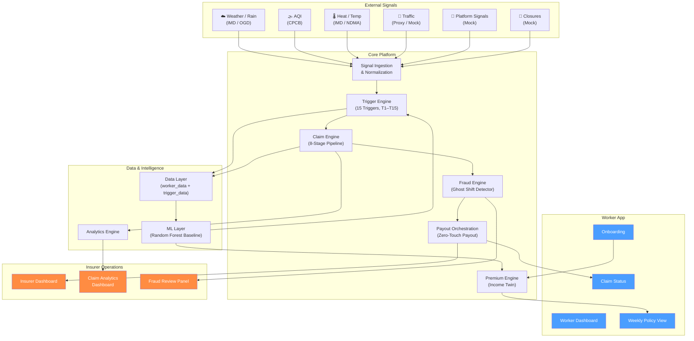
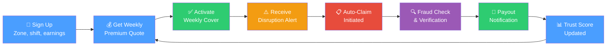

# DEVTrails 2026 — AI-Powered Parametric Income Protection for Gig Workers

> A hyperlocal, weekly income-protection engine for food-delivery workers that pays only when verified disruption overlaps real earning exposure.

---

## What This Project Is

DEVTrails is an AI-assisted **parametric insurance platform** that protects delivery workers' **weekly income** — not health, life, vehicle repair, or accident damage. The system monitors external disruption signals (heavy rain, severe AQI, heatwaves, outages, closures, traffic collapse), estimates whether a worker's earning ability was genuinely affected during a covered shift, and can automatically initiate claims when conditions are met.

### Core Product Pillars

| Module | Purpose |
|--------|---------|
| **Income Twin** | Continuously estimate expected weekly and shift-level earnings |
| **Streetwise Cover** | Hyperlocal underwriting at zone / route / hotspot level |
| **Disruption DNA** | Composite disruption scoring from multiple signal sources |
| **Ghost Shift Detector** | Fraud and anomaly detection layer |
| **Zero-Touch Payout** | Claims and payout orchestration for auto-initiated claims |
| **Trust Pass** *(optional)* | Loyalty / trust program for premium discounts and fast-lane claim decisions |

### The Idea Is Simple

1. The worker buys weekly coverage
2. The system monitors public trigger conditions
3. The platform matches the event to the worker's zone and shift
4. A claim can be initiated automatically
5. Fraud checks run before payout
6. The insurer dashboard tracks the full lifecycle

---

## Challenge Alignment

The DEVTrails 2026 challenge requires:

| Requirement | Our approach |
|-------------|-------------|
| Gig-worker income protection | Food-delivery workers in urban India, loss-of-income only |
| Weekly pricing | Dynamic weekly premium based on zone risk, shift exposure, trust score |
| AI-powered risk assessment | Hybrid rules + Random Forest ML + feedback adaptation |
| Intelligent fraud detection | 4-layer Ghost Shift Detector pipeline |
| Parametric trigger automation | 15-trigger library with public-threshold anchoring |
| Payout processing | Zero-Touch Payout with severity-proportional compensation |
| Analytics dashboards | Worker dashboard + Insurer dashboard + Claim analytics dashboard |

---

## Delivery Persona and Coverage Boundary

**Chosen persona:** Food-delivery workers in disruption-prone urban zones (India)

**Covered risk:** Temporary loss of earning opportunity caused by external disruption

**Not covered:**
- Health or hospitalization
- Life insurance
- Accident insurance
- Vehicle repair
- Personal theft unrelated to the disruption trigger

---

## Implementation Status

> [!IMPORTANT]
> This table separates what is **currently visible** in the repository from what is **documented as target architecture**. Each module README contains its own detailed status.

| Area | Status | Notes |
|------|--------|-------|
| Repository structure & README system | ✅ Current | 10 folder-level READMEs with inputs/outputs/downstream |
| Product framing & scope boundaries | ✅ Current | Consistent across all documentation |
| 15-trigger library (thresholds & logic) | 📝 Documented | Thresholds defined, formulas documented; implementation pending |
| Premium & payout formulas | 📝 Documented | Full formula book with derivation examples; implementation pending |
| Data schemas & seed dataset | 📝 Documented | 8-row seed + schema definitions; CSV generation pending |
| Worker dashboard | 📋 Planned | Pages and components specified; implementation pending |
| Insurer dashboard | 📋 Planned | Pages and components specified; implementation pending |
| Claim analytics dashboard | 📋 Planned | Metrics and views specified; implementation pending |
| Claim pipeline | 📋 Planned | 8-stage flow defined; implementation pending |
| Fraud detection engine | 📋 Planned | 4-layer framework defined; implementation pending |
| Backend API layer | 📋 Planned | 10 endpoints specified; implementation pending |
| Synthetic data generator | 📋 Planned | Endpoint and workflow defined; implementation pending |
| Integrations (weather, AQI, traffic) | 📋 Planned | Categories and mock strategy defined; connectors pending |
| Caching layer | 📋 Planned | Strategy and TTL policy defined; implementation pending |

**Legend:** ✅ Current Implementation — 📝 Documented Formula / Design Logic — 📋 Planned / Target Architecture

---

## System Architecture

### Unified System Architecture



> **📋 Status:** This diagram represents the **target architecture**. The repository currently contains the documentation layer; module implementations are in progress.


---

### Gig Worker Journey




---

## End-to-End Logic

| Step | What happens | Output |
|------|-------------|--------|
| 1. Onboarding | Worker enters delivery type, zones, shift window, earning band, payout preference | Persona profile and coverage context |
| 2. Weekly pricing | Risk engine combines zone risk, shift exposure, prior claims, trust score | Weekly premium and payout cap |
| 3. Coverage activation | Worker accepts weekly plan; policy becomes active | System starts monitoring disruptions |
| 4. Signal monitoring | Weather, AQI, traffic, closure, platform signals ingested | Structured events for decision engine |
| 5. Trigger scoring | Disruption DNA calculates severity; checks zone/shift overlap | Trigger score and exposure score |
| 6. Fraud check | Ghost Shift Detector validates worker exposure and behavior | Fraud / confidence score |
| 7. Claim decision | If trigger + exposure + confidence thresholds met → auto-create claim | Explainable decision and payout amount |
| 8. Payout simulation | Zero-Touch Payout sends simulated UPI / gateway response | Worker sees status; admin sees audit log |
| 9. Learning loop | Reviewed outcomes feed back into pricing, thresholds, fraud models | Improved accuracy over time |

---

## The 15-Trigger Library

The platform uses a **3-tier trigger architecture**: early warning → claim trigger → severe escalation.

### Environmental Triggers

| ID | Trigger | Threshold | Tier | Action |
|----|---------|-----------|------|--------|
| T1 | Rain Watch | 24h rain ≥ 48 mm | Early Warning | Raise risk score, notify worker |
| T2 | Heavy Rain Claim | 24h rain ≥ 64.5 mm | Claim Trigger | Open claim candidate if zone + shift overlap |
| T3 | Extreme Rain Escalation | 24h rain ≥ 115.6 mm | Severe Escalation | Escalate severity band and payout cap |
| T5 | AQI Caution | AQI 201–300 | Early Warning | Warn worker, raise premium sensitivity |
| T6 | AQI Severe Exposure | AQI ≥ 301 + active shift | Claim Trigger | Open claim candidate |
| T7 | Heat Wave | Temp ≥ 45°C or IMD heat-wave | Claim Trigger | Open claim candidate |
| T8 | Severe Heat | Temp ≥ 47°C | Severe Escalation | Escalated claim severity |
| T9 | Heat Persistence | 2 consecutive hot-risk days | Early Warning | Raise weekly risk loading |

### Operational and Civic Triggers

| ID | Trigger | Threshold | Tier | Action |
|----|---------|-----------|------|--------|
| T4 | Waterlogging Mobility | Accessibility score ≤ 0.40 | Claim Trigger | Claim candidate for blocked routes |
| T10 | Local Zone Closure | Official closure flag = 1 | Claim Trigger | Auto-escalate to claim review |
| T11 | Curfew / Strike Closure | Restriction window ≥ 4h | Claim Trigger | Claim candidate if pickup/drop blocked |
| T12 | Traffic Collapse | Travel delay ≥ 40% | Early Warning | Raise exposure and route stress |
| T13 | Platform Outage | Outage ≥ 30 min | Claim Trigger | Claim candidate for verified active workers |
| T14 | Demand Collapse | Orders drop ≥ 35% vs baseline | Early Warning | Raise loss-of-income probability |
| T15 | Composite Disruption | Composite score ≥ 0.70 | Severe Escalation | Fast-track claim escalation |

**Threshold sources:** IMD heavy-rain and heat-wave bands, CPCB AQI category thresholds, IMD/NDMA heat-wave guidance. Traffic, outage, and demand thresholds are internal operational thresholds.

---

## Data Split

The dataset is split into two major entities and joined only after exposure matching.

### worker_data
Worker-side profile and earning context:
`worker_id`, `zone_id`, `city`, `shift_window`, `hourly_income`, `active_days`, `bank_verified`, `gps_consistency`, `trust_score`, `prior_claim_rate`

### trigger_data
Event-side disruption context:
`trigger_id`, `city`, `zone_id`, `timestamp_start`, `timestamp_end`, `trigger_type`, `raw_value`, `threshold_crossed`, `severity_bucket`, `source_reliability`

### joined_training_data
Created only after matching `worker_data` ↔ `trigger_data` on `zone_id` + shift/time overlap.
Used for EDA, ML experiments, and premium/payout calculations.

---

## Premium and Payout Logic Summary

> Full formula derivations and worked examples are documented in [docs/README.md](docs/README.md) and the insurance formula reference.

### Key Formulas

| Formula | Expression |
|---------|-----------|
| Covered Income (B) | `0.70 × hourly_income × shift_hours × 6` |
| Severity Score (S) | Weighted composite: rain 0.23, AQI 0.14, heat 0.14, outage 0.12, traffic 0.10, closure 0.10, access 0.10, demand 0.07 |
| Exposure (E) | `clip(0.45 + 0.30×(shift_hours/12) + 0.25×(1−accessibility_score), 0.35, 1.00)` |
| Confidence (C) | `clip(0.50 + 0.30×trust + 0.10×gps + 0.10×bank, 0.45, 1.00) × (1 − 0.70×fraud_penalty)` |
| Expected Payout | `p × B × S × E × C × (1 − FH)` |
| Gross Premium | `[Expected Payout / (1 − 0.12 − 0.10)] × U` |
| Payout Cap | `0.75 × B × U` |
| Final Payout | `min(Cap, B × S × E × C × (1 − FH))` |

Where: `p` = claim probability (Random Forest), `FH` = fraud holdback, `U` = outlier uplift factor.

### Sample Scenario

**Worker:** hourly income = ₹84, shift = 11h, 6 days/wk, trust = 0.82, GPS consistency = 0.91, bank verified = ✅

**Trigger:** rain = 72mm, AQI = 240, temp = 41°C, traffic delay = 48%, outage = 12 min

**Interpretation:**
- Rain exceeds both the 48mm watch and 64.5mm heavy-rain thresholds → T2 fires
- AQI 240 sits in the 201–300 caution band → T5 fires
- Exposure is high: long shift + weak accessibility
- Confidence stays high: strong trust score and GPS consistency
- Payout can be automated unless fraud score triggers review

---

## Repository Map

```
Celestius_DEVTrails_P1/
├── README.md               ← You are here
├── backend/README.md        ← API layer, services, endpoints
├── caching/README.md        ← Cache strategy and TTL policies
├── claim-engine/README.md   ← Trigger-to-claim-to-approval pipeline
├── data/README.md           ← Synthetic data, schemas, seed dataset
├── docs/README.md           ← Documentation index, diagrams, formulas
│   ├── diagrams/            ← Mermaid source files (planned)
│   ├── assets/architecture/ ← Architecture visuals (planned)
│   └── assets/insurance/    ← Formula charts, EDA plots (planned)
├── fraud/README.md          ← Ghost Shift Detector, 4-layer fraud engine
├── frontend/README.md       ← Worker + insurer + analytics dashboards
├── integrations/README.md   ← External connectors & mock integrations
└── ml/README.md             ← Data science pipeline, models, experiments
```

Each folder README follows a consistent structure:
- **Goal** — what the module does
- **Inputs** — what data flows in
- **Outputs** — what data flows out
- **Downstream** — where the output goes next
- **Implementation Status** — current vs. planned

---

## Tech Stack

| Layer | Technology | Why |
|-------|-----------|-----|
| **Frontend** | React / Next.js | Fast UI iteration, component-based dashboards, clean demo experience |
| **Backend** | Python (FastAPI) | Transparent REST endpoint design, strong data-science ecosystem integration |
| **Cache** | Redis | Fast key-value caching for trigger feeds, dashboard summaries, simulation outputs |
| **Data Science** | pandas, numpy, scikit-learn, matplotlib | Bootstrap EDA, Random Forest baseline, boxplot outlier analysis |
| **Storage** | PostgreSQL | Relational storage for policies, claims, audit events, payout logs |
| **Visualization** | Recharts | React-native charting for analytics dashboards, trigger mix, severity distribution |

> **📋 Status:** Tech stack represents target technology choices. Implementations are in progress.

---

## Evaluator Quick-Start

> [!NOTE]
> The repository is currently in its **documentation-first phase**. The README system provides complete product logic, formulas, and architecture so evaluators can understand the platform without reading code. Runnable modules are being implemented in parallel.

**To understand the platform:**
1. Read this README for the full product overview
2. Read [docs/README.md](docs/README.md) for the documentation index
3. Read each module README for inputs/outputs/downstream flow
4. Review the trigger library table above for parametric threshold logic
5. Review the premium/payout formula summary for insurance math
6. Check the architecture diagrams for system flow

**When runnable modules are available:**
1. Clone the repo
2. Run the mock data generator to produce `worker_data.csv`, `trigger_data.csv`, and `joined_training_data.csv`
3. Open the worker dashboard and insurer dashboard
4. Trigger one sample scenario
5. Verify the claim decision, fraud score, and payout output
6. Check the dashboards for analytics updates

---

## Folder Ownership

| Folder | Responsibility | Status |
|--------|---------------|--------|
| `frontend/` | UI flows, dashboards, user experience | 📋 Planned |
| `backend/` | API orchestration, services, business logic | 📋 Planned |
| `claim-engine/` | Claim decision rules, 8-stage pipeline | 📋 Planned |
| `fraud/` | Ghost Shift Detector, anomaly logic, verification | 📋 Planned |
| `ml/` | Severity modeling, pricing experiments, EDA | 📋 Planned |
| `data/` | Synthetic data generation, CSV assets, schemas | 📋 Planned |
| `caching/` | Cache rules, TTL behavior, invalidation | 📋 Planned |
| `integrations/` | External signal connectors, payment mocks | 📋 Planned |
| `docs/` | Diagrams, formula docs, pitch assets, references | 📝 Documented |

---

## What Judges Should Immediately Understand

- The project is about **income loss**, not generic insurance
- The platform uses **weekly pricing** matched to gig-worker earning cycles
- The system is **parametric** — claims triggered by objective conditions, not manual forms
- The claims pipeline is **automated** with multi-layer verification
- The fraud layer uses **real logic** (4-layer Ghost Shift Detector), not buzzwords
- The trigger library has **15 thresholds** anchored to public government data
- The premium and payout math is **formula-driven and explainable**
- The repo is **readable enough to evaluate quickly** without inspecting code
- Current state vs. target architecture is **honestly labeled throughout**

---

## Business Framing

DEVTrails is positioned as an **insurer-facing platform** or **embedded protection layer** — not as a fully licensed insurer. The product provides the parametric underwriting engine, claims orchestration, and fraud detection that a licensed insurer would embed into their distribution channel for gig-worker income protection.

Key business metrics the system tracks:
- Loss ratio by zone
- Claim automation rate
- Payout-to-premium ratio
- Trust-weight distribution
- Fraud leakage rate
