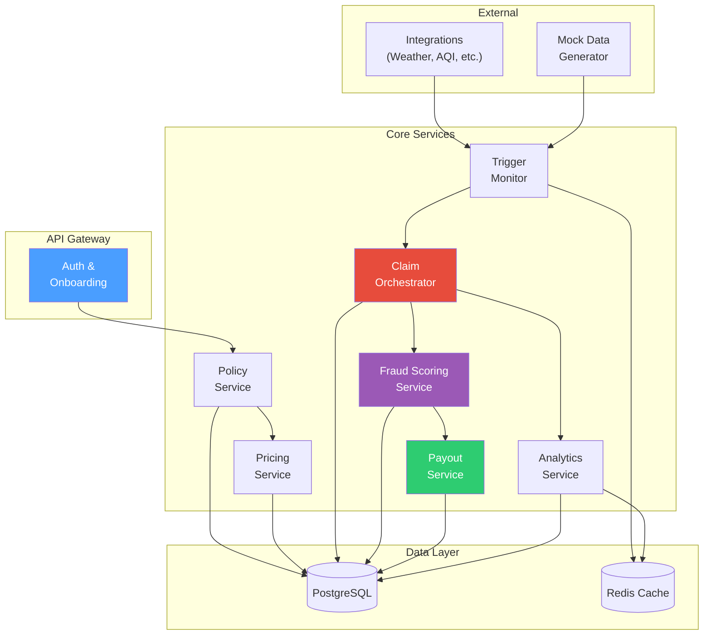
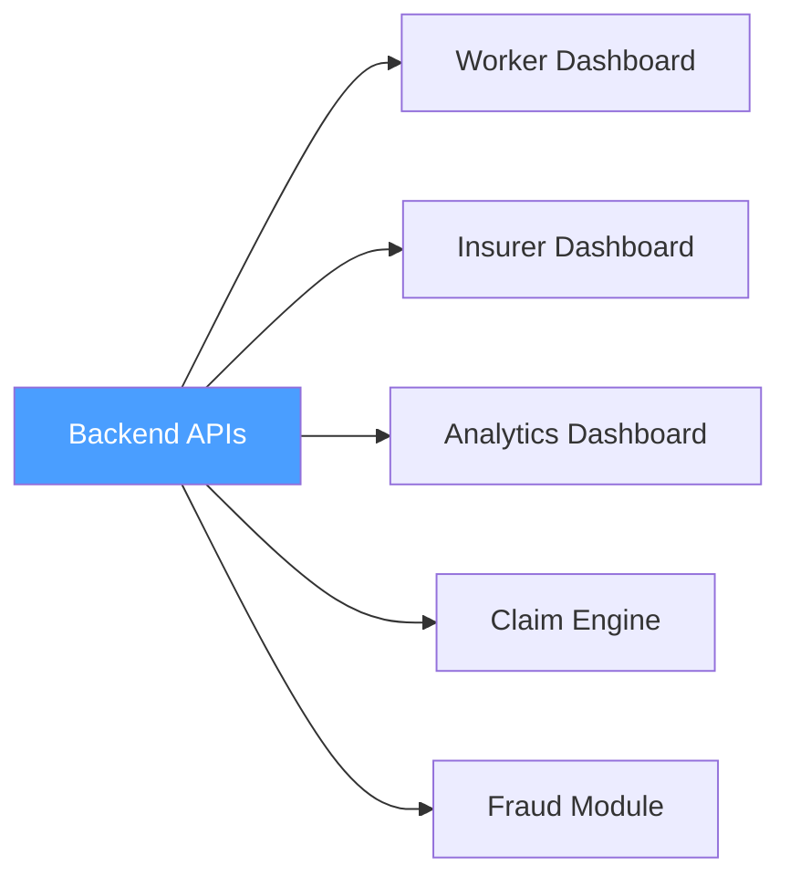

# Backend — API Layer & Service Orchestration

> The backend orchestrates the insurance logic. It should be easy to read, easy to demo, and segmented cleanly enough that an evaluator can follow the flow without reverse-engineering the code.

---

## Implementation Status

| Component | Status |
|-----------|--------|
| Service architecture definition | 📝 Documented |
| Endpoint inventory | 📝 Documented |
| Input/output specifications | 📝 Documented |
| Mock API scaffold (3 endpoints) | ✅ Present | See [`mock_api.py`](mock_api.py) |
| OpenAPI contract | ✅ Present | See [`openapi.yaml`](openapi.yaml) |
| Full API implementation | 📋 Planned |
| Database schema | 📋 Planned |
| Authentication layer | 📋 Planned |

---

## Tech Stack

| Component | Technology | Why |
|-----------|-----------|-----|
| Framework | Python (FastAPI) | Transparent REST endpoint design, automatic OpenAPI docs, strong data-science ecosystem integration |
| Database | PostgreSQL | Relational storage for policies, claims, audit events, payout logs with ACID guarantees |
| ORM | SQLAlchemy | Declarative models, migration support, clean query interface |
| Cache | Redis | Fast key-value caching for trigger feeds and dashboard summaries (see [caching/README.md](../caching/README.md)) |
| Auth | JWT tokens | Stateless authentication for worker and admin personas |

> **📋 Status:** Tech stack represents the selected target technologies. See `requirements.txt` for the Python dependency baseline. A minimal mock API scaffold is available — see instructions below.

---

## Quick Start — Mock API

A minimal runnable scaffold proves the documented architecture works. It exposes 3 read-only endpoints:

| Endpoint | What it returns |
|----------|----------------|
| `GET /health` | Service status and version |
| `GET /triggers/library` | Full 15-trigger library as JSON |
| `GET /claims/sample` | The sample claim from `claim-engine/examples/sample_claim.json` |

**To run:**

```bash
# From the repo root:
pip install fastapi uvicorn
uvicorn backend.mock_api:app --reload --port 8000
```

Then open:
- http://localhost:8000/health
- http://localhost:8000/triggers/library
- http://localhost:8000/claims/sample
- http://localhost:8000/docs (auto-generated Swagger UI)

> This is a **demo scaffold**, not a production backend. It reuses data already documented in the repo and adds no new business logic. Premium and payout formulas are documented centrally in [docs/README.md](../docs/README.md#formula-summary). `/claims/sample` returns the documented claim structure from `claim-engine/examples/sample_claim.json`. `/triggers/library` returns the 15-trigger threshold library as documented in the [root README](../README.md#the-15-trigger-library).

**OpenAPI contract:** [`openapi.yaml`](openapi.yaml) defines the formal API contract for these 3 endpoints.

---

## Service Architecture



---

## Core Modules

| Module | Responsibility | Connects to |
|--------|---------------|-------------|
| **Auth & Onboarding** | Worker registration, login, profile management | Policy service |
| **Policy Service** | Weekly plan lifecycle — create, activate, expire, renew | Pricing service, frontend |
| **Pricing Service** | Dynamic weekly premium calculation using Income Twin formula | ML layer, policy service |
| **Trigger Monitor** | Ingest external disruption signals, evaluate T1–T15 thresholds | Claim orchestrator, integrations |
| **Claim Orchestrator** | Run the [8-stage claim pipeline](../claim-engine/README.md) | Fraud service, payout service |
| **Fraud Scoring Service** | Execute [4-layer Ghost Shift Detector](../fraud/README.md) | Claim orchestrator |
| **Payout Service** | Calculate payout, apply cap, simulate UPI/gateway response | Worker dashboard, insurer dashboard |
| **Analytics Service** | Aggregate metrics for all three dashboards | Frontend dashboards |

---

## Endpoint Inventory

### Worker Endpoints

| Method | Endpoint | Purpose | Status |
|--------|----------|---------|--------|
| `POST` | `/workers` | Register new worker profile | 📋 Planned |
| `GET` | `/workers/{id}` | Get worker profile | 📋 Planned |
| `POST` | `/policies/quote` | Generate weekly premium quote | 📋 Planned |
| `POST` | `/policies/activate` | Activate weekly policy | 📋 Planned |
| `GET` | `/policies/{id}` | Get policy details and status | 📋 Planned |

### Trigger & Claim Endpoints

| Method | Endpoint | Purpose | Status |
|--------|----------|---------|--------|
| `GET` | `/triggers/live` | Current active trigger events | 📋 Planned |
| `POST` | `/claims/initiate` | Manually initiate a claim | 📋 Planned |
| `GET` | `/claims/{id}` | Get claim details and timeline | 📋 Planned |
| `POST` | `/claims/{id}/review` | Insurer review action on claim | 📋 Planned |

### Data & Analytics Endpoints

| Method | Endpoint | Purpose | Status |
|--------|----------|---------|--------|
| `GET` | `/mock-data/generate` | Generate synthetic worker & trigger data | 📋 Planned |
| `GET` | `/simulate/claim-scenario` | Run scenario simulation | 📋 Planned |
| `GET` | `/analytics/summary` | Dashboard metrics aggregate | 📋 Planned |

---

## Inputs

| Input | Source |
|-------|--------|
| Worker details (zone, shift, earnings, trust) | Frontend onboarding |
| Zone and city identifiers | Worker profile |
| Trigger stream (real or mock) | Integrations / mock generator |
| Bank verification state | Integrations (mock) |
| Policy state (active, expired, renewed) | Database |
| Prior claim information | Database |

## Outputs

| Output | Consumer |
|--------|----------|
| Premium quote (₹ amount + breakdown) | Worker dashboard |
| Claim status (approved / review / hold) | Worker dashboard, insurer dashboard |
| Fraud risk band (low / medium / high) | Insurer dashboard, fraud review panel |
| Payout amount (₹ amount + formula trace) | Worker dashboard, insurer dashboard |
| Analytics aggregates | All three dashboards |
| Audit events (timestamped pipeline log) | Claim analytics dashboard |

---

## Downstream Flow



Most backend outputs move to:
- **Frontend dashboards** — worker, insurer, and analytics views
- **Claim engine** — trigger evaluation and claim orchestration
- **Fraud module** — claim validation and fraud scoring
- **Analytics layer** — aggregated metrics and trend analysis
