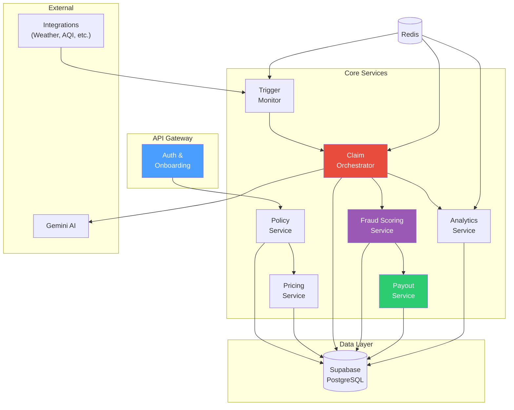

# Backend — API Layer & Service Orchestration

> The backend orchestrates the insurance logic. It should be easy to read, easy to demo, and segmented cleanly enough that an evaluator can follow the flow without reverse-engineering the code.

---

## Implementation Status

| Component | Status |
|-----------|--------|
| Service architecture definition | ✅ Implemented |
| FastAPI app with routers | ✅ Implemented |
| Auth endpoints (login, signup, profile) | ✅ Implemented |
| Claims endpoints (submit, list, detail, review, flag) | ✅ Implemented |
| Policies endpoints (quote with plan, activate with plan) | ✅ Implemented |
| Triggers endpoints (live feed, inject) | ✅ Implemented |
| Workers endpoints (profile, stats) | ✅ Implemented |
| Zones endpoints (list, detail, cities) | ✅ Implemented |
| Analytics endpoint (admin KPIs) | ✅ Implemented |
| Ingest endpoints (weather, AQI, traffic, scan-all-zones) | ✅ Implemented |
| 8-stage claim pipeline | ✅ Implemented |
| IRDAI pricing engine (₹28/₹42 weekly fixed plans) | ✅ Implemented |
| Fraud scoring engine (5-layer Ghost Shift Detector) | ✅ Implemented |
| TomTom route plausibility in Layer 2 | ✅ Implemented |
| Manual claim verifier | ✅ Implemented |
| Gemini AI claim narrative | ✅ Implemented |
| EXIF evidence extraction (forensic) | ✅ Implemented |
| Anti-spoofing verification | ✅ Implemented |
| Image forensics & AI detection | ✅ Implemented |
| Region controls & behavioral identity | ✅ Implemented |
| Region validation cache (fast-lane) | ✅ Implemented |
| Payout safety (event-ID, worker-event uniqueness) | ✅ Implemented |
| Claim state machine (8 states, soft hold) | ✅ Implemented |
| Post-approval fraud controls | ✅ Implemented |
| Supabase SQL schema (14 tables, unified migration) | ✅ Implemented |
| Row-Level Security policies | ✅ Implemented |
| CLI seed system | ✅ Implemented |
| KYC service (Sandbox.co.in — Aadhaar, PAN, Bank) | ✅ Implemented |
| Twilio WhatsApp + OTP (7 templates) | ✅ Implemented |
| OpenWeather live data (weather + temp triggers) | ✅ Live |
| CPCB AQI live data (data.gov.in, 511 stations) | ✅ Live |
| TomTom Traffic Flow + Routing | ✅ Live |
| ApiProviderPool (round-robin + LRU cache) | ✅ Implemented |
| Docker multi-stage build | ✅ Implemented |
| GitHub Actions CI/CD (3-job pipeline) | ✅ Implemented |
| Automated pytest suite (61 tests, 100% pass) | ✅ Implemented |
| Redis caching layer (`fastapi-cache2`) | ✅ Implemented (TTL decorators on `/triggers/live`, `/analytics/summary`, `/zones/`, `/policies/quote`) |
| ML live inference | ✅ Implemented (`get_claim_probability()` — lazy-loads `severity_rf.joblib`, falls back to p=0.15 if model missing) |
| DBSCAN cluster intelligence (Layer 4) | ✅ Implemented (`sklearn.cluster.DBSCAN` on lat/lng/timestamp batch) |
| Simulation & mock-data endpoints | ✅ Implemented (`/simulate/claim-scenario`, `/simulate/mock-data/generate`) |
| Payment gateway service | ✅ Implemented (mock `payment_mock.py` — RazorpayX-format async UPI payout simulation) |

---

## Tech Stack

| Component | Technology | Why |
|-----------|-----------|-----|
| Framework | Python (FastAPI) | Transparent REST endpoint design, automatic OpenAPI docs, strong data-science ecosystem integration |
| Database | Supabase (PostgreSQL) | Managed PostgreSQL with built-in Auth, Storage, RLS, and real-time capabilities |
| Auth | Supabase Auth | Google OAuth + email/password, JWT tokens, auth triggers for profile bootstrap |
| AI | Google Gemini | Claim narrative generation for admin-assisted review |
| HTTP Client | httpx | Async HTTP for evidence fetching and external calls |

---

## Quick Start

```bash
# From the repo root:
pip install -r requirements.txt

# Set environment variables (see .env.example)
cp .env.example .env  # fill in your keys
uvicorn backend.app.main:app --reload --port 8000

# Or with Docker:
docker compose up --build
```

Then open:
- http://localhost:8000/docs (Swagger UI — all endpoints)
- http://localhost:8000/health

---

## Service Architecture



---

## Endpoint Inventory

### Auth Endpoints

| Method | Endpoint | Purpose | Status |
|--------|----------|---------|--------|
| `POST` | `/auth/signup` | Register new user (worker or insurer) | ✅ Implemented |
| `POST` | `/auth/login` | Email/password login | ✅ Implemented |
| `GET` | `/auth/profile` | Get current user profile + role | ✅ Implemented |

### Worker Endpoints

| Method | Endpoint | Purpose | Status |
|--------|----------|---------|--------|
| `GET` | `/workers/profile` | Get worker profile with zone info | ✅ Implemented |
| `GET` | `/workers/stats` | Get worker earnings stats (14-day chart) | ✅ Implemented |

### Policy Endpoints

| Method | Endpoint | Purpose | Status |
|--------|----------|---------|--------|
| `GET` | `/policies/quote` | Generate weekly premium quote (plan-aware: essential/plus) | ✅ Implemented |
| `POST` | `/policies/activate` | Activate weekly policy with plan selection | ✅ Implemented |

### Trigger & Claim Endpoints

| Method | Endpoint | Purpose | Status |
|--------|----------|---------|--------|
| `GET` | `/triggers/live` | Current active trigger events | ✅ Implemented |
| `POST` | `/triggers/inject` | Inject mock trigger event (admin) | ✅ Implemented |
| `POST` | `/claims` | Submit manual claim with evidence + plan | ✅ Implemented |
| `GET` | `/claims` | List claims (worker=own, admin=all) | ✅ Implemented |
| `GET` | `/claims/{id}` | Get claim detail, evidence, payout | ✅ Implemented |
| `POST` | `/claims/{id}/review` | Admin review action on claim | ✅ Implemented |
| `POST` | `/claims/{id}/flag` | Post-approval fraud flag + trust downgrade | ✅ Implemented |

### Zone & Analytics Endpoints

| Method | Endpoint | Purpose | Status |
|--------|----------|---------|--------|
| `GET` | `/zones` | List zones, optionally by city (cached 1hr) | ✅ Implemented |
| `GET` | `/zones/{id}` | Zone detail with polygon | ✅ Implemented |
| `GET` | `/zones/cities/list` | Distinct cities with zones | ✅ Implemented |
| `GET` | `/analytics/summary` | Admin KPI metrics (cached 2min) | ✅ Implemented |

### Simulation & Dev Endpoints

| Method | Endpoint | Purpose | Status |
|--------|----------|---------|--------|
| `POST` | `/simulate/claim-scenario` | Simulate a full 8-stage claim pipeline run without persisting to DB | ✅ Implemented |
| `POST` | `/simulate/mock-data/generate` | Regenerate synthetic seed data into the DB | ✅ Implemented |

---

## Core Services (backend/app/services/)

| Module | File | Responsibility |
|--------|------|---------------|
| **Claim Pipeline** | `claim_pipeline.py` | 8-stage orchestration: validation → severity → parametric band → anti-spoofing + fraud → decision |
| **Severity Scoring** | `severity.py` | Compute severity score S from trigger data |
| **Pricing Engine** | `pricing.py` | Compute B (covered income), E (exposure), C (confidence), premiums and payouts |
| **Fraud Engine** | `fraud_engine.py` | 5-layer Ghost Shift Detector with signal confidence hierarchy, 5-band decisions (`auto_approve`, `needs_review`, `hold_for_fraud`, `batch_hold`, `reject_spoof_risk`), and ML feature vector output |
| **Anti-Spoofing** | `anti_spoofing.py` | Layer 3: EXIF vs GPS cross-check, timestamp freshness, VPN/datacenter IP detection, device continuity, impossible travel velocity, emulator/root detection |
| **Image Forensics** | `image_forensics.py` | Evidence integrity: EXIF completeness, software/editor detection, timestamp chain-of-custody, GPS precision, camera-device consistency, AI detection stub (Gemini SynthID) |
| **Region Controls** | `region_controls.py` | Behavioral identity: zone affinity, pre-trigger presence, dynamic trust penalties, zone volume monitoring, mass-claim throttling |
| **Region Validation Cache** | `region_validation_cache.py` | Fast-lane eligibility checks, cluster spike liquidity protection, post-approval trust score penalties |
| **Manual Verifier** | `manual_claim_verifier.py` | Evidence completeness and geo confidence for manual claims |
| **Evidence Processing** | `evidence.py` | EXIF metadata extraction (forensic-grade: 10+ fields including Software, DateTimeDigitized, ModifyDate, Make, GPS precision) |
| **Gemini Analysis** | `gemini_analysis.py` | AI-generated claim narrative for admin review |

---

## Database Schema (backend/sql/)

| File | Contents |
|------|----------|
| `00_unified_migration.sql` | **Single-file schema** — all 14+2 tables, RLS, auth triggers, storage policies, grants (idempotent) |
| `06_synthetic_seed.sql` | 62KB seed: demo users, zones, trigger events, claims |

> The schema is fully consolidated. Run `00_unified_migration.sql` in Supabase SQL Editor to bootstrap a fresh project.

---

## New Services (Phase 2)

| Module | File | Responsibility |
|--------|------|---------------|
| **KYC Service** | `kyc_service.py` | Sandbox.co.in Aadhaar OTP, PAN verify, bank verify. 3-tier progressive KYC ladder. |
| **Twilio Service** | `twilio_service.py` | WhatsApp + OTP. 7 notification templates. Mock fallback. |
| **Trigger Evaluator** | `trigger_evaluator.py` | Threshold evaluation bridge for all 15+ trigger families. |
| **Zone Coordinates** | `zone_coordinates.py` | Zone-to-coordinate mapping for batch scanning. |
| **Auto Claim Engine** | `auto_claim_engine.py` | Zero-touch claim initiation from verified trigger events. |
| **Payment Mock** | `payment_mock.py` | Async UPI payout simulation (RazorpayX-format). Returns transaction ID + status. Used by claim pipeline post-approval flow. |
| **ML Training** | `ml_training.py` | RandomForestClassifier training script. Reads `joined_training_data_seed.csv`, exports `ml/model_artifacts/severity_rf.joblib`. |

