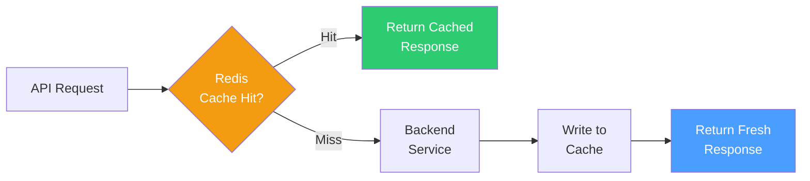

# Caching — Cache Strategy & TTL Policies

> External signal fetching, repeated dashboard loading, and repeated claim simulations can create unnecessary load. The cache avoids repeated recomputation and makes the demo feel fast.

---

## Engineering Snapshot (2026-04-05)

- Redis cache initialization now runs alongside event-relay lifecycle startup in backend lifespan.
- Cached API paths coexist with durable outbox processing, preserving responsiveness while reliability workflows run in background.
- Operational dead-letter triage is now available through events admin endpoints; cache remains independent and non-blocking.

---

## Implementation Status

| Component | Status |
|-----------|--------|
| Cache strategy definition | 📝 Documented |
| TTL policy specification | 📝 Documented |
| Invalidation rules | 📝 Documented |
| Redis integration (`fastapi-cache2[redis]`) | ✅ Implemented (wired in `main.py` lifespan, falls back gracefully if Redis unavailable) |
| Cache middleware decorators | ✅ Implemented (`@cache(expire=N)` on `/triggers/live`, `/analytics/summary`, `/zones/`, `/policies/quote`) |

---

## Tech Stack

| Component | Technology | Why |
|-----------|-----------|-----|
| Cache store | **Redis** | In-memory key-value store with TTL support, widely used, easy to integrate with FastAPI |

---

## What Gets Cached

| Cache Target | TTL | Key Pattern | Why cache it |
|-------------|-----|-------------|-------------|
| Trigger feeds by city/zone | **5 min** | `trigger:{city}:{zone}` | Avoid repeated external API calls during active monitoring |
| Threshold lookup tables | **24 hr** | `thresholds:{type}` | Static reference data; rarely changes |
| Dashboard summary cards | **2 min** | `dashboard:{type}:{scope}` | Reduce DB aggregation on repeated dashboard loads |
| Generated mock datasets | **30 min** | `mockdata:{city}:{days}` | Avoid regenerating identical synthetic data |
| Scenario simulation outputs | **10 min** | `sim:{worker_id}:{trigger_id}` | Same scenario re-run should return cached result |
| Premium quote results | **5 min** | `quote:{worker_id}:{week}` | Avoid recalculation on page refresh |

---

## Cache Invalidation Strategy

| Event | Invalidation action |
|-------|-------------------|
| New trigger event ingested | Invalidate `trigger:{city}:{zone}` for affected zone |
| Claim decision made | Invalidate `dashboard:*` for affected scope |
| Policy activated or renewed | Invalidate `quote:{worker_id}:*` |
| Mock data regenerated | Invalidate `mockdata:{city}:*` |
| Threshold configuration updated | Invalidate `thresholds:*` |

**General rule:** Prefer short TTLs over complex invalidation logic. For a hackathon demo, staleness of a few minutes is acceptable; correctness on cache miss is mandatory.

---

## Cache Flow

---

## Inputs

| Input | Description |
|-------|-------------|
| City identifier | Scopes trigger and mock-data caches |
| Zone identifier | Scopes trigger feed caches |
| Date range | Scopes temporal queries |
| Trigger type | Scopes threshold lookups |
| Simulation request key | Composite key for scenario caching |

## Outputs

| Output | Description |
|--------|-------------|
| Cached JSON payload | Stored response for cache hits |
| Cache hit/miss metadata | Used for monitoring and debugging |
| Cache headers | `X-Cache: HIT` or `X-Cache: MISS` in API responses |

## Downstream

The cached response is returned to **backend services** and then surfaced to the **frontend dashboards**. Cache sits between the API gateway and the service layer.

---

## Why This Folder Exists

This folder exists so we do not repeatedly fetch or recompute the same environmental signal logic during demos. When a judge refreshes the dashboard or re-runs a scenario, the response should be fast and consistent.

**Implementation detail:** `fastapi-cache2[redis]` is initialized in `backend/app/main.py` lifespan. If Redis is unavailable (e.g. localhost without Docker), the app logs a warning and continues serving live traffic — all cached endpoints degrade gracefully to direct DB queries. This ensures zero downtime on cache failures.

The caching layer makes the demo flow faster and more realistic during hackathon evaluation, and provides a production-hardened TTL pattern ready for scale.

## April 2026 Repo Update Addendum

### Newly implemented in current repo

- Redis-backed fastapi-cache2 integration is active with graceful fallback.
- High-traffic read endpoints use TTL-based caching for dashboard responsiveness.
- Startup path tolerates cache unavailability without request-path downtime.

### Planned and next tranche

- Add selective cache invalidation patterns for event-driven updates.
- Improve cache observability to expose hit-rate and stale-read trends.
- Evaluate stampede prevention for bursty trigger workloads.
- Extend TTL governance guidance per endpoint criticality.

