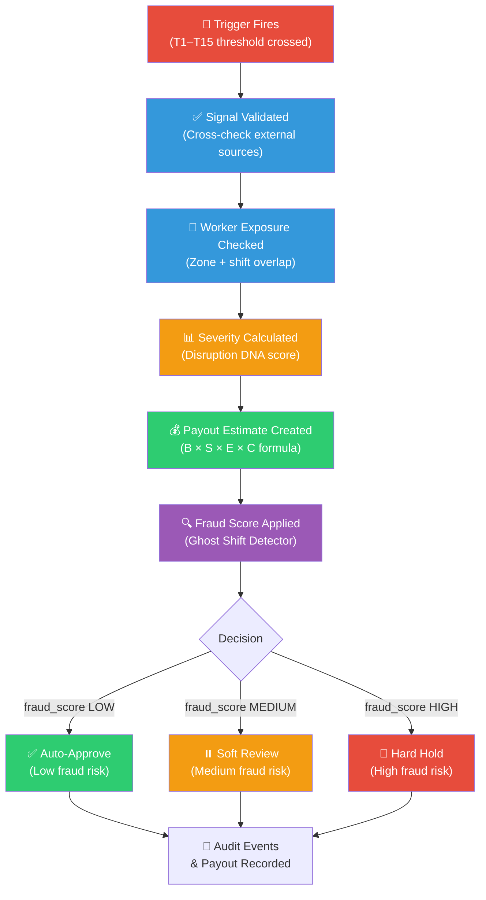
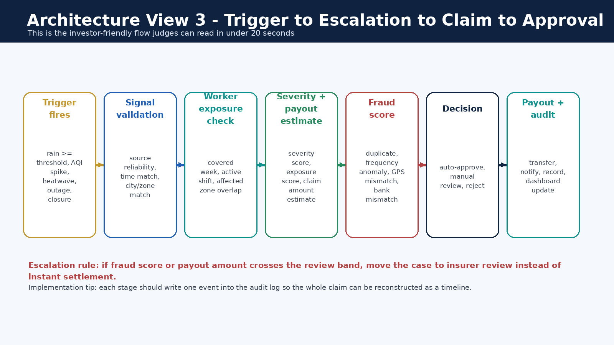
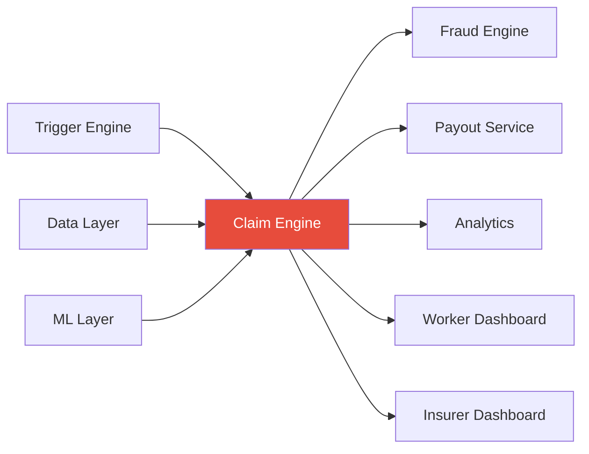

# Claim Engine

> This module owns the **trigger-to-claim-to-approval decision flow** — the core business logic pipeline that turns a raw disruption event into an approved, held, or rejected claim with an explainable payout.

---

## Implementation Status

| Component | Status |
|-----------|--------|
| 8-stage pipeline definition | 📝 Documented |
| Trigger threshold integration (T1–T15) | 📝 Documented |
| Severity calculation logic | 📝 Documented |
| Payout formula integration | 📝 Documented |
| Audit event emission | 📋 Planned |
| Claim orchestration service | 📋 Planned |
| Sample claim JSON | ✅ Present | See [`examples/sample_claim.json`](examples/sample_claim.json) |
| Claim JSON Schema | ✅ Present | See [`examples/sample_claim.schema.json`](examples/sample_claim.schema.json) |

---

## Sample Claim

A complete example claim is available at [`examples/sample_claim.json`](examples/sample_claim.json). It shows:

- The 8-stage pipeline trace with timestamps
- Worker and trigger context from the seed dataset (Worker W005, Trigger TR005)
- All computed scores (severity, exposure, confidence, fraud penalty)
- Full payout calculation breakdown with formula reference
- Final decision, fraud band, and audit trail

> This example uses synthetic data. All values align with the formulas documented above.

A machine-readable JSON Schema for the claim object is available at [`examples/sample_claim.schema.json`](examples/sample_claim.schema.json). It documents all required vs. optional fields, value ranges, and enums — useful for contract testing and API validation.

---

## Claim Decision Pipeline





---

## The 8 Stages in Detail

### Stage 1 — Trigger Fires
A threshold from the 15-trigger library (T1–T15) is crossed. The trigger engine passes the raw event payload to the claim engine.

**Example:** 24h rainfall reaches 72mm → T2 (Heavy Rain Claim) fires because threshold is ≥ 64.5mm.

### Stage 2 — Signal Validated
The claim engine cross-checks disruption data against external source truth. Did the rain actually happen in that zone? Does the AQI reading match the CPCB feed?

### Stage 3 — Worker Exposure Checked
The system verifies that the worker's **declared shift window** and **operating zone** overlap with the trigger event's time and geography.

**Match rule:** `worker.zone_id == trigger.zone_id AND trigger.timestamp overlaps worker.shift_window`

### Stage 4 — Severity Calculated
The Disruption DNA engine produces a composite severity score:

```
S = 0.23·rain_sev + 0.14·aqi_sev + 0.14·heat_sev + 0.10·traffic_sev
  + 0.12·outage_sev + 0.10·closure_sev + 0.07·demand_sev + 0.10·access_sev
```

Each component is normalized to 0–1 using public thresholds (IMD, CPCB) or operational thresholds.

> **Threshold provenance:** Environmental components (rain, AQI, heat) are normalized against official Indian government category bands — see [IMD rainfall FAQ](https://rsmcnewdelhi.imd.gov.in/images/pdf/faq.pdf), [CPCB AQI Index](https://www.cpcb.nic.in/national-air-quality-index/), and [NDMA heat-wave guidance](https://ndma.gov.in/Natural-Hazards/Heat-Wave). Operational components (traffic, outage, demand, closure, accessibility) use internal product thresholds documented in the [root README](../README.md#threshold-references-and-why-they-were-chosen).

### Stage 5 — Payout Estimate Created
The system computes:

```
Payout = min(Cap, B × S × E × C × (1 − FH))
```

Where B = covered weekly income, S = severity, E = exposure, C = effective confidence, FH = fraud holdback, Cap = `0.75 × B × U`. The outlier uplift factor U adjusts both premium and cap proportionally for validated high-risk cases. For the full variable dictionary and formula derivation, see the [Reference Register](../docs/README.md#formula-summary) in `docs/README.md`.

### Stage 6 — Fraud Score Applied
The [Ghost Shift Detector](../fraud/README.md) evaluates:
- Event truth (did the disruption happen?)
- Worker truth (was the worker genuinely exposed?)
- Behavioral anomalies (GPS spoofing, impossible movement)
- Cluster intelligence (group-level suspicious patterns)

### Stage 7 — Claim Decision
Based on the fraud confidence score:

| Fraud risk band | Decision | Action |
|----------------|----------|--------|
| Low | Auto-approve | Payout initiated immediately |
| Medium | Soft review | Queued for insurer review |
| High | Hard hold | Blocked pending investigation |

### Stage 8 — Audit Events Recorded
Every stage emits a timestamped audit event so the full claim can be reconstructed as a timeline.

---

## Inputs

| Input | Source |
|-------|--------|
| Trigger payload (type, severity, zone, timestamp) | Trigger engine |
| Worker profile (zone, shift, trust score, GPS) | Backend / data layer |
| Active policy (premium, payout cap, coverage window) | Policy service |
| Zone and shift overlap result | Exposure matching logic |
| Severity score | Disruption DNA calculation |
| Fraud score and confidence band | Ghost Shift Detector |

## Outputs

| Output | Consumer |
|--------|----------|
| Claim decision (approved / review / hold) | Worker dashboard, insurer dashboard |
| Payout amount | Payout orchestration (Zero-Touch Payout) |
| Review requirement | Insurer review queue |
| Audit event log | Claim analytics dashboard, insurer dashboard |
| Claim timeline | Worker claim status page |

---

## Golden Rule

> Every stage should emit one small event so the claim can be reconstructed later as a timeline. If a claim cannot be explained step-by-step from trigger to decision, the system fails the transparency test.

---

## Connection to Other Modules


