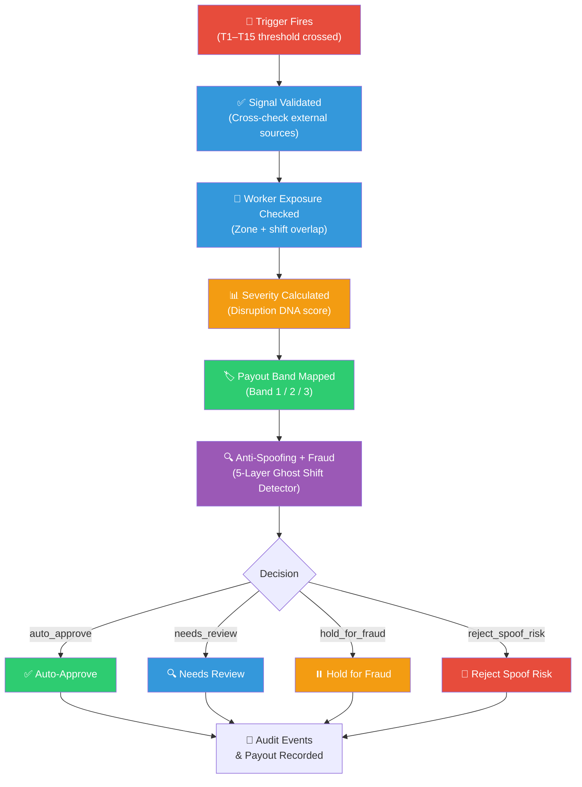
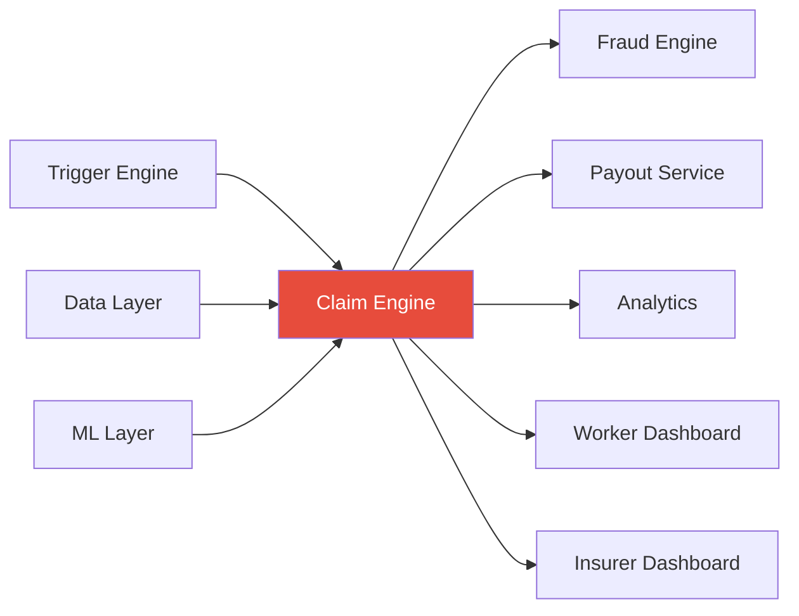

# Claim Engine

> This module owns the **trigger-to-claim-to-approval decision flow** — the core business logic pipeline that turns a raw disruption event into an approved, reviewed, held, or rejected claim with a **pre-agreed parametric payout**.

---

## Engineering Snapshot (2026-04-05)

- Claim persistence is now transaction-coupled with outbox write semantics via `persist_claim_with_outbox`.
- `claim.auto_processed` is now consumed asynchronously for side effects (notifications and rewards), reducing synchronous request-path coupling.
- Duplicate worker-event auto-claims are safely skipped and tracked in summary output.
- Claim-flow events (`claim.submitted`, `claim.reviewed`, `claim.offline_synced`, `claims.auto_process.*`) are emitted through the durable event path.

---

## Implementation Status

| Component | Status |
|-----------|--------|
| 8-stage pipeline definition | ✅ Implemented |
| Trigger threshold integration (T1–T15) | ✅ Implemented |
| Severity calculation logic | ✅ Implemented |
| Payout formula integration | ✅ Implemented |
| Claim state machine (8 states) | ✅ Implemented |
| Payout safety (event-ID, worker-event uniqueness) | ✅ Implemented |
| Region validation cache (fast-lane) | ✅ Implemented |
| Post-approval fraud controls | ✅ Implemented |
| Audit event emission | ✅ Implemented |
| Claim orchestration service | ✅ Implemented |
| Sample claim JSON | ✅ Present | See [`examples/sample_claim.json`](examples/sample_claim.json) |
| Claim JSON Schema | ✅ Present | See [`examples/sample_claim.schema.json`](examples/sample_claim.schema.json) |

---

## Sample Claim

A complete example claim is available at [`examples/sample_claim.json`](examples/sample_claim.json). It shows:

- The 8-stage pipeline trace with timestamps
- Worker and trigger context from the seed dataset (Worker W005, Trigger TR005)
- All computed scores (severity, exposure, confidence, fraud penalty)
- Full payout calculation breakdown with formula reference
- Final decision, fraud band, and audit trail

> This example uses synthetic data. All values align with the formulas documented above.

A machine-readable JSON Schema for the claim object is available at [`examples/sample_claim.schema.json`](examples/sample_claim.schema.json). It documents all required vs. optional fields, value ranges, and enums — useful for contract testing and API validation.

---

## Claim Decision Pipeline




---

## The 8 Stages in Detail

### Stage 1 — Trigger Fires
A threshold from the 15-trigger library (T1–T15) is crossed. The trigger engine passes the raw event payload to the claim engine.

**Example:** 24h rainfall reaches 72mm → T2 (Heavy Rain Claim) fires because threshold is ≥ 64.5mm.

### Stage 2 — Signal Validated
The claim engine cross-checks disruption data against external source truth. Did the rain actually happen in that zone? Does the AQI reading match the CPCB feed?

### Stage 3 — Worker Exposure Checked
The system verifies that the worker's **declared shift window** and **operating zone** overlap with the trigger event's time and geography.

**Match rule:** `worker.zone_id == trigger.zone_id AND trigger.timestamp overlaps worker.shift_window`

### Stage 4 — Severity Calculated
The Disruption DNA engine produces a composite severity score:

```
S = 0.23·rain_sev + 0.14·aqi_sev + 0.14·heat_sev + 0.10·traffic_sev
  + 0.12·outage_sev + 0.10·closure_sev + 0.07·demand_sev + 0.10·access_sev
```

Each component is normalized to 0–1 using public thresholds (IMD, CPCB) or operational thresholds.

> **Threshold provenance:** Environmental components (rain, AQI, heat) are normalized against official Indian government category bands — see [IMD rainfall FAQ](https://rsmcnewdelhi.imd.gov.in/images/pdf/faq.pdf), [CPCB AQI Index](https://www.cpcb.nic.in/national-air-quality-index/), and [NDMA heat-wave guidance](https://ndma.gov.in/Natural-Hazards/Heat-Wave). Operational components (traffic, outage, demand, closure, accessibility) use internal product thresholds documented in the [root README](../README.md#threshold-references-and-why-they-were-chosen).

### Stage 5 — Payout Band Mapped
The system maps the composite severity score to a **parametric payout band**:

Let `W` = selected weekly benefit (Essential = ₹3,000, Plus = ₹4,500).

| Trigger / exposure band | Description | Parametric payout |
|---|---|---:|
| **Band 1** | Watch-level trigger + partial exposure | `0.25 × W` |
| **Band 2** | Claim-level trigger + strong exposure | `0.50 × W` |
| **Band 3** | Escalation-level trigger + full exposure | `1.00 × W` |

The internal calibration formula (`B × S × E × C`) is used behind the scenes for premium sizing and plan calibration, but the worker-facing payout follows this pre-agreed ladder. See the [Parametric Product](../README.md#parametric-product-weekly-benefit-plans) section in the root README.

### Stage 6 — Anti-Spoofing + Fraud Check
The [5-Layer Ghost Shift Detector](../fraud/README.md) evaluates:
- Layer 1: Event truth (did the disruption happen? — OpenWeather / IMD / CPCB cross-check)
- Layer 2: Worker truth (was the worker genuinely exposed? — shift + zone overlap + activity continuity)
- Layer 3: **Anti-spoofing verification** (EXIF vs browser GPS, timestamp freshness, route plausibility via TomTom, device continuity, network/IP/ASN pattern, movement plausibility)
- Layer 4: Cluster intelligence (DBSCAN clustering, synchronized timing, shared payouts/devices, coordinate density)
- Layer 5: Behavioral anomaly (claim history, impossible movement, prior suspicious rate)

### Stage 7 — Claim Decision
Based on the multi-signal verification result:

| Outcome | Conditions | Action |
|---|---|---|
| **`auto_approve`** | Trigger present + exposure match + anti-spoofing pass + low fraud score | Payout released via parametric ladder → claim status: `auto_approved` |
| **`needs_review`** | Manual claim OR missing EXIF OR moderate uncertainty OR weak trigger match | Queued for human-assisted review → claim status: `soft_hold_verification` |
| **`hold_for_fraud`** | Spoof indicators + cluster anomaly + evidence mismatch | Held pending investigation → claim status: `fraud_escalated_review` |
| **`reject_spoof_risk`** | No valid trigger + high spoof confidence + fraud-ring pattern | Rejected — 48-hour appeal/resubmit window → claim status: `rejected` |

> **Fraud engine output → claim status mapping:** The fraud engine produces 5 decision bands (`auto_approve`, `needs_review`, `hold_for_fraud`, `batch_hold`, `reject_spoof_risk`). The claim pipeline maps these to 8 claim states: `auto_approved`, `soft_hold_verification`, `fraud_escalated_review`, `approved`, `rejected`, `paid`, `submitted`, `post_approval_flagged`. This separation keeps the fraud engine's vocabulary clean while giving the claim lifecycle richer state tracking.

> [!NOTE]
> **Basis-risk acknowledgment:** A trigger may fire but not every worker suffers equally. A worker may suffer disruption even when the trigger is borderline. The system mitigates this through tiered thresholds, exposure matching, anti-spoofing verification, and review routing for uncertain cases.

### Stage 8 — Audit Events Recorded
Every stage emits a timestamped audit event so the full claim can be reconstructed as a timeline.

---

## Inputs

| Input | Source |
|-------|--------|
| Trigger payload (type, severity, zone, timestamp) | Trigger engine |
| Worker profile (zone, shift, trust score, GPS) | Backend / data layer |
| Active policy (premium, payout cap, coverage window) | Policy service |
| Zone and shift overlap result | Exposure matching logic |
| Severity score | Disruption DNA calculation |
| Fraud score and confidence band | Ghost Shift Detector |

## Outputs

| Output | Consumer |
|--------|----------|
| Claim decision (auto_approved / soft_hold / fraud_escalated / rejected / paid) | Worker dashboard, insurer dashboard |
| Payout amount | Payout orchestration (Zero-Touch Payout) |
| Review requirement | Insurer review queue |
| Audit event log | Claim analytics dashboard, insurer dashboard |
| Claim timeline | Worker claim status page |

---

## Golden Rule

> Every stage should emit one small event so the claim can be reconstructed later as a timeline. If a claim cannot be explained step-by-step from trigger to decision, the system fails the transparency test.

---

## Connection to Other Modules


