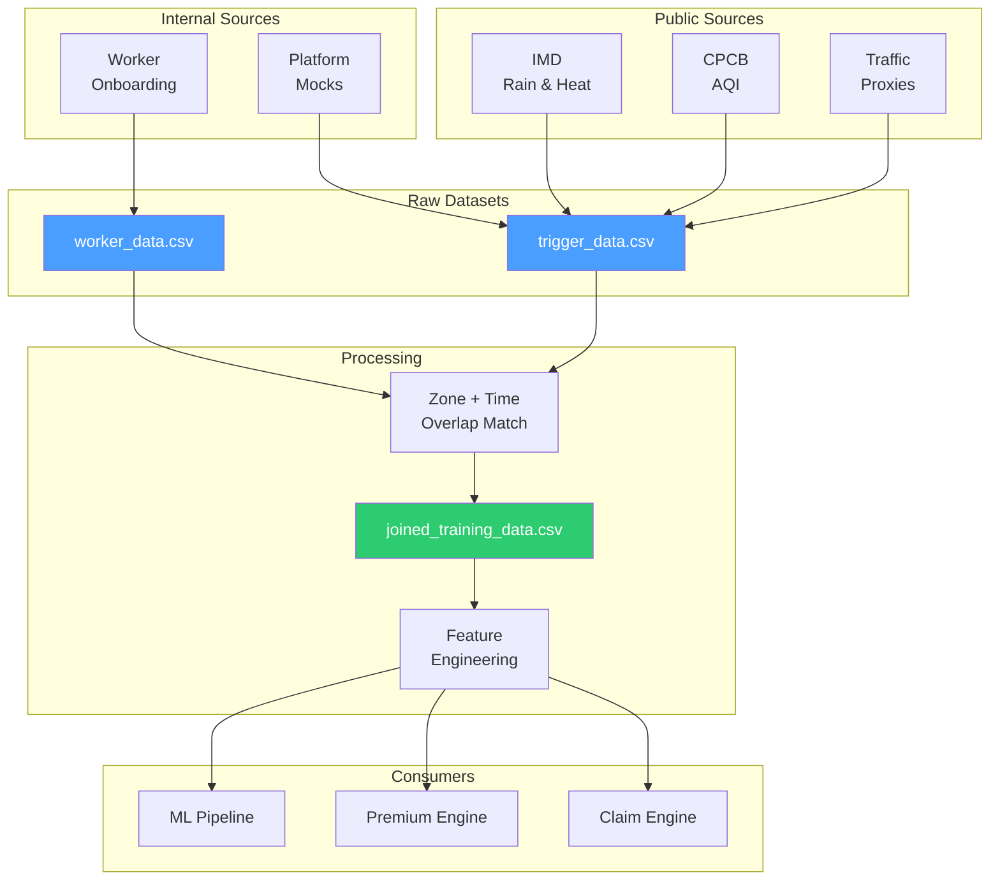

# Data — Synthetic Data Generation & Schemas

> This folder owns synthetic data generation, bootstrap sample rows, variable definitions, threshold references, and all CSV outputs used for analysis and demonstration. Every variable is documented with why it exists and how it influences premium or payout.

---

## Implementation Status

| Component | Status |
|-----------|--------|
| Schema definitions (worker_data, trigger_data, joined) | 📝 Documented |
| 8-row seed dataset | 📝 Documented |
| Variable dictionary | 📝 Documented |
| Threshold reference table | 📝 Documented |
| Synthetic data generator script | 📋 Planned |
| Mock-data API endpoint | 📋 Planned |
| CSV file outputs | 📋 Planned |

---

## Data Pipeline



---

## Schema Definitions

### worker_data

Worker-side profile and earning context. One row per worker.

| Field | Type | Description | Used in |
|-------|------|-------------|---------|
| `worker_id` | string | Unique worker identifier | All modules |
| `zone_id` | string | Primary operating zone | Exposure matching, pricing |
| `city` | string | City of operation | Zone-level risk |
| `shift_hours` | int | Daily shift duration (hours) | Exposure (E), covered income (B) |
| `hourly_income` | float | Average hourly earnings (INR) | Covered income (B) |
| `active_days` | int | Working days per week | Covered income (B) |
| `trust_score` | float (0–1) | Behavioral trust metric | Confidence (C), premium discount |
| `prior_claim_rate` | float (0–1) | Historical claim frequency | Fraud penalty |
| `gps_consistency` | float (0–1) | Location trace reliability | Confidence (C), fraud detection |
| `bank_verified` | bool (0/1) | Bank account verification status | Confidence (C), payout eligibility |

### trigger_data

Event-side disruption context. One row per trigger event.

| Field | Type | Description | Used in |
|-------|------|-------------|---------|
| `trigger_id` | string | Unique event identifier | Claim matching |
| `city` | string | City of event | Zone matching |
| `zone_id` | string | Affected zone | Exposure matching |
| `timestamp_start` | datetime | Event start time | Shift overlap check |
| `timestamp_end` | datetime | Event end time | Shift overlap check |
| `trigger_type` | string | Category (rain, AQI, heat, etc.) | Severity calculation |
| `rain_mm` | float | 24h rainfall in mm | Severity weight 0.23 |
| `aqi` | int | Air Quality Index reading | Severity weight 0.14 |
| `temp_c` | float | Temperature in °C | Severity weight 0.14 |
| `traffic_delay_pct` | float | Travel delay percentage | Severity weight 0.10 |
| `outage_min` | int | Platform outage in minutes | Severity weight 0.12 |
| `closure_flag` | bool (0/1) | Official zone closure | Severity weight 0.10 |
| `demand_drop_pct` | float | Order volume drop vs baseline | Severity weight 0.07 |
| `accessibility_score` | float (0–1) | Route accessibility | Severity weight 0.10 |
| `severity_bucket` | string | low / medium / high / extreme | Trigger tier classification |
| `source_reliability` | float (0–1) | Data source confidence | Confidence scoring |

### joined_training_data

Created **only after** matching `worker_data` with `trigger_data` on `zone_id` + shift/time overlap. This is the dataset used for EDA, ML experiments, and premium/payout calculations.

| Field | Type | Description |
|-------|------|-------------|
| All `worker_data` fields | — | Worker context |
| All `trigger_data` fields | — | Trigger context |
| `severity_score` | float (0–1) | Composite S from Disruption DNA |
| `exposure_score` | float (0.35–1) | Computed E |
| `confidence_score` | float (0.45–1) | Computed C |
| `fraud_penalty` | float (0–0.50) | Computed fraud penalty |
| `claim_flag` | bool | Whether a claim should be triggered |
| `premium` | float (INR) | Calculated gross premium |
| `payout` | float (INR) | Calculated payout amount |

**Match rule:** A worker record and trigger record are matched when they share the same `zone_id` and the trigger timestamp overlaps the worker's declared shift window. This prevents paying everyone in a city when only a subset of routes/hours/zones were disrupted.

---

## 8-Row Seed Dataset

The expert session required an initial manual dataset of ≈8 rows. This seed is the starting point for synthetic expansion:

| Zone | Income/hr (₹) | Shift h | Trust | Rain mm | AQI | Temp °C | Traffic % | Outage min | Closure |
|------|--------------|---------|-------|---------|-----|---------|-----------|------------|---------|
| A | 95 | 9 | 0.88 | 72 | 185 | 38 | 35 | 5 | 0 |
| B | 90 | 10 | 0.81 | 130 | 210 | 39 | 55 | 12 | 0 |
| C | 105 | 8 | 0.93 | 20 | 95 | 43 | 20 | 0 | 0 |
| D | 85 | 11 | 0.76 | 10 | 320 | 41 | 60 | 8 | 0 |
| E | 100 | 9 | 0.69 | 68 | 145 | 46 | 48 | 25 | 1 |
| F | 92 | 10 | 0.84 | 0 | 75 | 36 | 18 | 45 | 0 |
| G | 98 | 9 | 0.72 | 118 | 355 | 44 | 72 | 40 | 1 |
| H | 88 | 8 | 0.90 | 66 | 260 | 40 | 44 | 0 | 0 |

> **Note:** Income assumptions are team assumptions, not official government wages. All values are plausible but synthetic.

---

## Variable Dictionary

| Symbol | Name | Formula / Source | Meaning |
|--------|------|-----------------|---------|
| B | Covered weekly income | `0.70 × hourly_income × shift_hours × 6` | 70% of estimated weekly earnings |
| S | Disruption severity | Weighted composite (8 components) | How bad the disruption was |
| E | Exposure | `clip(0.45 + 0.30×(shift_hours/12) + 0.25×(1−accessibility), 0.35, 1.00)` | How much of the shift was affected |
| C | Effective confidence | `confidence × (1 − 0.70 × fraud_penalty)` | Trust-adjusted verification |
| p | Claim probability | Random Forest model output | Predicted claim likelihood |
| FH | Fraud holdback | `clip(0.15 + 0.25 × fraud_penalty, 0.15, 0.30)` | Risk-based payout withholding |
| U | Outlier uplift | `min(1.35, gross_premium / median_premium)` if outlier, else 1.0 | Proportional increase for extreme risk |
| Cap | Payout cap | `0.75 × B × U` | Maximum payout per claim |

---

## Trigger Threshold Reference Table

| Variable | Threshold | Reference |
|----------|-----------|-----------|
| Rain | 48mm watch / 64.5mm heavy / 115.6mm very heavy+ | IMD operational + heavy-rain / very-heavy-rain bands |
| AQI | 201+ caution / 301+ severe / 401+ extreme | CPCB AQI category thresholds |
| Heat | 45°C heat-wave / 47°C severe heat | IMD / NDMA heat-wave guidance |
| Traffic | ≥ 40% travel delay | Internal operational threshold |
| Platform outage | ≥ 30 minutes | Internal operational threshold |
| Demand collapse | ≥ 35% order drop vs baseline | Internal operational threshold |

---

## Data Creation Plan

1. Start with the 8-row manually created seed dataset (above)
2. Apply public-threshold logic for rain, AQI, heat, closures, and outages
3. Generate more rows using controlled synthetic variation (perturbation of seed)
4. Keep `worker_data` and `trigger_data` strictly separate
5. Join only after zone and shift overlap is validated

---

## Planned Generator Endpoint

> **📋 Status:** Planned / target architecture

```
GET /mock-data/generate?city=<city>&days=<n>
Returns:
  - worker_data.csv
  - trigger_data.csv
  - joined_training_data.csv
  - summary.json

GET /simulate/claim-scenario?worker_id=<id>&trigger_id=<id>
Returns:
  - trigger evaluation
  - premium before/after
  - payout recommendation
  - fraud confidence
  - claim decision trace
```

---

## Required Output Assets

| File | Status | Purpose |
|------|--------|---------|
| `worker_data.csv` | 📋 Planned | Worker profiles for analysis |
| `trigger_data.csv` | 📋 Planned | Trigger events for analysis |
| `joined_training_data.csv` | 📋 Planned | Matched dataset for ML training |
| `summary.json` | 📋 Planned | Aggregate statistics |
| Variable dictionary | 📝 Documented (this README) | Field definitions |
| Threshold reference table | 📝 Documented (this README) | Public threshold citations |

---

## Important Rule

> No random nonsense. Every variable must be documented with why it exists and how it influences premium or payout. If a reviewer cannot trace a data field to a formula, the data quality story fails.
