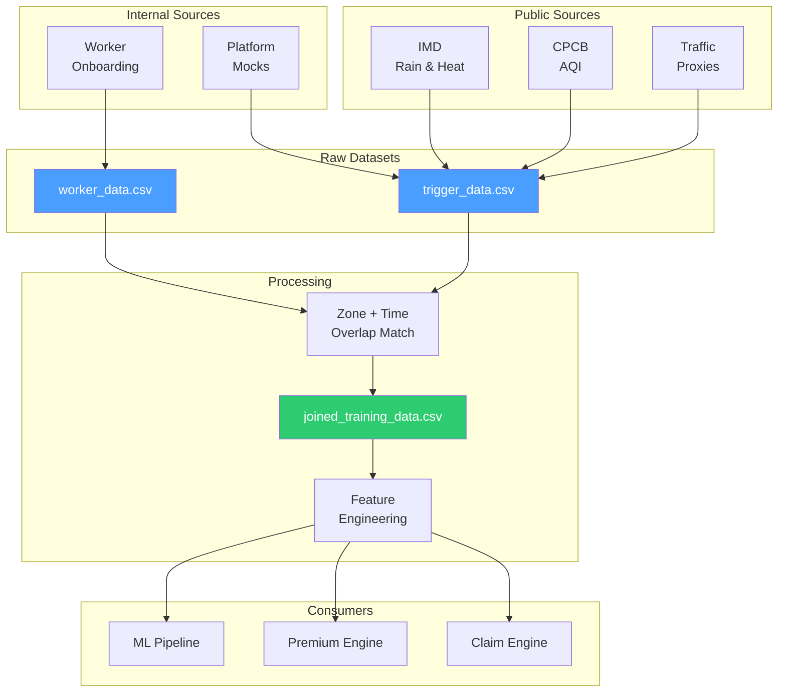

# Data — Synthetic Data Generation & Schemas

> This folder owns synthetic data generation, bootstrap sample rows, variable definitions, threshold references, and all CSV outputs used for analysis and demonstration. Every variable is documented with why it exists and how it influences premium or payout.

---

## Engineering Snapshot (2026-04-05)

- Data and claim records now participate in transactional outbox persistence for durable event delivery.
- New schema migrations (`backend/sql/10` to `13`) add rewards ledger support plus event outbox and consumer dead-letter reliability structures.
- Seed/sample datasets remain the same reference source for ML and pricing experiments; reliability additions are backward-compatible with existing sample flows.

---

## Implementation Status

| Component | Status |
|-----------|--------|
| Schema definitions (worker_data, trigger_data, joined) | 📝 Documented |
| 8-row seed dataset | ✅ Present | See `data/samples/` |
| Variable dictionary | 📝 Documented |
| Threshold reference table | 📝 Documented |
| Seed CSV files | ✅ Present | `data/samples/*.csv` (3 files, 8 rows each) |
| Synthetic data generator (DB re-seed) | ✅ Implemented (`POST /simulate/mock-data/generate`) |
| Claim scenario simulation endpoint | ✅ Implemented (`POST /simulate/claim-scenario` — full 8-stage pipeline, no DB write) |

---

## Data Pipeline



---

## Schema Definitions

### worker_data

Worker-side profile and earning context. One row per worker.

| Field | Type | Description | Used in |
|-------|------|-------------|---------|
| `worker_id` | string | Unique worker identifier | All modules |
| `zone_id` | string | Primary operating zone | Exposure matching, pricing |
| `city` | string | City of operation | Zone-level risk |
| `shift_hours` | int | Daily shift duration (hours) | Exposure (E), covered income (B) |
| `hourly_income` | float | Average hourly earnings (INR) | Covered income (B) |
| `active_days` | int | Working days per week | Covered income (B) |
| `trust_score` | float (0–1) | Behavioral trust metric | Confidence (C), premium discount |
| `prior_claim_rate` | float (0–1) | Historical claim frequency | Fraud penalty |
| `gps_consistency` | float (0–1) | Location trace reliability | Confidence (C), fraud detection |
| `bank_verified` | bool (0/1) | Bank account verification status | Confidence (C), payout eligibility |

### trigger_data

Event-side disruption context. One row per trigger event.

| Field | Type | Description | Used in |
|-------|------|-------------|---------|
| `trigger_id` | string | Unique event identifier | Claim matching |
| `city` | string | City of event | Zone matching |
| `zone_id` | string | Affected zone | Exposure matching |
| `timestamp_start` | datetime | Event start time | Shift overlap check |
| `timestamp_end` | datetime | Event end time | Shift overlap check |
| `trigger_type` | string | Category (rain, AQI, heat, etc.) | Severity calculation |
| `rain_mm` | float | 24h rainfall in mm | Severity weight 0.23 |
| `aqi` | int | Air Quality Index reading | Severity weight 0.14 |
| `temp_c` | float | Temperature in °C | Severity weight 0.14 |
| `traffic_delay_pct` | float | Travel delay percentage | Severity weight 0.10 |
| `outage_min` | int | Platform outage in minutes | Severity weight 0.12 |
| `closure_flag` | bool (0/1) | Official zone closure | Severity weight 0.10 |
| `demand_drop_pct` | float | Order volume drop vs baseline | Severity weight 0.07 |
| `accessibility_score` | float (0–1) | Route accessibility | Severity weight 0.10 |
| `severity_bucket` | string | low / medium / high / extreme | Trigger tier classification |
| `source_reliability` | float (0–1) | Data source confidence | Confidence scoring |

### joined_training_data

Created **only after** matching `worker_data` with `trigger_data` on `zone_id` + shift/time overlap. This is the dataset used for EDA, ML experiments, and premium/payout calculations.

| Field | Type | Description |
|-------|------|-------------|
| All `worker_data` fields | — | Worker context |
| All `trigger_data` fields | — | Trigger context |
| `severity_score` | float (0–1) | Composite S from Disruption DNA |
| `exposure_score` | float (0.35–1) | Computed E |
| `confidence_score` | float (0.45–1) | Computed C |
| `fraud_penalty` | float (0–0.50) | Computed fraud penalty |
| `claim_flag` | bool | Whether a claim should be triggered |
| `premium` | float (INR) | Calculated gross premium |
| `payout` | float (INR) | Calculated payout amount |

**Match rule:** A worker record and trigger record are matched when they share the same `zone_id` and the trigger timestamp overlaps the worker's declared shift window. This prevents paying everyone in a city when only a subset of routes/hours/zones were disrupted.

---

## 8-Row Seed Dataset

The expert session required an initial manual dataset of ≈8 rows. This seed is the starting point for synthetic expansion:

| Zone | Income/hr (₹) | Shift h | Trust | Rain mm | AQI | Temp °C | Traffic % | Outage min | Closure |
|------|--------------|---------|-------|---------|-----|---------|-----------|------------|---------|
| A | 95 | 9 | 0.88 | 72 | 185 | 38 | 35 | 5 | 0 |
| B | 90 | 10 | 0.81 | 130 | 210 | 39 | 55 | 12 | 0 |
| C | 105 | 8 | 0.93 | 20 | 95 | 43 | 20 | 0 | 0 |
| D | 85 | 11 | 0.76 | 10 | 320 | 41 | 60 | 8 | 0 |
| E | 100 | 9 | 0.69 | 68 | 145 | 46 | 48 | 25 | 1 |
| F | 92 | 10 | 0.84 | 0 | 75 | 36 | 18 | 45 | 0 |
| G | 98 | 9 | 0.72 | 118 | 355 | 44 | 72 | 40 | 1 |
| H | 88 | 8 | 0.90 | 66 | 260 | 40 | 44 | 0 | 0 |

> **Note:** Income assumptions are team assumptions, not official government wages. All values are plausible but synthetic.

### Downloadable Seed Files

The seed dataset is available as actual CSV files in `data/samples/`:

| File | Records | Description |
|------|---------|-------------|
| [`worker_data_seed.csv`](samples/worker_data_seed.csv) | 8 | Worker profiles matching the schema above |
| [`trigger_data_seed.csv`](samples/trigger_data_seed.csv) | 8 | Trigger events with all signal fields |
| [`joined_training_data_seed.csv`](samples/joined_training_data_seed.csv) | 8 | Matched worker+trigger rows with computed scores |

---

## Variable Dictionary

| Symbol | Name | Formula / Source | Meaning |
|--------|------|-----------------|---------|
| B | Covered weekly income | `0.70 × hourly_income × shift_hours × 6` | 70% of estimated weekly earnings |
| S | Disruption severity | Weighted composite (8 components) | How bad the disruption was |
| E | Exposure | `clip(0.45 + 0.30×(shift_hours/12) + 0.25×(1−accessibility), 0.35, 1.00)` | How much of the shift was affected |
| C | Effective confidence | `confidence × (1 − 0.70 × fraud_penalty)` | Trust-adjusted verification |
| p | Claim probability | Random Forest model output | Predicted claim likelihood |
| FH | Fraud holdback | `clip(0.15 + 0.25 × fraud_penalty, 0.15, 0.30)` | Risk-based payout withholding |
| U | Outlier uplift | `min(1.35, gross_premium / median_premium)` if outlier, else 1.0 | Proportional increase for extreme risk |
| Cap | Payout cap | `0.75 × B × U` | Maximum payout per claim |

---

## Trigger Threshold Reference Table

| Variable | Thresholds Used | Official Source | Inference / Mapping | Anchoring |
|----------|----------------|-----------------|---------------------|-----------|
| **Rain** | 48 mm watch / 64.5 mm heavy / 115.6 mm very heavy | [IMD Rainfall FAQ](https://rsmcnewdelhi.imd.gov.in/images/pdf/faq.pdf), [IMD Heavy Rainfall Warning](https://mausam.imd.gov.in/imd_latest/contents/pdf/pubbrochures/Heavy%20Rainfall%20Warning%20Services.pdf) | IMD defines heavy rainfall at 64.5 mm and very heavy at 115.6 mm. We introduce 48 mm as an earlier product watch threshold to begin elevated monitoring before the claim level. | ✅ Public |
| **AQI** | 201+ caution / 301+ severe / 401+ extreme | [CPCB National AQI](https://www.cpcb.nic.in/national-air-quality-index/), [OGD AQI Dataset](https://www.data.gov.in/resource/real-time-air-quality-index-various-locations) | CPCB defines Poor (201–300), Very Poor (301–400), Severe (401+). We map 201+ as caution and 301+ as claim threshold because these bands impair outdoor delivery work. | ✅ Public |
| **Heat** | 45°C heat-wave / 47°C severe | [IMD Heat Wave Warning](https://mausam.imd.gov.in/imd_latest/contents/pdf/pubbrochures/Heat%20Wave%20Warning%20Services.pdf), [NDMA Heat Wave](https://ndma.gov.in/Natural-Hazards/Heat-Wave) | IMD/NDMA define heat-wave at ≥ 45°C for plains regions. We use 45°C as claim threshold and 47°C as severe escalation. | ✅ Public |
| **Traffic** | ≥ 40% travel delay | [TomTom Traffic Flow API](https://developer.tomtom.com/traffic-api/documentation/traffic-flow/flow-segment-data) | 40% delay threshold is a product-engineering decision estimating the point where routes become undeliverable. TomTom live data provides proxy. *(Planned: Google Maps Distance Matrix API)* | ⚙️ TomTom live + Operational |
| **Platform outage** | ≥ 30 minutes | Internal | Platform data is not publicly available. 30-minute threshold estimates loss of material earning opportunity during a shift. | ⚙️ Operational |
| **Demand collapse** | ≥ 35% order drop vs baseline | Internal | Order volume is not publicly available. 35% drop estimates the threshold where earning opportunity falls below viable levels. | ⚙️ Operational |

> **Anchoring principle:** Environmental thresholds (rain, AQI, heat) are anchored to official Indian government classifications. Operational thresholds (traffic, outage, demand) are product-engineering estimates that may be refined with real operating data.

---

## Data Creation Plan

1. Start with the 8-row manually created seed dataset (above)
2. Apply public-threshold logic for rain, AQI, heat, closures, and outages
3. Generate more rows using controlled synthetic variation (perturbation of seed)
4. Keep `worker_data` and `trigger_data` strictly separate
5. Join only after zone and shift overlap is validated

**Matching rule:** A worker record and a trigger record are matched when they share the same `zone_id` **and** the trigger `timestamp_start`/`timestamp_end` overlaps the worker's declared `shift_window`. This prevents the system from paying everyone in a city when only a subset of routes, hours, or delivery zones were actually disrupted. See `samples/worker_data_seed.csv`, `samples/trigger_data_seed.csv`, and `samples/joined_training_data_seed.csv` for the seed dataset that demonstrates this matching.

> For threshold provenance and the full reference register, see [docs/README.md](../docs/README.md#reference-register).

---

## Simulation Endpoints (Implemented)

```
POST /simulate/mock-data/generate
  Runs seed_all() to re-populate the DB with synthetic data.
  Returns: { status, details }
  Auth: insurer_admin only

POST /simulate/claim-scenario
  Body: { worker_id, zone_id, trigger_family, raw_value }
  Returns:
    - worker_metrics (B, E, C)
    - ml_probability (live RF inference)
    - fraud_engine (5-layer full breakdown)
    - payout_calculation
    - recommended_action
  Auth: insurer_admin only
  Note: Does NOT write to the database. Safe for demo use.
```

---

## Required Output Assets

| File | Status | Purpose |
|------|--------|---------|
| `worker_data_seed.csv` | ✅ Present | Seed / demo worker profiles |
| `trigger_data_seed.csv` | ✅ Present | Seed / demo trigger events |
| `joined_training_data_seed.csv` | ✅ Present | Matched seed data used for RF training |
| Variable dictionary | 📝 Documented (this README) | Field definitions |
| Threshold reference table | 📝 Documented (this README) | Public threshold citations |

---

## Important Rule

> No random nonsense. Every variable must be documented with why it exists and how it influences premium or payout. If a reviewer cannot trace a data field to a formula, the data quality story fails.


## April 2026 Repo Update Addendum

### Newly implemented in current repo

- Canonical schema and patch migrations now cover review workflow,
  payout settlement reliability, and event outbox durability.
- Seed and joined training data continue to back internal calibration,
  simulation, and reproducible demo flows.
- Synthetic generation endpoints support rapid reseed during testing.

### Planned and next tranche

- Expand synthetic scenarios for edge conditions and fraud stress tests.
- Add versioned data-shape notes for schema evolution safety.
- Improve dataset lineage notes linking SQL seeds to ML inputs.
- Add richer anonymized examples for explainability demos.

