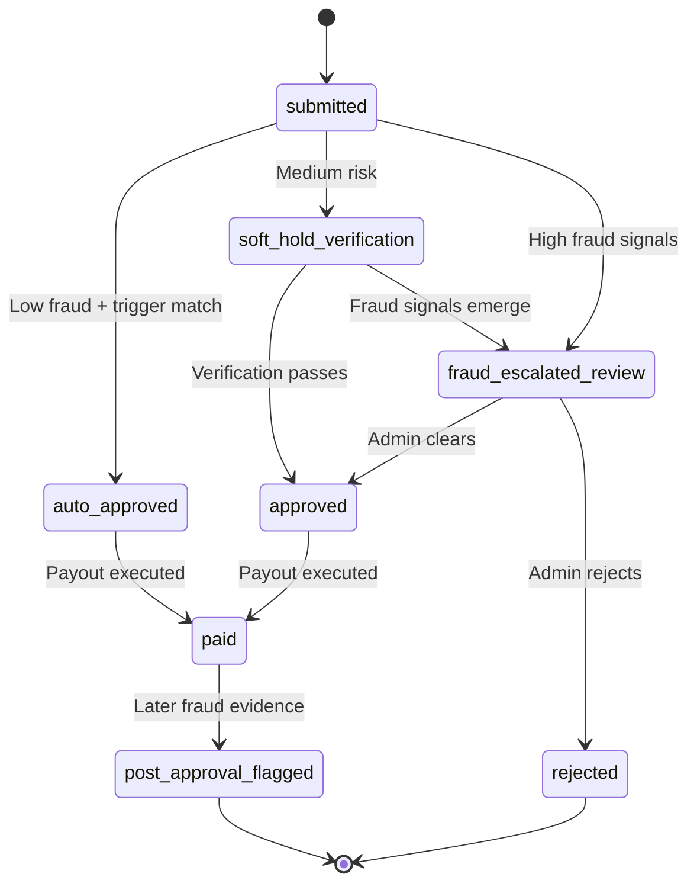

# Covara One — Implementation Status & Technical Reference

> This document is the **complete technical reference** for the Covara One platform.
> For the product overview, start at the [main README](../README.md).

---

## 📑 Navigation

| Section | What's inside |
|---------|--------------|
| [Implementation Status](#implementation-status) | What's built vs. planned — full checklist |
| [15-Trigger Library](#15-trigger-library) | All triggers with thresholds and sources |
| [Parametric Product](#parametric-product--weekly-benefit-plans) | Essential/Plus plans, payout ladder |
| [Internal Calibration Engine](#internal-calibration-engine) | Premium and severity formulas |
| [What ML Does vs. Doesn't](#what-ml-does-vs-what-ml-does-not-do) | Model role boundaries |
| [Threshold References](#threshold-references) | IMD, CPCB, NDMA source links |
| [Data Split](#data-split) | worker_data, trigger_data, joined schemas |
| [Payout Safety](#payout-safety--duplicate-prevention) | Idempotency, state machine, duplicates |
| [Region Validation Cache](#region-validation-cache--fast-lane-approvals) | Fast-lane incident processing |
| [Post-Approval Controls](#post-approval-fraud-controls) | Trust score penalties, legal escalation |
| [Progressive KYC](#progressive-kyc--trust-ladder) | 5-tier identity verification |
| [Business Framing](#business-framing) | Insurer value proposition, key metrics |

---

## Implementation Status

| Area | Status | Notes |
|------|--------|-------|
| Repository structure & README system | ✅ Current | Root README + 8 module READMEs |
| 15-trigger library (thresholds & logic) | ✅ Implemented | Trigger engine with live feed evaluation |
| Premium & payout formulas | ✅ Implemented | IRDAI-aligned: Essential ₹28/week, Plus ₹42/week |
| Parametric product (Essential / Plus) | ✅ Implemented | Fixed weekly benefit ladder: ₹3,000 / ₹4,500 cap |
| Data schemas & seed dataset | ✅ Present | 14-table Supabase SQL schema with RLS + seed CSVs |
| Backend API — full services | ✅ Implemented | Auth, claims, policies, triggers, zones, workers, analytics |
| Worker dashboard | ✅ Implemented | Profile, earnings chart, zone alerts, policy quote, claim submission |
| Insurer dashboard | ✅ Implemented | KPI cards, BCR/Loss Ratio, trigger mix chart, review queue |
| Claim pipeline | ✅ Implemented | 8-stage: severity → pricing → fraud → payout → Gemini AI |
| Fraud detection engine | ✅ Implemented | 5-layer Ghost Shift Detector + TomTom route plausibility (live) |
| Anti-spoofing (EXIF, VPN, device) | ✅ Implemented | Multi-signal verification, coordinated-ring detection |
| DBSCAN cluster detection | ✅ Implemented | Layer 5 fraud engine for synchronized mass-claim rings |
| Payout safety & idempotency | ✅ Implemented | Event-ID uniqueness, worker-event constraint, duplicate prevention |
| Claim state machine | ✅ Implemented | 8 states: submitted → auto_approved / soft_hold / fraud_escalated → paid |
| Post-approval fraud controls | ✅ Implemented | Flag endpoint, trust score downgrade, severity-graded penalties |
| Region validation cache | ✅ Implemented | Validated-incident fast-lane with liquidity protection |
| Supabase Auth & RLS | ✅ Implemented | Google OAuth, role-based routing, Row-Level Security |
| Edge SSR Middleware | ✅ Implemented | Next.js `middleware.ts` — server-side auth before hydration |
| OpenWeather API | ✅ Live | Weather + temperature triggers (real API key) |
| CPCB AQI (data.gov.in) | ✅ Live | 511-station AQI feed (real API key) |
| TomTom Traffic + Routing | ✅ Live | Real-time flow + route plausibility for fraud detection |
| KYC — Sandbox.co.in | ✅ Implemented | Aadhaar OTP + PAN + bank verification (3-tier progressive KYC) |
| Twilio WhatsApp + OTP | ✅ Implemented | 7 notification templates + Verify OTP (sandboxed) |
| Redis caching layer | ✅ Implemented | fastapi-cache2[redis] with TTL decorators on high-frequency endpoints |
| ML live inference | ✅ Implemented | RF model trained + saved; live `predict_proba()` wired into claim pipeline |
| DBSCAN fraud clustering | ✅ Implemented | Batch anomaly detection in `fraud_engine.py` |
| Actuarial metrics (BCR / Loss Ratio) | ✅ Implemented | Admin dashboard + `/analytics/summary` endpoint |
| Stress test simulator | ✅ Implemented | `ml/stress_test_simulator.py` — 10,000 workers, 3-day monsoon |
| Offline claim sync (Dark Zone) | ✅ Implemented | `POST /claims/offline-sync` — regional correlation hold |
| Docker (multi-stage builds) | ✅ Implemented | backend/Dockerfile + frontend/Dockerfile + docker-compose.yml |
| Kubernetes orchestration | ✅ Ready | `k8s/` — Deployment, Service, Ingress manifests |
| GitHub Actions CI/CD | ✅ Implemented | 3-job pipeline: lint+test → docker build → security audit |
| Automated test suite | ✅ Implemented | 61 pytest tests, 100% pass — pricing, fraud, pipeline, KYC, Twilio |
| Regional AQI Calibration | ✅ Implemented | City-specific baselines (Delhi 250+ vs Mumbai 150+) |
| Dynamic Threshold Engine | ✅ Implemented | Monthly p50/p75/p90 distribution calculations (Python + DB) |
| Indian Zone Network | ✅ Implemented | 65 detailed zones across 15 cities with validated PIN codes |
| Payment gateway (UPI) | ✅ Mock | `payment_mock.py` — async, RazorpayX-format, failure simulation |

**Legend:** ✅ Implemented & Live — ⚠️ Implemented with Known Limitation — 📋 Planned

### Planned Migrations (Post-Approval)

| Integration | Current | Target | Condition |
|---|---|---|---|
| **Weather** | OpenWeather API (live) | IMD direct APIs | After IMD IP whitelist approval |
| **KYC Level 4+** | Sandbox.co.in | DigiLocker (MeitY/NIC) | After official MeitY partnership |
| **Payment Disbursement** | Mock (DB record only) | Razorpay / Cashfree UPI Payouts | After payment gateway agreement |

---

## 15-Trigger Library

The platform uses a **3-tier trigger architecture**: early warning → claim trigger → severe escalation.

### Environmental Triggers

| ID | Trigger | Threshold | Tier | Action |
|----|---------|-----------|------|--------|
| T1 | Rain Watch | 24h rain ≥ 48 mm | Early Warning | Raise risk score, notify worker |
| T2 | Heavy Rain Claim | 24h rain ≥ 64.5 mm | Claim Trigger | Open claim candidate if zone + shift overlap |
| T3 | Extreme Rain Escalation | 24h rain ≥ 115.6 mm | Severe Escalation | Escalate severity band and payout cap |
| T5 | AQI Caution | AQI 201–300 | Early Warning | Warn worker, raise premium sensitivity |
| T6 | AQI Severe Exposure | AQI ≥ 301 + active shift | Claim Trigger | Open claim candidate |
| T7 | Heat Wave | Temp ≥ 45°C or IMD heat-wave | Claim Trigger | Open claim candidate |
| T8 | Severe Heat | Temp ≥ 47°C | Severe Escalation | Escalated claim severity |
| T9 | Heat Persistence | 2 consecutive hot-risk days | Early Warning | Raise weekly risk loading |

### Operational and Civic Triggers

| ID | Trigger | Threshold | Tier | Action |
|----|---------|-----------|------|--------|
| T4 | Waterlogging Mobility | Accessibility score ≤ 0.40 | Claim Trigger | Claim candidate for blocked routes |
| T10 | Local Zone Closure | Official closure flag = 1 | Claim Trigger | Auto-escalate to claim review |
| T11 | Curfew / Strike Closure | Restriction window ≥ 4h | Claim Trigger | Claim candidate if pickup/drop blocked |
| T12 | Traffic Collapse | Travel delay ≥ 40% | Early Warning | Raise exposure and route stress |
| T13 | Platform Outage | Outage ≥ 30 min | Claim Trigger | Claim candidate for verified active workers |
| T14 | Demand Collapse | Orders drop ≥ 35% vs baseline | Early Warning | Raise loss-of-income probability |
| T15 | Composite Disruption | Composite score ≥ 0.70 | Severe Escalation | Fast-track claim escalation |

**Threshold sources:** IMD heavy-rain and heat-wave bands, CPCB AQI category thresholds, IMD/NDMA heat-wave guidance.

---

## Parametric Product: Weekly Benefit Plans

Covara One uses an internal weekly risk-and-pricing model to calibrate premiums, while the final worker-facing product remains parametric: once a trigger band is hit and anti-spoofing verification passes, the payout is released per the selected weekly benefit plan.

### Parametric Payout Ladder

Let `W` = selected weekly benefit.

| Trigger / exposure band | Description | Parametric payout |
|---|---|---:|
| **Band 1** — Moderate disruption | Watch-level trigger confirmed with partial exposure | `0.25 × W` |
| **Band 2** — Major disruption | Claim-level trigger confirmed with strong exposure | `0.50 × W` |
| **Band 3** — Severe disruption | Escalation-level trigger with full exposure match | `1.00 × W` |

#### Example: Essential plan (W = ₹3,000)

| Band | Payout |
|---|---:|
| Band 1 | ₹750 |
| Band 2 | ₹1,500 |
| Band 3 | ₹3,000 |

#### Example: Plus plan (W = ₹4,500)

| Band | Payout |
|---|---:|
| Band 1 | ₹1,125 |
| Band 2 | ₹2,250 |
| Band 3 | ₹4,500 |

---

## Internal Calibration Engine

The formula engine is retained for internal use only — it calibrates premiums and benefit sizing but does **not** determine the worker-facing payout.

| Formula | Expression | Internal use |
|---|---|---|
| Covered Income (B) | `0.70 × hourly_income × shift_hours × 6` | Plan benefit calibration |
| Severity Score (S) | Weighted composite of 8 components | Trigger band mapping |
| Exposure (E) | `clip(0.45 + 0.30×(shift_hours/12) + 0.25×(1−accessibility_score), 0.35, 1.00)` | Exposure verification |
| Confidence (C) | `clip(0.50 + 0.30×trust + 0.10×gps + 0.10×bank, 0.45, 1.00) × (1 − 0.70×fraud_penalty)` | Review routing |
| Expected Payout | `p × B × S × E × C × (1 − FH)` | Premium calibration |
| Gross Premium | `[Expected Payout / (1 − 0.12 − 0.10)] × U` | Weekly premium pricing |

### Sample Scenario (Parametric)

**Worker:** Plus plan (W = ₹4,500), shift = 11h, zone = MU-WE-01, trust = 0.82

**Trigger:** rain = 72mm in zone MU-WE-01, AQI = 240, temp = 41°C

**Decision flow:**
1. Rain 72mm exceeds 64.5mm → **T2 fires** (claim-level)
2. AQI 240 → T5 fires (caution, contributes to composite)
3. Composite severity maps to **Band 2**
4. Anti-spoofing: EXIF GPS matches zone, shift overlap confirmed, route plausibility verified ✅
5. Fraud score: 0.12 → `auto_approve`
6. **Payout: ₹2,250** (0.50 × ₹4,500)

---

## Actuarial Metrics

The Admin Dashboard and `/analytics/summary` endpoint surface live actuarial metrics from the `payout_recommendations` table:

| Metric | Formula | Target |
|--------|---------|--------|
| **Burning Cost Rate (BCR)** | `total_expected_payout / total_gross_premium` | 0.55–0.70 |
| **Loss Ratio** | `total_recommended_payout / total_gross_premium` | < 1.0 |

---

## What ML Does vs. What ML Does Not Do

> ML supports classification, anomaly ranking, and review routing, but **does not independently authorize payout**.

| ML does | ML does not |
|---|---|
| Estimate claim probability `p` via `predict_proba()` | Directly authorize or block payout |
| DBSCAN cluster detection for fraud rings | Set the final payout amount |
| Anomaly and cluster scoring | Replace the parametric payout ladder |
| Zone-level trend detection | Replace underwriting judgment |
| Power `needs_review` classification | Act as a black-box decision engine |

**Correct architecture:**
- **Parametric payout ladder** = public-facing insurance logic (trigger band → pre-agreed benefit)
- **Formula engine** = internal premium and benefit calibration
- **ML model** = supporting signal for probability estimation, anomaly detection, review routing

---

## Threshold References

| Parameter | Source | Threshold | Anchoring |
|-----------|--------|-----------|-----------|
| **Rain** | [IMD Heavy Rainfall Warning](https://mausam.imd.gov.in/imd_latest/contents/pdf/pubbrochures/Heavy%20Rainfall%20Warning%20Services.pdf) | 48mm = watch; 64.5mm = claim; 115.6mm = escalation | ✅ Public-source |
| **AQI** | [CPCB National Air Quality Index](https://www.cpcb.nic.in/national-air-quality-index/) | 201+ = caution; 301+ = claim | ✅ Public-source |
| **Heat** | [IMD Heat Wave Warning Services](https://mausam.imd.gov.in/imd_latest/contents/pdf/pubbrochures/Heat%20Wave%20Warning%20Services.pdf) | 45°C = claim; 47°C = escalation | ✅ Public-source |
| **Traffic** | Internal product threshold | ≥ 40% travel-time delay | ⚙️ Internal |
| **Platform Outage** | Internal product threshold | ≥ 30 min downtime | ⚙️ Internal |
| **Demand Collapse** | Internal product threshold | ≥ 35% order drop | ⚙️ Internal |

---

## Regional Calibration & Dynamic Thresholds

Covara One uses a **data-driven regional calibration engine** to ensure fairness across India's diverse climates. A static trigger (e.g., AQI > 200) is unfair in Delhi (where AQI is rarely below 150) vs. Bangalore (where 101 is "Poor").

### 1. City-Specific Baselines

The system applies a baseline offset to the national standard based on historical city data:

| City | Baseline AQI | Sensitivity | Why? |
|:---|:---:|:---:|:---|
| **Delhi / NCR** | 180 | Low | High chronic pollution; requires valid spike to trigger |
| **Mumbai** | 60 | High | Coastal ventilation; 150 is a significant health disruption |
| **Bangalore** | 50 | High | Clean air baseline; triggers fire earlier for safety |
| **Chennai / Kochi** | 70 | High | Marine influence; rain-based triggers more sensitive |

### 2. Dynamic Monthly Engine

The `dynamic_threshold_engine.py` (triggered via `POST /ingest/compute-dynamic-thresholds`) simulates 30 days of historical data distributions for every zone:

1. **Calculate Percentiles**: Computes p50 (median), p75, and p90.
2. **Derive Triggers**: 
   - `Watch = p50 * 1.4` (+ zone type adjustment)
   - `Claim = p75 * 1.3` (+ zone type adjustment)
   - `Extreme = p90 * 1.2` (+ zone type adjustment)
3. **Zone Type Adjustments**: 
   - `urban_core`: +25 tolerance (better shelter/drainage accessibility)
   - `mixed`: Baseline
   - `peri_urban`: -25 tolerance (higher risk of local blockage)

---

## Data Split

The dataset is split into two major entities and joined only after exposure matching.

### worker_data
`worker_id`, `zone_id`, `city`, `shift_window`, `hourly_income`, `active_days`, `bank_verified`, `gps_consistency`, `trust_score`, `prior_claim_rate`

### trigger_data
`trigger_id`, `city`, `zone_id`, `timestamp_start`, `timestamp_end`, `trigger_type`, `raw_value`, `threshold_crossed`, `severity_bucket`, `source_reliability`

### joined_training_data
Created only after matching `worker_data` ↔ `trigger_data` on `zone_id` + shift/time overlap. Used for EDA, ML experiments, and premium/payout calculations.

---

## Payout Safety & Duplicate Prevention

> [!IMPORTANT]
> Every disruption window gets a **deterministic event ID** (hash of zone + trigger family + window start). The system enforces **one payout per worker per event**.

| Safety control | How it works |
|---|---|
| **Event-ID idempotency** | Each disruption window has a unique `event_id`. Re-firing the same trigger returns the existing event — no duplicate created. |
| **Worker-event uniqueness** | Partial unique index on `(worker_id, event_id)` in payout records. Duplicates are rejected at the database level. |
| **Atomic state transitions** | Claim status transitions are validated against the allowed state machine. |
| **No partial payouts** | Soft hold delays money movement until verification completes. No clawback risk. |
| **Retry-safe requests** | Payout execution is idempotent — retrying returns the existing result, never creates a second payment. |

### Claim State Machine

---

## Region Validation Cache & Fast-Lane Approvals

When a disruption affects many workers simultaneously, forcing every claim through manual review is inefficient.

**How it works:**
1. System detects unusual claim spike in a region/time-window
2. Regional incident validated via trusted workers (3+), admin confirmation, news feed, or public API
3. Incident marked **validated** in region cache
4. Later claims from same zone/trigger/window fast-tracked — skip repeated manual review
5. **Individual anti-fraud checks are never bypassed**

> [!WARNING]
> **Cluster spike protection:** If >50 claims/hour from one zone, platform switches to cluster-level validation — protecting the liquidity pool before mass payouts execute.

---

## Post-Approval Fraud Controls

| Control | Action | Effect |
|---|---|---|
| **Post-approval flag** | Admin flags a previously approved/paid claim | Claim status → `post_approval_flagged` |
| **Trust score downgrade** | Graduated penalty applied | Future claims default to `soft_hold_verification` |
| **Legal escalation** | Severe/critical fraud | Routed to compliance/platform risk team |
| **Account review** | Critical fraud | Worker suspended pending investigation |

### Trust Score Penalties

| Fraud severity | Trust score penalty | Additional action |
|---|---:|---|
| Minor (evidence quality issue) | −0.05 | None |
| Moderate (timing inconsistency) | −0.15 | Future claims reviewed |
| Severe (coordinated fraud) | −0.30 | Legal escalation flag |
| Critical (systematic abuse) | −0.50 | Full account review |

---

## Progressive KYC / Trust Ladder

| Level | Verification | When triggered |
|---|---|---|
| **Level 1** | Phone OTP | Sign-up |
| **Level 2** | Partner / platform ID validation | First policy activation |
| **Level 3** | Bank / UPI ownership match (₹1 penny-drop) | First payout |
| **Level 4** | Optional DigiLocker-backed identity verification | High-value claims or escalation |
| **Level 5** | Selfie / document path | Fraud escalation only |

---

## Business Framing

Covara One is positioned as an **insurer-facing platform** — not a fully licensed insurer. We provide the parametric underwriting engine, claims orchestration, and fraud detection that a licensed insurer embeds into their gig-worker distribution channel.

### Insurer Value Proposition

| Benefit | How Covara One delivers it |
|---|---|
| **Reduced manual claim handling** | 8-stage automated pipeline + region fast-lane |
| **Lower Loss Adjustment Expense (LAE)** | Parametric trigger-based decisions replace manual adjuster visits |
| **Fraud leakage reduction** | 5-layer Ghost Shift Detector + post-approval controls |
| **Validated-incident batching** | Region cache groups same-zone claims into event-level exposure views |
| **Actuarial visibility** | Live BCR and Loss Ratio tracked in the Admin Dashboard |

### Key Business Metrics

- Loss ratio by zone
- Burning Cost Rate (BCR) — target 0.55–0.70
- Claim automation rate
- Payout-to-premium ratio
- Trust-weight distribution
- Fraud leakage rate

---

## Module Deep-Dive

| Module | README | What it covers |
|---|---|---|
| **Backend** | [backend/README.md](../backend/README.md) | FastAPI services, 10-service inventory, endpoint catalog, SQL schema |
| **Frontend** | [frontend/README.md](../frontend/README.md) | Next.js 16 pages, Edge Middleware, auth flow, API integration map |
| **Fraud** | [fraud/README.md](../fraud/README.md) | 5-layer pipeline, advanced vectors, signal hierarchy, decision bands |
| **Claim Engine** | [claim-engine/README.md](../claim-engine/README.md) | 8-stage pipeline, parametric payout ladder, decision matrix |
| **ML** | [ml/README.md](../ml/README.md) | Random Forest baseline, DBSCAN, XGBoost benchmark, stress test |
| **Data** | [data/README.md](../data/README.md) | Schemas, seed datasets, variable dictionary, threshold references |
| **Integrations** | [integrations/README.md](../integrations/README.md) | Real vs. mock APIs, KYC pipeline, payment mock |
| **Caching** | [caching/README.md](../caching/README.md) | Cache targets, TTL policies, graceful degradation |
| **Docs** | [docs/README.md](README.md) | Documentation index, reference register |
