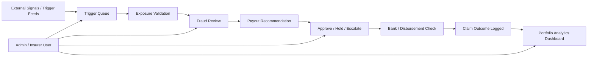

# Docs — Documentation Index

> This folder is the **non-code explanation layer** of the project. It contains architecture diagrams, formula references, pitch assets, and supporting documentation that allow judges and reviewers to understand the platform without inspecting source code.

---

## Engineering Snapshot (2026-04-09)

- Added event reliability runbook docs at `docs/EVENT_BUS_KAFKA_ROADMAP.md`.
- Added signed mobile telemetry contract at `docs/MOBILE_DEVICE_CONTEXT_CONTRACT.md`.
- Reliability hardening now includes outbox dead-letter + consumer dead-letter operational workflows with admin endpoints.
- Added release/deployment hardening runbook at `docs/DEPLOYMENT_RELEASE_RUNBOOK.md`.
- Added payout/event dead-letter recovery runbook at `docs/PAYOUT_EVENT_REQUEUE_RUNBOOK.md`.
- Added one-pass release verification checklist at `docs/RELEASE_VERIFICATION_CHECKLIST.md`.
- Trust lifecycle auditability is now live: trust-score history persistence and worker/admin history API visibility.

### New Docs Added

- `docs/EVENT_BUS_KAFKA_ROADMAP.md` - event bus evolution, Kafka rollout stages, operational defaults, and safety notes.
- `docs/MOBILE_DEVICE_CONTEXT_CONTRACT.md` - signed header contract, replay controls, key rotation, and compatibility requirements.
- `docs/DEPLOYMENT_RELEASE_RUNBOOK.md` - CI release gates, strict env validation, compose/k8s apply order, smoke checks, and rollback steps.
- `docs/PAYOUT_EVENT_REQUEUE_RUNBOOK.md` - replay-safe dead-letter list/requeue flow, verification checklist, and escalation stop conditions.
- `docs/RELEASE_VERIFICATION_CHECKLIST.md` - single-pass DB + RPC + backend + runtime + CI verification checklist for release approval.

---

## Implementation Status

| Asset | Status | Notes |
|-------|--------|-------|
| Folder structure & README index | ✅ Current | You are reading it |
| Architecture diagrams (Mermaid) | ✅ Present | Inline in READMEs + standalone `.mmd` files in `docs/diagrams/` |
| Architecture diagram PNGs | ✅ Present | 5 PNGs in `docs/assets/architecture/` |
| Data-science chart PNGs | ✅ Present | 2 PNGs in `docs/assets/insurance/` |

---

## Folder Structure

```
docs/
├── README.md                     ← You are here
├── IMPLEMENTATION_STATUS.md      ← Full technical reference
├── DEPLOYMENT_RELEASE_RUNBOOK.md ← Release/deploy/smoke/rollback
├── PAYOUT_EVENT_REQUEUE_RUNBOOK.md ← Dead-letter recovery for payout/event pipelines
├── RELEASE_VERIFICATION_CHECKLIST.md ← One-pass release verification checklist
├── RENDER_STRIPE_POSTMAN_HANDOFF.md ← Render/Stripe/Postman deployment handoff
├── STRIPE_WEBHOOK_EVENTS.md     ← Stripe webhook event catalog
├── EVENT_BUS_KAFKA_ROADMAP.md    ← Event bus evolution
├── MOBILE_DEVICE_CONTEXT_CONTRACT.md ← Mobile telemetry contract
├── diagrams/                     ← Standalone Mermaid source files (.mmd)
│   ├── overall-system-architecture.mmd
│   ├── worker-journey.mmd
│   ├── insurer-operations.mmd
│   ├── trigger-to-claim-flow.mmd
│   └── fraud-detection-pipeline.mmd
├── assets/
│   ├── architecture/             ← 5 architecture diagram PNGs
│   └── insurance/                ← 2 formula/EDA chart PNGs
```

> All diagram and asset directories are populated. Mermaid diagrams are also embedded inline in the module READMEs.

---

## Documentation Inventory

### Architecture Views

Five architecture views are defined for this project (per expert-session requirements):

| # | View | Where to find it | Format |
|---|------|-------------------|--------|
| 1 | Unified System Architecture | [Root README](../README.md) | Mermaid (inline) |
| 2 | Gig Worker Journey | [Root README](../README.md) | Mermaid (inline) |
| 3 | Insurance Company Operations | Below (this file) | Mermaid (inline) |
| 4 | Trigger → Claim → Approval Flow | [claim-engine/README.md](../claim-engine/README.md) | Mermaid (inline) |
| 5 | Fraud Detection Pipeline (5-Layer) | [fraud/README.md](../fraud/README.md) | Mermaid (inline) |
| 6 | Adversarial Defense & Anti-Spoofing | [Root README](../README.md#adversarial-defense--anti-spoofing-strategy) | Tables + narrative |

#### View 3 — Insurer Operations

This view shows the insurer/admin-side operating flow — from incoming trigger feeds through exposure validation, fraud checks, payout authorization, and into the portfolio analytics dashboard.



> **📋 Status:** This diagram represents the **target architecture** for insurer-side operations.


### Formula & Data-Science Documentation

| Document | Content | Where referenced |
|----------|---------|-----------------| 
| Premium formula book | Internal calibration: B, S, E, C, expected payout, gross premium | [Root README](../README.md), [ml/README.md](../ml/README.md) |
| Parametric payout ladder | Public-facing: Essential/Plus plans, Band 1/2/3 payouts | [Root README](../README.md#parametric-product-weekly-benefit-plans) |
| Adversarial defense & anti-spoofing | Multi-signal verification, decision matrix, circuit-breakers, fraud-ring scenario | [Root README](../README.md#adversarial-defense--anti-spoofing-strategy), [fraud/README.md](../fraud/README.md) |
| What ML Does vs Does Not Do | ML role boundaries, correct architecture split | [Root README](../README.md#what-ml-does-vs-what-ml-does-not-do), [ml/README.md](../ml/README.md) |
| Trigger threshold reference | IMD rain bands, CPCB AQI categories, IMD/NDMA heat-wave guidance, operational thresholds | [Root README](../README.md), [claim-engine/README.md](../claim-engine/README.md) |
| Derivation example | Worked scenario: ₹84/hr worker, 72mm rain, AQI 240 → premium and payout outputs | [Root README](../README.md) |
| Seed dataset | 8-row manually created base dataset | [data/README.md](../data/README.md) |
| Bootstrap pipeline results | Median premium ₹218.7, median payout ₹442.6, AUC 0.647 | [ml/README.md](../ml/README.md) |

### Pitch & Presentation Assets

| Asset | Purpose | Status |
|-------|---------|--------|
| 5-minute pitch script | Timed judge-facing narrative (0:00–5:00) | 📝 Documented |
| Demo sequence | Worker quote → trigger event → claim path → insurer dashboard → analytics | 📝 Documented |
| Judge Q&A preparation | 5 likely questions with sharp responses | 📝 Documented |
| Challenge alignment note | Maps every challenge requirement to our approach | ✅ In root README |

---

## Recommended Reading Order

For a reviewer encountering the project for the first time:

1. **Root README** — full product overview, architecture, trigger library, formula summary
2. **This file (docs/README.md)** — documentation index and asset map
3. **claim-engine/README.md** — core business logic pipeline
4. **fraud/README.md** — fraud detection architecture
5. **data/README.md** — data schemas, seed dataset, generation plan
6. **ml/README.md** — data science pipeline and model results
7. **backend/README.md** — API layer and service architecture
8. **frontend/README.md** — dashboard specifications
9. **integrations/README.md** — external connectors and mock status
10. **caching/README.md** — cache strategy

---

## Static Asset Placement Guide

When visual assets are added to the repository, use these locations:

| Asset type | Destination | Actual files present |
|-----------|-------------|---------------------|
| Architecture diagrams | Inline in READMEs | Mermaid code blocks (GitHub-renderable) — AI-generated PNGs removed |
| Insurance/formula charts | `docs/assets/insurance/` | `feature_importance.png`, `premium_payout_boxplot.png` |
| Mermaid source files | `docs/diagrams/` | `overall-system-architecture.mmd`, `worker-journey.mmd`, `insurer-operations.mmd`, `trigger-to-claim-flow.mmd`, `fraud-detection-pipeline.mmd` |
| Pitch deck | `docs/` | *(not yet added)* |

> **Preference:** Use Mermaid diagrams (GitHub-renderable) inline in READMEs. Use static images only when Mermaid cannot adequately represent the content (e.g., boxplots, scatter plots, feature importance charts).

---

## Reference Register

### Public Threshold References

| # | Source | Supports | Justification | Link |
|---|--------|----------|---------------|------|
| 1 | CPCB National Air Quality Index | AQI category bands for T5, T6 triggers | Official Indian AQI framework defines Poor (201–300), Very Poor (301–400), and Severe (401+). We use these directly as caution and claim thresholds. | [cpcb.nic.in](https://www.cpcb.nic.in/national-air-quality-index/) |
| 2 | OGD Real-Time AQI Dataset | AQI data ingestion | Provides downloadable real-time AQI readings by city/station from CPCB monitoring network. | [data.gov.in](https://www.data.gov.in/resource/real-time-air-quality-index-various-locations) |
| 3 | IMD Rainfall FAQ | Rain threshold categories for T1–T3 triggers | Defines heavy rainfall (64.5–115.5 mm/24h) and very heavy rainfall (115.6–204.4 mm/24h). We anchor claim and escalation thresholds to these bands. | [IMD FAQ PDF](https://rsmcnewdelhi.imd.gov.in/images/pdf/faq.pdf) |
| 4 | IMD Heavy Rainfall Warning Services | Rain warning methodology | Documents operational heavy-rain warning services and category definitions used by IMD field offices. | [IMD Brochure PDF](https://mausam.imd.gov.in/imd_latest/contents/pdf/pubbrochures/Heavy%20Rainfall%20Warning%20Services.pdf) |
| 5 | IMD Heat Wave Warning Services | Heat threshold for T7–T9 triggers | Defines heat-wave conditions (≥ 45°C for plains, or departure ≥ 4.5°C from normal). We use 45°C as claim and 47°C as escalation. | [IMD Brochure PDF](https://mausam.imd.gov.in/imd_latest/contents/pdf/pubbrochures/Heat%20Wave%20Warning%20Services.pdf) |
| 6 | NDMA Heat Wave Guidance | Heat-wave preparedness criteria | Government guidance on heat-wave classification and impact categories. Supports our heat-wave threshold mapping. | [ndma.gov.in](https://ndma.gov.in/Natural-Hazards/Heat-Wave) |

### Model / Data Science References

| # | Source | Supports | Justification | Link |
|---|--------|----------|---------------|------|
| 7 | Breiman (2001), *Random Forests* | Baseline severity classifier | Random Forest was selected for its interpretability through feature importance, robustness to small datasets, and resistance to overfitting — important for an 8-row seed with bootstrap expansion. | [stat.berkeley.edu PDF](https://www.stat.berkeley.edu/~breiman/randomforest2001.pdf) |
| 8 | Chen & Guestrin (2016), *XGBoost* | Future benchmark model | XGBoost is retained as a potential benchmark if dataset complexity warrants gradient-boosted trees. Not yet used in current pipeline. | [arXiv:1603.02754](https://arxiv.org/abs/1603.02754) |

### Premium / Pricing References

Environmental trigger thresholds and premium/payout formulation are grounded in separate, independently verifiable sources. The repo intentionally separates hazard classification (public government references) from pricing methodology (actuarial and data-science references).

| # | Source | What it supports | Why it is relevant | Link |
|---|--------|------------------|--------------------|------|
| 1 | CPCB AQI Report | AQI category bands for T5, T6 triggers | Official Indian AQI framework defines Poor (201–300), Very Poor (301–400), and Severe (401+). We use these directly as caution and claim thresholds. | [cpcb.nic.in](https://www.cpcb.nic.in/aqi_report.php) |
| 2 | OGD Real-Time AQI | AQI data ingestion | Provides downloadable real-time AQI readings by city/station from the CPCB monitoring network. | [data.gov.in](https://www.data.gov.in/catalog/real-time-air-quality-index) |
| 3 | IMD Heavy Rainfall Warning Services | Rain threshold categories for T1–T3 triggers | Documents operational heavy-rain warning services and defines heavy rainfall (64.5–115.5 mm/24h) and very heavy rainfall (115.6–204.4 mm/24h). | [IMD Brochure PDF](https://mausam.imd.gov.in/imd_latest/contents/pdf/pubbrochures/Heavy%20Rainfall%20Warning%20Services.pdf) |
| 4 | IMD FAQ on Heat Wave | Heat threshold for T7–T9 triggers | Defines heat-wave conditions (≥ 45°C for plains, or departure ≥ 4.5°C from normal). We use 45°C as claim and 47°C as escalation. | [IMD Heat Wave FAQ PDF](https://internal.imd.gov.in/section/nhac/dynamic/FAQ_heat_wave.pdf) |
| 5 | NDMA Heat Wave Guidance | Heat-wave preparedness criteria | Government guidance on heat-wave classification and impact categories. Supports our heat-wave threshold mapping. | [ndma.gov.in](https://ndma.gov.in/Natural-Hazards/Heat-Wave) |
| 6 | Breiman (2001), *Random Forests* | Baseline severity classifier (claim probability `p`) | Random Forest was selected for interpretability through feature importance, robustness to small datasets, and resistance to overfitting — critical for an 8-row bootstrap seed. | [doi.org](https://doi.org/10.1023/A:1010933404324) |
| 7 | Chen & Guestrin (2016), *XGBoost* | Future benchmark model | XGBoost is retained as a planned benchmark if dataset complexity warrants gradient-boosted trees. Not yet used in current pipeline. | [doi.org](https://doi.org/10.1145/2939672.2939785) |
| 8 | *Loss Data Analytics*, Ch. 7: Premium Foundations | Expected-loss premium principle | Provides the actuarial grounding for the expected-value premium formula used in our gross premium calculation. | [openacttexts.github.io](https://openacttexts.github.io/Loss-Data-Analytics/ChapPremiumFoundations.html) |
| 9 | Mikosch, *Non-Life Insurance Mathematics* | Premium loading and risk margin methodology | Supports the expense-loading (α) and risk-margin (β) assumptions in the gross premium formula. | [Springer PDF](https://unina2.on-line.it/sebina/repository/catalogazione/documenti/Mikosch%20-%20Non-life%20insurance%20mathematics.pdf) |

### Insurance-Side Trend Sources

| # | Source | What it supports | Why it is relevant | Link |
|---|--------|------------------|--------------------|------|
| 10 | IRDAI Annual Reports & Handbook | Claim trends, market structure, complaint/settlement statistics | Grounds pricing and claims reasoning in actual Indian insurance market data rather than pure synthetic logic | [irdai.gov.in](https://www.irdai.gov.in/annual-reports) |
| 11 | IIB (Insurance Information Bureau) | Analytics-oriented insurance datasets, general-insurance patterns | Provides fraud/risk-analytics orientation and claims/operational trend benchmarking | [iib.gov.in](https://iib.gov.in/) |
| 12 | Swiss Re Parametric Insurance Guide | Parametric insurance product framing | Provides the conceptual framework for trigger-band-based payouts and basis-risk acknowledgment | [swissre.com](https://www.swissre.com/) |
| 13 | Financial Protection Forum | Disaster-response parametric insurance | Supports the parametric trigger architecture for weather-linked income protection | [financialprotectionforum.org](https://www.financialprotectionforum.org/) |

> These insurance-side sources do not magically produce gig-delivery product data, but they make the pricing, claims reasoning, and product framing more defensible than pure synthetic logic alone.

### Threshold Inference Notes

| Trigger family | Official / source threshold | Product threshold used | Why we inferred it this way | Anchoring |
|---------------|----------------------------|------------------------|----------------------------|-----------|
| **Rain** | IMD: heavy = 64.5 mm/24h, very heavy = 115.6 mm/24h | 48 mm watch, 64.5 mm claim, 115.6 mm escalation | 48 mm is a pre-claim watch level introduced for elevated monitoring. 64.5 mm and 115.6 mm map directly to IMD heavy-rain bands. | ✅ Public-source anchored |
| **AQI** | CPCB: Poor = 201–300, Very Poor = 301–400, Severe = 401+ | 201+ caution, 301+ severe, 401+ extreme | Maps directly to CPCB category boundaries. 201+ impairs outdoor delivery; 301+ causes significant work disruption. | ✅ Public-source anchored |
| **Heat** | IMD/NDMA: heat-wave ≥ 45°C for plains, or departure ≥ 4.5°C | 45°C claim trigger, 47°C severe escalation | 45°C uses IMD/NDMA criteria directly. 47°C adds a severe band for escalated payouts. | ✅ Public-source anchored |
| **Traffic** | [TomTom Traffic Flow API](https://developer.tomtom.com/traffic-api/documentation/traffic-flow/flow-segment-data) | ≥ 40% travel-time delay | Operational estimate: 40%+ delay significantly reduces deliverable orders. TomTom provides live proxy. *(Planned: Google Maps API)* | ⚙️ TomTom / Operational |
| **Platform outage** | Platform data not publicly available | ≥ 30 min outage | Operational estimate: 30+ minutes causes material earning loss during an active shift. | ⚙️ Internal operational |
| **Demand collapse** | Order volume not publicly available | ≥ 35% order drop vs baseline | Operational estimate: 35%+ drop pushes earning opportunity below viable thresholds. | ⚙️ Internal operational |

### Formula Summary

| Symbol | Name | Formula |
|--------|------|---------|
| B | Covered weekly income | `0.70 × hourly_income × shift_hours × 6` |
| S | Disruption severity | Weighted composite of 8 normalized components (rain 0.23, AQI 0.14, heat 0.14, traffic 0.10, outage 0.12, closure 0.10, demand 0.07, access 0.10) |
| E | Exposure | `clip(0.45 + 0.30×(shift_hours/12) + 0.25×(1 − accessibility_score), 0.35, 1.00)` |
| C | Effective confidence | `clip(0.50 + 0.30×trust + 0.10×gps + 0.10×bank, 0.45, 1.00) × (1 − 0.70×fraud_penalty)` |
| p | Claim probability | Random Forest model output on the joined worker-trigger row |
| FH | Fraud holdback | `clip(0.15 + 0.25×fraud_penalty, 0.15, 0.30)` |
| U | Outlier uplift | `min(1.35, gross_premium / median_premium)` if outlier; else `1.00` |

> [!IMPORTANT]
> These formulas are the **internal calibration engine**. The **public-facing product** uses a parametric payout ladder: Band 1 = 0.25 × W, Band 2 = 0.50 × W, Band 3 = 1.00 × W, where W is the selected plan's weekly benefit (Essential = ₹3,000, Plus = ₹4,500). See [Parametric Product](../README.md#parametric-product-weekly-benefit-plans) in the root README.

**Key internal formulas:**
- **Expected Payout** = `p × B × S × E × C × (1 − FH)`
- **Gross Premium** = `[Expected Payout / (1 − α − β)] × U` where α = 0.12 (expense load), β = 0.10 (risk margin)

Public thresholds anchor hazard normalization (the S component). Worker-specific variables drive exposure (E) and confidence (C). ML is used as an explainable baseline for claim probability (p), not as a hidden actuarial black-box — feature importance is transparent and the model's role is narrow and auditable. ML supports classification, anomaly ranking, and review routing, but does not independently authorize payout.

---

## Why This Folder Matters

A strong docs folder means judges do not need to guess what the product does, how the numbers were built, or how the repo is structured. The expert-session feedback specifically requires:

- Architecture separation into multiple views
- Formula derivation with worked examples
- Public threshold citations
- Sample scenarios with numbers that make immediate sense
- README system that explains itself without code inspection


## April 2026 Repo Update Addendum

### Newly implemented in current repo

- Deployment release runbook now defines pre-release gates,
  environment validation, smoke checks, and rollback guidance.
- Event bus roadmap documents phased migration across in-memory,
  durable outbox, and Kafka-backed operation.
- Mobile device-context contract reflects v2 signing and replay protections.
- Implementation status now tracks staging validation and planned migrations.

### Planned and next tranche

- Keep all module README updates synchronized with implementation milestones.
- Add more operations evidence snapshots as reliability tests expand.
- Extend diagram updates when event and payout workflows evolve.
- Continue tightening release governance across environments.

### Deployment & Integration Updates (April 12, 2026)

- Backend deployed to Render as Docker Web Service at `covara-backend.onrender.com`.
- Stripe Test Mode integrated via provider-agnostic `PayoutProviderAdapter` with 61 webhook events.
- KYC provider switched from Sandbox.co.in to Postman Mock Server.
- Webhook endpoint: `https://covara-backend.onrender.com/payouts/webhooks/http_gateway`.
- Full event catalog: [STRIPE_WEBHOOK_EVENTS.md](STRIPE_WEBHOOK_EVENTS.md).

