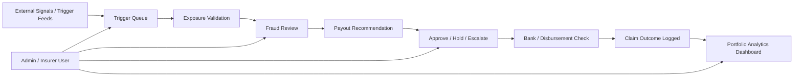
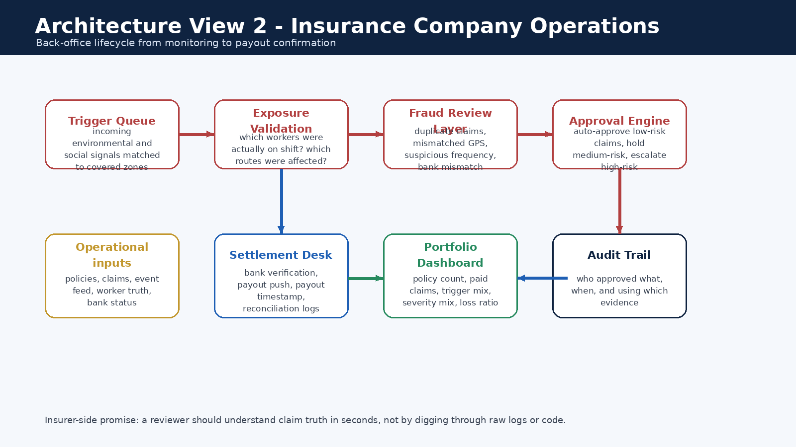

# Docs — Documentation Index

> This folder is the **non-code explanation layer** of the project. It contains architecture diagrams, formula references, pitch assets, and supporting documentation that allow judges and reviewers to understand the platform without inspecting source code.

---

## Implementation Status

| Asset | Status | Notes |
|-------|--------|-------|
| Folder structure & README index | ✅ Current | You are reading it |
| Architecture diagrams (Mermaid) | ✅ Current | Embedded in root and module READMEs |
| Premium/payout formula reference | 📝 Documented | Full formula book exists in planning docs |
| Trigger threshold references | 📝 Documented | Public thresholds cited in root README |
| Pitch script | 📝 Documented | 5-minute judge-facing pitch exists |
| Sample scenario walkthrough | 📝 Documented | Worked example with numbers in root README |
| Architecture PNGs | 📋 Planned | To be placed in `docs/assets/architecture/` |
| EDA / insurance formula charts | 📋 Planned | To be placed in `docs/assets/insurance/` |

---

## Folder Structure

```
docs/
├── README.md                     ← You are here
├── diagrams/                     ← Mermaid source files for architecture views
├── assets/
│   ├── architecture/             ← Architecture diagram PNGs (if Mermaid is insufficient)
│   └── insurance/                ← Formula charts, boxplots, feature importance visuals
```

> **📋 Note:** The `diagrams/`, `assets/architecture/`, and `assets/insurance/` subdirectories will be created as visual assets are finalized. Primary architecture views are already embedded as Mermaid diagrams in the module READMEs.

---

## Documentation Inventory

### Architecture Views

Five architecture views are defined for this project (per expert-session requirements):

| # | View | Where to find it | Format |
|---|------|-------------------|--------|
| 1 | Unified System Architecture | [Root README](../README.md) | Mermaid (inline) |
| 2 | Gig Worker Journey | [Root README](../README.md) | Mermaid (inline) |
| 3 | Insurance Company Operations | Below (this file) | Mermaid (inline) |
| 4 | Trigger → Claim → Approval Flow | [claim-engine/README.md](../claim-engine/README.md) | Mermaid (inline) |
| 5 | Fraud Detection Pipeline | [fraud/README.md](../fraud/README.md) | Mermaid (inline) |

#### View 3 — Insurer Operations

This view shows the insurer/admin-side operating flow — from incoming trigger feeds through exposure validation, fraud checks, payout authorization, and into the portfolio analytics dashboard.



> **📋 Status:** This diagram represents the **target architecture** for insurer-side operations.



### Formula & Data-Science Documentation

| Document | Content | Where referenced |
|----------|---------|-----------------|
| Premium formula book | Covered income (B), severity (S), exposure (E), confidence (C), expected payout, gross premium, payout cap | [Root README](../README.md), [ml/README.md](../ml/README.md) |
| Trigger threshold reference | IMD rain bands, CPCB AQI categories, IMD/NDMA heat-wave guidance, operational thresholds | [Root README](../README.md), [claim-engine/README.md](../claim-engine/README.md) |
| Derivation example | Worked scenario: ₹84/hr worker, 72mm rain, AQI 240 → premium and payout outputs | [Root README](../README.md) |
| Seed dataset | 8-row manually created base dataset | [data/README.md](../data/README.md) |
| Bootstrap pipeline results | Median premium ₹218.7, median payout ₹442.6, AUC 0.647 | [ml/README.md](../ml/README.md) |

### Pitch & Presentation Assets

| Asset | Purpose | Status |
|-------|---------|--------|
| 5-minute pitch script | Timed judge-facing narrative (0:00–5:00) | 📝 Documented |
| Demo sequence | Worker quote → trigger event → claim path → insurer dashboard → analytics | 📝 Documented |
| Judge Q&A preparation | 5 likely questions with sharp responses | 📝 Documented |
| Challenge alignment note | Maps every challenge requirement to our approach | ✅ In root README |

---

## Recommended Reading Order

For a reviewer encountering the project for the first time:

1. **Root README** — full product overview, architecture, trigger library, formula summary
2. **This file (docs/README.md)** — documentation index and asset map
3. **claim-engine/README.md** — core business logic pipeline
4. **fraud/README.md** — fraud detection architecture
5. **data/README.md** — data schemas, seed dataset, generation plan
6. **ml/README.md** — data science pipeline and model results
7. **backend/README.md** — API layer and service architecture
8. **frontend/README.md** — dashboard specifications
9. **integrations/README.md** — external connectors and mock status
10. **caching/README.md** — cache strategy

---

## Static Asset Placement Guide

When visual assets are added to the repository, use these locations:

| Asset type | Destination | Example |
|-----------|-------------|---------|
| Architecture diagrams (PNG/SVG) | `docs/assets/architecture/` | `unified_system.png`, `worker_journey.png` |
| Insurance/formula charts | `docs/assets/insurance/` | `feature_importance.png`, `premium_boxplot.png` |
| Mermaid source files | `docs/diagrams/` | `claim_flow.mmd`, `fraud_pipeline.mmd` |
| Pitch deck | `docs/` | `pitch_deck.pdf` |

> **Preference:** Use Mermaid diagrams (GitHub-renderable) inline in READMEs. Use static images only when Mermaid cannot adequately represent the content (e.g., boxplots, scatter plots, feature importance charts).

---

## Why This Folder Matters

A strong docs folder means judges do not need to guess what the product does, how the numbers were built, or how the repo is structured. The expert-session feedback specifically requires:

- Architecture separation into multiple views
- Formula derivation with worked examples
- Public threshold citations
- Sample scenarios with numbers that make immediate sense
- README system that explains itself without code inspection
