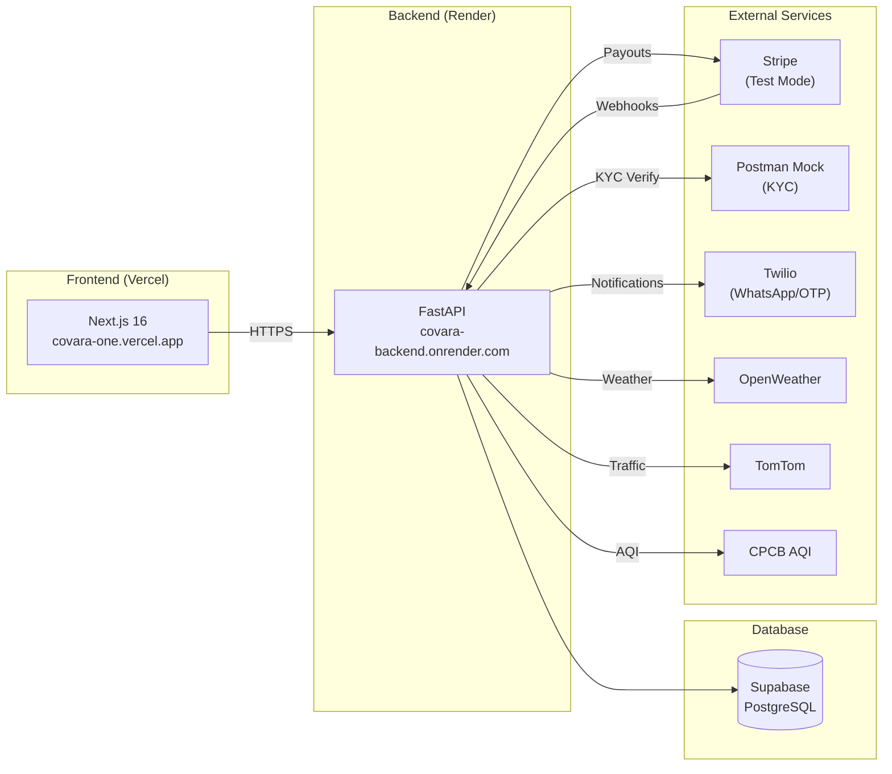

# Render / Stripe / Postman — Deployment Handoff

> This document is the **single source of truth** for the Covara One production deployment stack.
> Last updated: 2026-04-12.

---

## Table of Contents

1. [Architecture Overview](#1-architecture-overview)
2. [Render Deployment](#2-render-deployment)
3. [Stripe Integration](#3-stripe-integration)
4. [Postman Mock KYC](#4-postman-mock-kyc)
5. [Secret Management](#5-secret-management)
6. [Troubleshooting](#6-troubleshooting)
7. [Migration Targets](#7-migration-targets)

---

## 1. Architecture Overview



| Component | URL | Platform |
|-----------|-----|----------|
| Frontend | `https://covara-one.vercel.app` | Vercel |
| Backend | `https://covara-backend.onrender.com` | Render |
| Database | `https://aptgddoivrzpvpmydfyh.supabase.co` | Supabase |
| KYC Mock | `https://293baabc-ac9d-4c1b-a978-ba5a0095c70a.mock.pstmn.io` | Postman |

---

## 2. Render Deployment

### Service Configuration

| Setting | Value |
|---------|-------|
| **Service Type** | Docker Web Service |
| **Dockerfile Path** | `backend/Dockerfile` |
| **Docker Build Context** | `.` (repo root) |
| **Root Directory** | `backend/` |
| **Branch** | `main` |
| **Region** | Oregon (US West) |
| **Instance** | Free tier |
| **PORT** | Set automatically by Render (currently 10000) |
| **WEB_CONCURRENCY** | 1 |

### Environment Variables on Render

All secrets are set in **Render Dashboard → Environment**, never committed to git.

For initial setup, use `render.env` (local only, gitignored) via **"Add from .env"** in the Render dashboard.

| Variable | Category | Notes |
|----------|----------|-------|
| `APP_ENV` | Server | `production` |
| `CORS_ORIGINS` | Server | `https://covara-one.vercel.app` |
| `NEXT_PUBLIC_API_URL` | Server | `https://covara-backend.onrender.com` |
| `NEXT_PUBLIC_SUPABASE_URL` | Supabase | Project URL |
| `NEXT_PUBLIC_SUPABASE_ANON_KEY` | Supabase | Anon key |
| `SUPABASE_SERVICE_ROLE_KEY` | Supabase | Service role (admin) |
| `GEMINI_API_KEY` | External API | Google Gemini |
| `OPENWEATHER_API_KEY` | External API | Weather data |
| `TOMTOM_API_KEY` | External API | Traffic + routing |
| `AQI_API_KEY_1` | External API | CPCB AQI feed |
| `SANDBOX_KYC_BASE_URL` | KYC | Postman Mock URL |
| `TWILIO_ACCOUNT_SID` | Twilio | Account SID |
| `TWILIO_AUTH_TOKEN` | Twilio | Auth token |
| `TWILIO_VERIFY_SERVICE_SID` | Twilio | Verify service |
| `TWILIO_WHATSAPP_FROM` | Twilio | `whatsapp:+14155238886` |
| `TWILIO_WHATSAPP_SANDBOX_KEYWORD` | Twilio | Sandbox keyword |
| `PAYOUT_PROVIDER` | Stripe | `http_gateway` |
| `PAYOUT_PROVIDER_API_BASE_URL` | Stripe | `https://api.stripe.com/v1` |
| `PAYOUT_PROVIDER_API_KEY` | Stripe | `sk_test_...` (secret key) |
| `STRIPE_PUBLISHABLE_KEY` | Stripe | `pk_test_...` (publishable) |
| `PAYOUT_PROVIDER_WEBHOOK_SECRET` | Stripe | `whsec_...` (signing secret) |
| `DEVICE_CONTEXT_HMAC_SECRET` | Security | 64-char hex HMAC key |

### Smoke Checks

```bash
# Health check
curl https://covara-backend.onrender.com/health
# Expected: {"status":"ok"}

# Readiness check
curl https://covara-backend.onrender.com/ready
# Expected: {"ready":true, ...}

# Swagger docs
open https://covara-backend.onrender.com/docs
```

### Manual Redeploy

Environment variable changes require: **Render Dashboard → Manual Deploy → Deploy latest commit**.

### Free Tier Caveat

Render free-tier instances spin down after 15 minutes of inactivity. First request after cold start takes 30–60 seconds.

---

## 3. Stripe Integration

### Account Setup

| Setting | Value |
|---------|-------|
| **Mode** | Test Mode |
| **Dashboard** | [dashboard.stripe.com](https://dashboard.stripe.com) |
| **Account** | Linked to project email |

### API Keys

| Key Type | Env Variable | Prefix | Location |
|----------|-------------|--------|----------|
| Secret Key | `PAYOUT_PROVIDER_API_KEY` | `sk_test_` | Render env only |
| Publishable Key | `STRIPE_PUBLISHABLE_KEY` | `pk_test_` | Render env only |
| Webhook Signing Secret | `PAYOUT_PROVIDER_WEBHOOK_SECRET` | `whsec_` | Render env only |

> [!CAUTION]
> Never commit actual Stripe keys to git. Use `render.env` (gitignored) for local reference and Render Environment for production.

### Webhook Configuration

| Setting | Value |
|---------|-------|
| **Endpoint URL** | `https://covara-backend.onrender.com/payouts/webhooks/http_gateway` |
| **Events** | 61 event types (see [STRIPE_WEBHOOK_EVENTS.md](STRIPE_WEBHOOK_EVENTS.md)) |
| **Signing Secret** | Stored as `PAYOUT_PROVIDER_WEBHOOK_SECRET` in Render env |

### Backend Webhook Handler

| Item | Value |
|------|-------|
| Route | `POST /webhooks/{provider_key}` |
| Router | `backend/app/routers/payouts.py` |
| Signature verification | `backend/app/services/payout_provider.py` |
| Business logic | `backend/app/services/payout_workflow.py` |

### Provider Adapter Architecture

The payout system uses a provider-agnostic adapter pattern:

```
PayoutProviderAdapter
├── http_gateway    → Stripe API (production/test)
├── simulated_gateway → In-memory simulation (CI/tests)
└── mock_fallback   → Hardcoded success (development)
```

Set `PAYOUT_PROVIDER` env var to switch modes.

### Test Cards

| Card Number | Scenario |
|-------------|----------|
| `4242 4242 4242 4242` | Success |
| `4000 0000 0000 0002` | Decline |
| `4000 0000 0000 3220` | 3D Secure required |
| `4000 0000 0000 9995` | Insufficient funds |
| `4000 0000 0000 0069` | Expired card |

> Use any future expiry date and any 3-digit CVC for all test cards.

### Webhook Event Categories (61 total)

| Category | Count | Key Events |
|----------|-------|------------|
| Payment Intents | 7 | `succeeded`, `payment_failed`, `requires_action` |
| Charges | 6 | `succeeded`, `failed`, `refunded` |
| Refunds | 3 | `created`, `updated`, `failed` |
| Disputes & Fraud | 7 | `dispute.created`, `radar.early_fraud_warning.created` |
| Payouts | 5 | `payout.paid`, `payout.failed` |
| Subscriptions | 6 | `created`, `updated`, `deleted` |
| Invoices | 7 | `paid`, `payment_failed` |
| Customer | 4 | `created`, `updated` |
| Payment Methods | 4 | `attached`, `detached` |
| Balance & Transfers | 4 | `balance.available`, `transfer.created` |
| Checkout Sessions | 4 | `completed`, `expired` |
| Setup Intents | 2 | `succeeded`, `setup_failed` |
| Mandates | 1 | `mandate.updated` |
| Account | 1 | `account.updated` |

Full catalog: [STRIPE_WEBHOOK_EVENTS.md](STRIPE_WEBHOOK_EVENTS.md)

---

## 4. Postman Mock KYC

### Mock Server Configuration

| Setting | Value |
|---------|-------|
| **Mock URL** | `https://293baabc-ac9d-4c1b-a978-ba5a0095c70a.mock.pstmn.io` |
| **Provider** | Postman Cloud Mock Server |
| **Collection** | `postman/collections/Covara KYC Mock/` |
| **Local Mock** | `postman/mocks/mock-1.js` (port 4500) |

### Endpoints

#### POST `/kyc/pan/verify`

**Request:**
```json
{
  "pan_number": "ABCDE1234F"
}
```

**Response (Success):**
```json
{
  "status": "success",
  "pan_number": "ABCDE1234F",
  "name": "Test User",
  "verified": true
}
```

#### POST `/kyc/bank/verify`

**Request:**
```json
{
  "account_number": "0000000000",
  "ifsc": "SBIN0000001"
}
```

**Response (Success):**
```json
{
  "status": "success",
  "account_number": "0000000000",
  "ifsc": "SBIN0000001",
  "name_at_bank": "Test User",
  "verified": true
}
```

### Backend Integration

| Item | Value |
|------|-------|
| Service | `backend/app/services/kyc_service.py` |
| Base URL env | `SANDBOX_KYC_BASE_URL` |
| API Key env | `SANDBOX_KYC_API_KEY` (Postman API key) |
| Switchable | Yes — change `SANDBOX_KYC_BASE_URL` to `https://api.sandbox.co.in` for production |

### Running Local Mock

```bash
cd postman/mocks
node mock-1.js
# Runs on http://localhost:4500
```

---

## 5. Secret Management

### Secret Locations

| Location | Purpose | In Git? |
|----------|---------|---------|
| `render.env` | Render import template (all real secrets) | ❌ Gitignored |
| `.env` | Local development (all real secrets) | ❌ Gitignored |
| `.env.example` | Placeholder template for onboarding | ✅ Tracked (no real secrets) |
| Render Dashboard | Production runtime secrets | N/A (cloud) |
| Stripe Dashboard | API keys and webhook secrets | N/A (cloud) |

### Secret Rotation Checklist

> [!WARNING]
> The Stripe webhook signing secret (`whsec_...`) was briefly committed to `docs/STRIPE_WEBHOOK_EVENTS.md` in commit `0b77890` and remains in git history. Since this is Test Mode, the risk is low, but rotation is recommended.

**To rotate the webhook secret:**

1. Go to [Stripe Dashboard → Developers → Webhooks](https://dashboard.stripe.com/test/webhooks)
2. Click on the `covara-backend.onrender.com` endpoint
3. Click "Roll secret" → generates a new `whsec_...`
4. Update in `render.env` (local) → `PAYOUT_PROVIDER_WEBHOOK_SECRET=whsec_NEW_VALUE`
5. Update in Render Dashboard → Environment → `PAYOUT_PROVIDER_WEBHOOK_SECRET`
6. Trigger Manual Deploy in Render

### `.gitignore` Coverage

These patterns protect secrets from accidental commit:

```gitignore
.env
.env.local
.env.*.local
render.env
*.pem
*.key
TEMP_WILL_BE_DELETED/
```

---

## 6. Troubleshooting

### Render

| Issue | Fix |
|-------|-----|
| Cold start takes 30-60s | Expected on free tier. First request wakes the instance. |
| Env var change not taking effect | Must do **Manual Deploy → Deploy latest commit** |
| Build fails | Check `backend/Dockerfile` and ensure `requirements.runtime.txt` is up to date |
| PORT mismatch | Render sets `PORT` automatically. Backend reads `os.environ.get("PORT", 8000)` |

### Stripe Webhooks

| Issue | Fix |
|-------|-----|
| Webhook returns 400 | Check `PAYOUT_PROVIDER_WEBHOOK_SECRET` matches Stripe dashboard |
| Webhook not firing | Verify endpoint URL in Stripe dashboard matches Render URL exactly |
| Signature verification fails | Secret mismatch or payload tampering. Re-roll secret. |
| Test event not received | Use "Send test webhook" in Stripe dashboard to debug |

### Postman Mock

| Issue | Fix |
|-------|-----|
| Mock returns 404 | Verify endpoint path matches (`/kyc/pan/verify`, `/kyc/bank/verify`) |
| Mock server down | Postman cloud mocks have uptime limits on free tier. Use local mock as fallback. |
| Local mock won't start | Run `node postman/mocks/mock-1.js` — requires Node.js installed |

---

## 7. Migration Targets

| Integration | Current State | Production Target | Trigger |
|-------------|--------------|-------------------|---------|
| **Stripe** | Test Mode (`sk_test_*`) | Live Mode (`sk_live_*`) | After Stripe business verification |
| **KYC** | Postman Mock Server | Sandbox.co.in → DigiLocker | After official API partnership |
| **Twilio** | WhatsApp Sandbox | Production number | After Twilio number purchase |
| **Render** | Free tier (cold starts) | Paid tier (always-on) | After production launch |
| **Weather** | OpenWeather API | IMD direct APIs | After IMD IP whitelist approval |

> [!IMPORTANT]
> All migration targets require only environment variable changes — no code changes needed. The provider adapter pattern (`PayoutProviderAdapter`, `kyc_service.py`) abstracts the switch.
