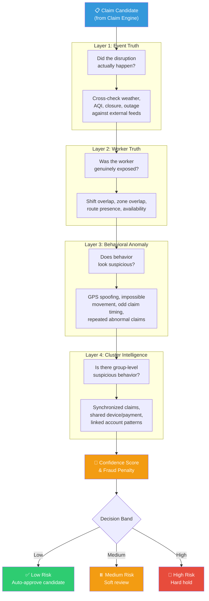
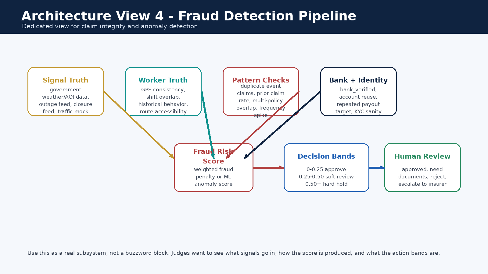
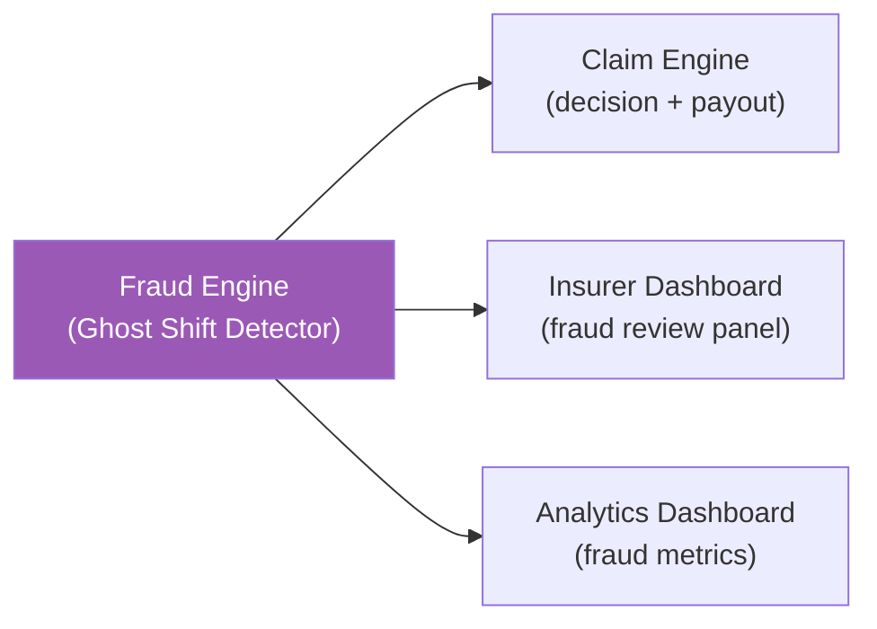

# Fraud — Ghost Shift Detector

> This module implements the **4-layer fraud detection pipeline** (Ghost Shift Detector) that validates every claim before payout. It is a rules-plus-score layer that directly changes the claim decision — not just a buzzword section.

---

## Implementation Status

| Component | Status |
|-----------|--------|
| 4-layer framework definition | 📝 Documented |
| Fraud formula (confidence, penalty) | 📝 Documented |
| Decision band logic | 📝 Documented |
| Parameter tracking checklist | 📝 Documented |
| Fraud scoring service | 📋 Planned |
| GPS validation module | 📋 Planned |
| Cluster intelligence engine | 📋 Planned |

---

## Fraud Detection Pipeline





---

## The 4 Layers Explained

### Layer 1 — Event Truth
**Question:** Did the disruption itself really happen?

| Check | Method |
|-------|--------|
| Weather cross-check | Compare claimed rain/AQI/heat against IMD/CPCB feeds |
| Closure verification | Confirm official closure flag from source |
| Outage confirmation | Verify platform outage duration from heartbeat data |
| Traffic validation | Cross-check traffic delay percentage against feed data |

### Layer 2 — Worker Truth
**Question:** Was this worker actually affected?

| Check | Method |
|-------|--------|
| Shift overlap | Worker's declared shift must overlap trigger window |
| Zone overlap | Worker's operating zone must match trigger zone |
| Route presence | GPS trace should show activity in the affected area |
| Availability status | Worker should have been online/available during event |

### Layer 3 — Behavioral Anomaly Detection
**Question:** Does the worker's behavior look suspicious?

| Check | Method |
|-------|--------|
| GPS spoofing | Detect inconsistent or improbable GPS traces |
| Impossible movement | Flag impossible travel speeds between locations |
| Claim timing anomalies | Detect claims filed suspiciously close to trigger onset |
| Repeated abnormal claims | Flag workers with statistically unusual claim frequency |
| Device anomalies | Detect one device used for multiple accounts |

### Layer 4 — Cluster Intelligence
**Question:** Is there group-level suspicious behavior?

| Check | Method |
|-------|--------|
| Synchronized claims | Multiple linked accounts claiming in the same pattern |
| Shared payment paths | Overlapping bank/UPI destinations across claimants |
| Device sharing | Same device ID appearing across multiple worker accounts |
| Geographic clustering | Unusual concentration of claims from a small area |

---

## Fraud Formulas

### Confidence Score

```
confidence = clip(0.50 + 0.30 × trust_score + 0.10 × gps_consistency + 0.10 × bank_verified, 0.45, 1.00)
```

### Fraud Penalty

```
fraud_penalty = clip(0.35 × prior_claim_rate + 0.30 × (1 − trust_score) + 0.35 × (1 − gps_consistency), 0.00, 0.50)
```

### Effective Confidence (C)

```
C = confidence × (1 − 0.70 × fraud_penalty)
```

### Fraud Holdback (FH)

```
FH = clip(0.15 + 0.25 × fraud_penalty, 0.15, 0.30)
```

The effective confidence score `C` and fraud holdback `FH` directly affect the payout amount in the [claim engine](../claim-engine/README.md).

---

## Parameters Tracked

| Category | Parameters |
|----------|-----------|
| **Location** | Zone mismatch, GPS drift consistency, impossible jumps, stationary GPS during claim windows |
| **Time** | Claim time vs event time, shift overlap percentage, suspicious activity only during trigger periods |
| **Platform activity** | Orders accepted, completed orders after claim window, online/offline inconsistencies |
| **Identity & device** | One device for many accounts, payout destination overlap, odd device switching |
| **Claim history** | Repeated use of same trigger, abnormal claim frequency, outlier payout ratio vs peers |

---

## Decision Bands

| Band | Fraud risk | Action | Impact on payout |
|------|-----------|--------|-----------------|
| **Low** | fraud_penalty < 0.15 | Auto-approve candidate | Full payout (minus standard FH) |
| **Medium** | 0.15 ≤ fraud_penalty < 0.35 | Soft review | Queued for insurer review before payout |
| **High** | fraud_penalty ≥ 0.35 | Hard hold | Blocked pending investigation |

---

## Inputs

| Input | Source |
|-------|--------|
| Claim candidate payload | Claim engine (Stage 6) |
| Worker profile (trust_score, gps_consistency) | Data layer |
| Trigger truth (event data + external feeds) | Trigger engine / integrations |
| Policy state | Policy service |
| Claim history | Data layer |
| Bank verification data | Integrations (mock) |
| Route and GPS traces | Worker app (planned) |

## Outputs

| Output | Consumer |
|--------|----------|
| `fraud_penalty` (0.00–0.50) | Claim engine payout calculation |
| `confidence` score | Claim engine decision |
| `review_band` (low / medium / high) | Insurer dashboard review queue |
| Rejection reason or escalation flag | Insurer fraud review panel |
| Fraud audit events | Claim analytics dashboard |

---

## Downstream Flow



---

## Why This Matters for Judges

This is not just anomaly buzzwords. The fraud layer uses **four progressively deeper validation steps**, produces a **quantitative fraud penalty** that directly modifies the payout formula, and creates **explainable decision bands** that determine whether a claim is auto-approved, reviewed, or held. Every decision can be traced back through the layers to specific evidence.
