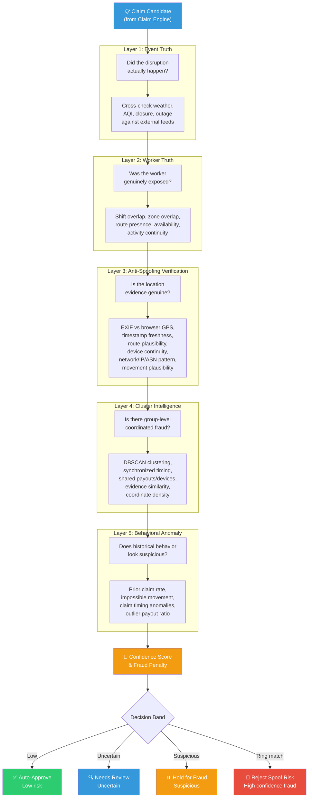
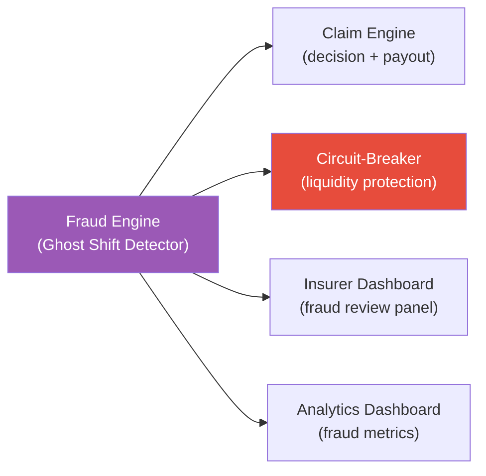

# Fraud — Ghost Shift Detector

> This module implements the **5-layer fraud detection pipeline** (Ghost Shift Detector) that validates every claim before payout. It is a rules-plus-score layer that directly changes the claim decision — not just a buzzword section. Following the adversarial defense update, the pipeline now includes dedicated anti-spoofing verification and coordinated-ring detection.

---

## Engineering Snapshot (2026-04-05)

- Mobile device-context signatures are now verified server-side before fraud evaluation when telemetry headers are provided.
- Anti-spoofing layer consumes normalized device-context aliases and replay-protected metadata for stronger spoof resistance.
- Auto-claim path now emits durable events and shifts non-critical side effects to async consumers, while fraud outcomes remain part of the claim decision trace.

---

## Implementation Status

| Component | Status |
|-----------|--------|
| 5-layer framework definition | ✅ Implemented |
| Anti-spoofing verification (Layer 3) | ✅ Implemented |
| Cluster intelligence with ring detection (Layer 4) | ✅ Implemented |
| Fraud formula (confidence, penalty) | ✅ Implemented |
| Decision band logic (5-band) | ✅ Implemented |
| Anti-spoofing ML feature table | ✅ Implemented |
| Liquidity circuit-breaker controls | ✅ Implemented |
| Fraud scoring service | ✅ Implemented |
| Manual claim verifier | ✅ Implemented |
| Geo-verification module | ✅ Implemented |
| Post-approval fraud controls | ✅ Implemented |
| Region validation cache (fast-lane) | ✅ Implemented |

---

## Fraud Detection Pipeline




---

## The 5 Layers Explained

### Layer 1 — Event Truth
**Question:** Did the disruption itself really happen?

| Check | Method |
|-------|--------|
| Weather cross-check | Compare claimed rain/AQI/heat against OpenWeather and IMD/CPCB feeds |
| Closure verification | Confirm official closure flag from source; cross-reference NewsAPI for civic context |
| Outage confirmation | Verify platform outage duration from heartbeat data |
| Traffic validation | Cross-check traffic delay via TomTom Traffic API *(Planned: Google Maps)* |

### Layer 2 — Worker Truth
**Question:** Was this worker actually affected?

| Check | Method |
|-------|--------|
| Shift overlap | Worker's declared shift must overlap trigger window |
| Zone overlap | Worker's operating zone must match trigger zone |
| Route presence | GPS trace should show activity in the affected area |
| Availability status | Worker should have been online/available during event |
| Activity continuity | Was the worker completing orders before the disruption? A genuinely stranded worker shows pre-disruption delivery activity |

### Layer 3 — Anti-Spoofing Verification *(New)*
**Question:** Is the location evidence genuine, or spoofed?

> [!IMPORTANT]
> This layer was added in response to the coordinated GPS-spoofing syndicate threat. Simple GPS verification is obsolete. This layer uses multi-signal cross-validation to detect sophisticated spoofing.

| Check | Method | Why it catches spoofers |
|-------|--------|----------------------|
| EXIF GPS vs. browser/device GPS | Compare photo EXIF coordinates against device-reported location | Spoofing apps change device GPS but cannot alter already-captured EXIF |
| EXIF timestamp freshness | Validate evidence was captured within the claim window | Reused evidence from old events fails freshness checks |
| Route plausibility | TomTom Snap-to-Roads confirms coordinates map to real delivery routes | Spoofed coordinates often land on rooftops, parks, or impossible positions |
| Device continuity | Same device consistently associated with this worker account | Fraud rings rotate devices across accounts |
| Network / IP / ASN pattern | Check if multiple claimants share the same network fingerprint | Coordinated rings operating from one location share IP/ASN patterns |
| Movement plausibility over time | GPS trail shows realistic movement across multiple time points | Spoofers show teleportation or perfect stillness — real workers show natural drift |
| Geofence match | TomTom Geofencing API confirms device within operating zone boundary | Out-of-geofence claims are immediately flagged |
| **AI-generated image detection** | Gemini SynthID watermark scan + AI-generation probability scoring | AI-generated "proof" photos are flagged; catches both Google (SynthID) and non-Google AI models |
| **EXIF integrity & modification** | Check EXIF completeness, Software field for editors, timestamp chain-of-custody (DateTimeOriginal vs DateTimeDigitized vs ModifyDate), thumbnail vs full image comparison, GPS precision analysis, camera-device consistency | Edited, re-saved, or metadata-tampered photos are flagged |
| **Image forensics (ELA / noise)** | Error Level Analysis for splice detection, noise pattern consistency, JPEG quantization table analysis, perceptual hash cross-matching | Photoshopped scenes, composite images, re-saved evidence, and recycled photos from previous claims |

> [!NOTE]
> Workers who submit evidence via WhatsApp or Telegram may have EXIF stripped automatically. This is **not treated as fraud** — it reduces the evidence integrity score to Medium and routes the claim to `needs_review`. The system never auto-rejects based on EXIF absence alone. For full details on the evidence integrity scoring model, see the [root README](../README.md#1a-evidence-integrity--ai-image-detection).


### Layer 4 — Cluster Intelligence
**Question:** Is there group-level coordinated fraud?

| Check | Method |
|-------|--------|
| Synchronized claims | DBSCAN clustering on submission timestamps — flag batches within narrow windows |
| Coordinate density | Flag when N+ claims share GPS coordinates within a 50m radius |
| Shared payment paths | Graph analysis on payout destination (bank/UPI) overlap across claimants |
| Device sharing | Same device ID or browser fingerprint appearing across multiple worker accounts |
| Evidence similarity | Perceptual hash comparison detects identical/near-identical photos across batch |
| Network clustering | ASN and IP subnet clustering identifies co-located claimants |
| Evidence variety | Low evidence type diversity scoring per claimant suggests templated submissions |

### Layer 5 — Behavioral Anomaly & Identity Verification
**Question:** Does the worker's historical behavior and identity context look suspicious?

| Check | Method |
|-------|--------|
| GPS spoofing patterns | Detect inconsistent or improbable GPS traces across claim history |
| Impossible travel (velocity check) | Flag impossible travel speeds between locations — e.g., appearing 50 km away within 5 minutes |
| Historical zone affinity | Flag first-ever appearance in a red-alert zone precisely during a trigger event |
| Pre-trigger presence | Worker must show presence or work activity in/near the zone *before* the trigger window opened |
| Claim timing anomalies | Detect claims filed suspiciously close to trigger onset |
| Repeated abnormal claims | Flag workers with statistically unusual claim frequency |
| Outlier payout ratio | Workers with payout/premium ratios far above peers |
| Prior suspicious claim rate | Bayesian prior weighting based on historical fraud flags |
| VPN / datacenter IP detection | Claims from known VPN endpoints, TOR exit nodes, or cloud datacenter IPs (AWS, Azure, GCP) flagged as supporting signals |
| Device-account binding | New-device login during red-alert triggers liveness check; multiple devices per account flagged |
| Emulator / root detection | Detect rooted devices, emulator fingerprints, mock-location permission enabled, developer-mode active, sensor inconsistency |
| Dynamic trust score feedback | Accumulated anomalies feed back into worker's `trust_score` — lowered trust increases premium at renewal and defaults claims to `needs_review` |

---

## Anti-Spoofing ML Feature Table

Beyond rule-based checks, these features are engineered for ML-assisted spoof detection:

| Feature | Description | Expected behavior |
|---------|-------------|-------------------|
| `exif_browser_gps_distance_m` | Meters between EXIF GPS and browser/device GPS | Genuine: < 100m. Spoofed: > 500m or missing |
| `exif_claim_time_lag_min` | Minutes between EXIF timestamp and claim submission | Genuine: < 30min. Reused: > 72h |
| `claim_zone_vs_assigned_zone` | Binary mismatch flag | Genuine: match. Suspicious: mismatch |
| `shift_overlap_ratio` | Fraction of trigger window covered by worker's shift | Genuine: > 0.5. Suspicious: 0.0 |
| `route_plausibility_score` | TomTom Snap-to-Roads confidence | Genuine: > 0.7. Spoofed: < 0.3 |
| `historical_order_continuity` | Orders completed in 2h before claim | Genuine: > 0. Suspicious: 0 |
| `repeated_coord_density` | Count of other claims within 50m radius in same window | Genuine: < 3. Ring: > 10 |
| `batch_timing_similarity` | Standard deviation of submission times within cluster | Organic: high variance. Coordinated: < 5min |
| `trigger_correlation_score` | Was a real trigger independently verified for the zone? | Genuine: 1.0. Fake claim: 0.0 |
| `evidence_completeness` | Score based on photo + text + geo presence | Genuine: > 0.7. Suspicious: < 0.3 |
| `prior_suspicious_rate` | Historical rate of flagged/held claims for this worker | Low-risk: < 0.05. High-risk: > 0.20 |
| `device_account_ratio` | Devices per account and accounts per device | Normal: 1:1. Suspicious: many:1 |
| `network_cluster_size` | Number of claimants on same IP/ASN in same window | Normal: < 3. Ring: > 10 |
| `vpn_datacenter_flag` | Claim IP is a known VPN / TOR / datacenter IP | Normal: 0. Suspicious: 1 |
| `impossible_travel_flag` | Worker appeared in two distant zones within impossible timeframe | Normal: 0. Fraud: 1 |
| `zone_affinity_score` | Fraction of historical deliveries in the claimed zone | Genuine: > 0.3. Weather chaser: < 0.01 |
| `pre_trigger_presence` | Activity in/near the zone before the trigger window | Genuine: present. Suspicious: first-time appearance |
| `emulator_root_flag` | Device shows emulator or root/dev signals | Normal: 0. Suspicious: 1 |

### Model output labels

| Label | Meaning |
|-------|---------|
| `auto_approve` | All signals pass — route to automatic payout |
| `needs_review` | Moderate uncertainty — route to human-assisted review |
| `hold_for_fraud` | Spoofing indicators + cluster anomaly — hold pending investigation |
| `batch_hold` | Mass cluster anomaly — hold entire batch for cluster-level screening |
| `reject_spoof_risk` | No valid trigger + high spoof confidence + fraud-ring pattern — reject with appeal |

### Advanced Fraud Vectors

Beyond individual signal analysis, the fraud engine defends against these tiered attack vectors:

#### Tier 1 — Direct Spoofing
- GPS spoofing apps → EXIF cross-check + Snap-to-Roads + movement plausibility
- VPN / proxy routing → Carrier-IP expectation + datacenter IP detection (supporting signal, not standalone rejection)
- Emulator / app hooking → Root/emulator detection + sensor inconsistency + developer-mode flag

#### Tier 2 — Identity Misuse
- Buddy login (account handoff) → Device fingerprint history + session continuity + zone affinity + liveness check on high-risk escalation
- Account sharing ring → Multi-device per account detection + IP/ASN clustering
- Credential farming → KYC gap detection + low-activity anomaly + rapid account-to-first-claim interval

#### Tier 3 — Coordinated / Systemic Abuse
- Weather chaser (zone squatting) → Pre-trigger presence + zone affinity + work-intent evidence
- Activity continuity anomaly → Order completion gap analysis + shift-activity mismatch
- Fraud ring cluster → DBSCAN + circuit-breaker controls + cluster screening

> For full details on each vector and defense, see the [Adversarial Defense section](../README.md#1b-advanced-fraud-vectors--threat-model) in the root README.

---

## Fraud Formulas

### Confidence Score

```
confidence = clip(0.50 + 0.30 × trust_score + 0.10 × gps_consistency + 0.10 × bank_verified, 0.45, 1.00)
```

### Fraud Penalty

```
fraud_penalty = clip(0.35 × prior_claim_rate + 0.30 × (1 − trust_score) + 0.35 × (1 − gps_consistency), 0.00, 0.50)
```

### Effective Confidence (C)

```
C = confidence × (1 − 0.70 × fraud_penalty)
```

### Fraud Holdback (FH)

```
FH = clip(0.15 + 0.25 × fraud_penalty, 0.15, 0.30)
```

The effective confidence score `C` and fraud holdback `FH` feed into the internal calibration engine. They affect whether a claim is routed to auto-approval or review, and how the premium is adjusted at renewal. They do **not** determine the public parametric payout amount — the [payout ladder](../README.md#parametric-payout-ladder) does.

---

## Decision Bands

| Band | Outcome | Signal pattern | Impact |
|------|---------|------------|--------|
| **Low** | `auto_approve` | Trigger match + shift continuity + zone match + anti-spoofing pass + low fraud | Instant payout via parametric ladder |
| **Uncertain** | `needs_review` | Trigger match + missing EXIF + moderate uncertainty; OR missing trigger + weak continuity + moderate spoof signals | Human-assisted review — no penalty |
| **Suspicious** | `hold_for_fraud` | New device + red-alert + zone anomaly + VPN; OR spoof indicators + cluster anomaly + evidence mismatch | Held pending investigation — liveness check triggered on escalation |
| **Cluster** | `batch_hold` | Mass identical claims + weak activity continuity + high spoof-risk cluster | Entire cluster held — individual claims reviewed separately |
| **Ring match** | `reject_spoof_risk` | No valid trigger + high spoof confidence + strong fraud-ring pattern | Rejected — 48-hour appeal/resubmit window |

---

## Liquidity Protection & Circuit-Breaker Controls

| Control | Trigger condition | Action |
|---|---|---|
| **Mass-claim throttling** | > 50 claims from a single zone within 1 hour | All new claims enter `needs_review` |
| **Batch hold on anomaly spike** | Cluster analysis detects coordinated submission pattern | Entire batch held for cluster-level screening |
| **Payout release gate** | Extreme events (Band 3 severity in 3+ zones) | Payouts released only after fraud screening |
| **Post-trigger fraud-ring screening** | Any bulk payout release from a single trigger event | Cluster-level review before funds leave the pool |
| **Spoof-risk payout throttling** | Zone-level spoof-risk score rises sharply | Payout velocity reduced; high-confidence pass, uncertain queued |
| **Emergency admin override** | Manual insurer/admin intervention | Admin can freeze, release, or escalate any batch |
| **Daily zone payout cap** | Cumulative payouts exceed 3× historical daily average | Remaining claims queued for next-day review |

---

## Parameters Tracked

| Category | Parameters |
|----------|-----------|
| **Location** | Zone mismatch, GPS drift consistency, impossible jumps, stationary GPS, EXIF vs browser GPS distance, geofence match |
| **Time** | Claim time vs event time, shift overlap percentage, EXIF timestamp freshness, submission synchronization |
| **Platform activity** | Orders accepted, completed orders before/after claim window, online/offline inconsistencies, activity continuity |
| **Identity & device** | Device continuity, device-to-account ratio, payout destination overlap, network/IP/ASN clustering |
| **Evidence** | Evidence completeness, evidence type variety, perceptual hash similarity across batch, photo freshness |
| **Claim history** | Repeated use of same trigger, abnormal claim frequency, outlier payout ratio vs peers, prior suspicious rate |

---

## Inputs

| Input | Source |
|-------|--------|
| Claim candidate payload | Claim engine (Stage 6) |
| Worker profile (trust_score, gps_consistency) | Data layer |
| Trigger truth (event data + external feeds) | Trigger engine / integrations |
| EXIF metadata from evidence | Evidence service |
| Device / network fingerprint | Worker app client |
| Policy state | Policy service |
| Claim history | Data layer |
| Bank verification data | Integrations (mock) |
| Route and GPS traces | Worker app / TomTom APIs |

## Outputs

| Output | Consumer |
|--------|----------|
| `fraud_penalty` (0.00–0.50) | Internal calibration engine |
| `confidence` score | Claim decision routing |
| `review_band` (auto_approve / needs_review / hold_for_fraud / reject_spoof_risk) | Insurer dashboard review queue |
| Anti-spoofing verification result | Claim pipeline decision logic |
| Cluster analysis result | Circuit-breaker controls |
| Rejection reason or escalation flag | Insurer fraud review panel |
| Fraud audit events | Claim analytics dashboard |

---

## Downstream Flow



---

## Why This Matters for Judges

This is not just anomaly buzzwords. The fraud layer uses **five progressively deeper validation steps** — from event truth through anti-spoofing to coordinated-ring detection — produces a **quantitative fraud penalty** that directly affects claim routing, and creates **five explainable decision outcomes** that determine whether a claim is auto-approved, reviewed, held, batch-held, or rejected. Every decision can be traced back through the layers to specific evidence. The liquidity circuit-breaker controls protect the payout pool from mass-claim drain attacks without blocking legitimate claims.

Fraud detection also extends **after payout** — post-approval flagging, graduated trust score penalties, and legal escalation ensure the system stays accountable even after money has moved.
