# Frontend — Dashboards & Worker Experience

> The frontend makes the entire insurance journey understandable for two personas: **gig workers** and **insurer operations reviewers**. The UI is not just for beauty — it is part of the explanation layer for judges.

---

## Implementation Status

| Component | Status |
|-----------|--------|
| Dashboard specifications | 📝 Documented |
| Page inventory | 📝 Documented |
| Component list | 📝 Documented |
| Tech stack selected | 📝 Documented |
| Worker dashboard implementation | 📋 Planned |
| Insurer dashboard implementation | 📋 Planned |
| Claim analytics dashboard implementation | 📋 Planned |

---

## Tech Stack

| Component | Technology | Why |
|-----------|-----------|-----|
| Framework | React (Next.js) | Fast UI iteration, SSR for demo, component-based architecture |
| Styling | Tailwind CSS | Rapid prototyping, consistent design tokens |
| Charts | Recharts | React-native charting for analytics dashboards |
| State | Zustand | Minimal state management with no boilerplate |
| API client | Axios | HTTP client for REST API consumption from backend |

> **📋 Status:** Tech stack selected. No frontend code exists yet.

---

## Dashboard Ecosystem

```mermaid
flowchart TD
    subgraph "Backend APIs"
        API["REST Endpoints"]
    end

    subgraph "Worker Dashboard"
        W1["Policy Card<br/>(premium, cap, window)"]
        W2["Trigger Alert View<br/>(active disruptions)"]
        W3["Claim Status Timeline<br/>(pipeline stages)"]
        W4["Payout History<br/>(amount, date, method)"]
        W5["Trust Score Display"]
        W6["Notifications"]
    end

    subgraph "Insurer Dashboard"
        I1["Trigger Queue<br/>(pending evaluation)"]
        I2["Claim Lifecycle<br/>(review, approve, hold)"]
        I3["Fraud Case Panel<br/>(flagged claims)"]
        I4["Payout Reconciliation<br/>(settlements)"]
        I5["Zone Metrics<br/>(risk by area)"]
    end

    subgraph "Claim Analytics Dashboard"
        A1["Claim Volume by Trigger"]
        A2["Trigger Mix Chart"]
        A3["Severity Distribution"]
        A4["High-Risk Zone Map"]
        A5["Automation Rate"]
        A6["Loss Ratio Tracking"]
    end

    API --> W1 & W2 & W3 & W4 & W5 & W6
    API --> I1 & I2 & I3 & I4 & I5
    API --> A1 & A2 & A3 & A4 & A5 & A6

    style API fill:#4a9eff,color:#fff
```

---

## Page Inventory

### Worker Side

| Page | What it shows | Status |
|------|--------------|--------|
| Onboarding page | Zone, shift, earnings, bank details capture | 📋 Planned |
| Weekly quote page | Premium amount, breakdown, plan options | 📋 Planned |
| Active policy card | Coverage window, premium, payout cap, risk status | 📋 Planned |
| Trigger alert view | Active disruptions in worker's zone | 📋 Planned |
| Claim status timeline | Pipeline stages from trigger → decision → payout | 📋 Planned |
| Payout history | Past payouts with amounts, dates, methods | 📋 Planned |
| Notifications | Alerts, warnings, payout confirmations | 📋 Planned |

### Insurer Side

| Page | What it shows | Status |
|------|--------------|--------|
| Trigger queue | Pending trigger events awaiting evaluation | 📋 Planned |
| Review dashboard | Claims needing manual review (medium/high fraud risk) | 📋 Planned |
| Claim lifecycle dashboard | Full claim flow: trigger → validation → approval → payout | 📋 Planned |
| Fraud case panel | Flagged claims with fraud scores and evidence | 📋 Planned |
| Payout reconciliation panel | Settlement status, amounts, bank verification | 📋 Planned |
| Analytics dashboard | Aggregate metrics (see claim analytics section) | 📋 Planned |

### Claim Analytics (shared view)

| View | What it shows | Status |
|------|--------------|--------|
| Claim volume by trigger type | Bar chart of claims per T1–T15 trigger | 📋 Planned |
| Severity distribution | Histogram of severity scores | 📋 Planned |
| High-risk zone map | Heatmap of claim density by zone | 📋 Planned |
| Automation rate | % of claims auto-approved vs reviewed | 📋 Planned |
| Loss ratio tracking | Premium collected vs payouts by period | 📋 Planned |
| Suspicious-case ratio | Fraud-flagged claims as % of total | 📋 Planned |

---

## Inputs (from Backend APIs)

| Input | API Source |
|-------|-----------|
| Worker profile | `GET /workers/{id}` |
| Premium quote | `POST /policies/quote` |
| Active policy status | `GET /policies/{id}` |
| Trigger alerts | `GET /triggers/live` |
| Claim decision & timeline | `GET /claims/{id}` |
| Fraud score band | Embedded in claim response |
| Payout status | Embedded in claim response |
| Analytics summaries | `GET /analytics/summary` |

## Outputs (to Backend APIs)

| Output | API Destination |
|--------|----------------|
| Onboarding form data | `POST /workers` |
| Policy purchase request | `POST /policies/activate` |
| Assisted claim confirmation | `POST /claims/initiate` |
| Insurer review action | `POST /claims/{id}/review` |
| Manual approval / hold decision | `POST /claims/{id}/review` |

---

## Recommended Components

| Component | Purpose | Used in |
|-----------|---------|---------|
| Policy Card | Show weekly premium, coverage window, payout cap | Worker dashboard |
| Trigger Severity Banner | Alert bar for active disruptions | Worker dashboard |
| Step Timeline | Visualize claim pipeline stages | Worker + insurer dashboards |
| Fraud Badge | Display fraud risk band (low/medium/high) | Insurer dashboard |
| Payout Summary Tile | Show payout amount with formula trace | Worker + insurer dashboards |
| Trigger Mix Chart | Bar chart of claims by trigger type | Analytics dashboard |
| Loss Ratio Chart | Premium vs payout trend line | Analytics dashboard |
| Audit Trail Drawer | Expandable claim event timeline | Insurer dashboard |

---

## UI Design Rule

> Every screen should answer **one question only**:
> - **Worker dashboard:** What am I covered for? What is happening right now? Did I get paid?
> - **Insurer dashboard:** Which claims need action? Why were they flagged? What happened after payout?
> - **Analytics dashboard:** Where are the risks? How are we performing? Where is leakage?

---

## What Must Be Visible to Judges

- [ ] Weekly premium amount and how it was calculated
- [ ] Which trigger caused the claim (T1–T15 reference)
- [ ] Payout formula summary (B × S × E × C visible)
- [ ] Fraud status with decision band
- [ ] Full claim lifecycle from trigger to payout
- [ ] Analytics showing trigger mix and loss ratio
