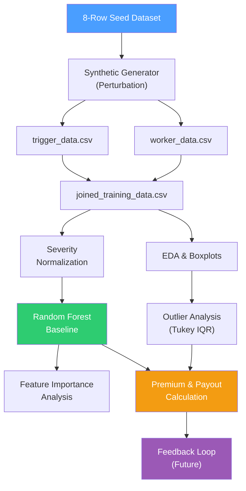
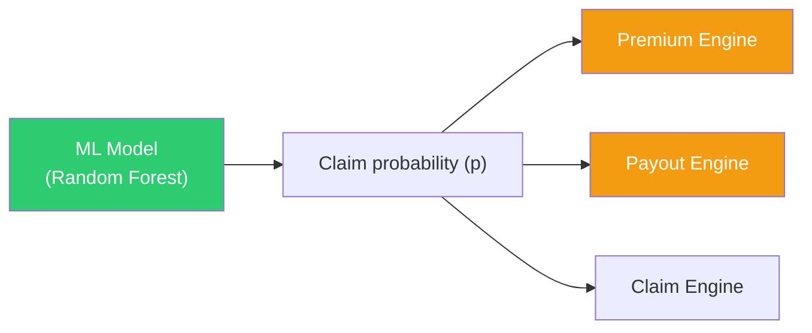

# ML — Data Science & Severity Modeling

> This folder contains the data-science side of the project. The first job is not to chase fancy models. The first job is to **prove that the numbers make sense** — and then let the model improve them.
>
> **Key principle:** ML supports classification, anomaly ranking, and review routing, but does not independently authorize payout.

---

## Engineering Snapshot (2026-04-05)

- ML-assisted claim outputs now flow through a durability-hardened claim pipeline with transactional outbox persistence.
- Non-critical post-claim actions (notifications/rewards) have moved to async consumers, keeping model inference and claim decision paths cleaner.
- Reliability validation is green after migration and consumer dead-letter hardening, preserving current ML-calibration behavior.

---

## Implementation Status

| Component | Status |
|-----------|--------|
| Bootstrap pipeline design | ✅ Implemented |
| Random Forest baseline results | ✅ Trained + saved (`ml/model_artifacts/severity_rf.joblib`) |
| Feature importance analysis | ✅ Documented |
| Boxplot outlier analysis | ✅ Documented |
| Severity normalization method | ✅ Implemented (`severity.py`) |
| Pricing integration formula | ✅ Implemented (`pricing.py`) |
| ML training scripts | ✅ Implemented (`ml_training.py`) |
| Anti-spoofing feature engineering | ✅ Documented (13 features, output by `fraud_engine.py`) |
| What ML Does vs Does Not Do | ✅ Documented |
| EDA notebook | ✅ Implemented (`ml/notebooks/eda.ipynb`) |
| XGBoost benchmark comparison | ✅ Implemented (`ml/xgboost_benchmark.py`) |
| ML live inference wired to claims | ✅ Implemented (`get_claim_probability()` lazy-loads model, falls back to p=0.15 if artifact missing) |
| DBSCAN batch clustering | ✅ Implemented (`fraud_engine.py` — `recent_claims_batch` parameter) |
| Feedback loop implementation | 📋 Planned (requires production claim outcome data) |

> **Pricing note:** Bootstrap median was ₹218.7/week on high-income assumptions. Final IRDAI-aligned fixed rates are ₹28/week (Essential) and ₹42/week (Plus) — both compliant with the ₹10,000/year IRDAI micro-insurance limit.


---

## Data Science Pipeline



---

## Pipeline Workflow

### Step 1 — Seed Dataset
Start with the [8-row manually created base dataset](../data/README.md) covering diverse zone/risk combinations.

### Step 2 — Synthetic Expansion
Perturb seed rows using controlled variation to create a larger scenario set for stress testing. Variables are bounded by public threshold ranges.

### Step 3 — Feature Engineering
Engineer hazard, exposure, and confidence features from the joined dataset:
- **Severity Score (S):** weighted composite of 8 disruption components
- **Exposure (E):** shift duration + route accessibility
- **Confidence (C):** trust-adjusted verification score after fraud penalty

### Step 4 — Random Forest Baseline
Fit a `RandomForestClassifier` (scikit-learn) on the joined training data to predict `claim_flag`.

**Why Random Forest first?** The current dataset is small and synthetic. Random Forest handles tabular mixtures well, gives quick feature-importance feedback, and is easier to defend in an early-stage hackathon build than jumping directly into XGBoost.

### Step 5 — Outlier Analysis
Apply the Tukey IQR rule on the gross-premium distribution:
```
Q1 = 25th percentile
Q3 = 75th percentile
IQR = Q3 − Q1
High-risk cutoff = Q3 + 1.5 × IQR
```

If `gross_premium > high-risk cutoff`, apply outlier uplift:
```
U = min(1.35, gross_premium / median_premium)
```
Applied to **both** premium and payout cap so the relationship stays fair.

### Step 6 — Premium & Payout Outputs
Use ML-predicted claim probability `p` in the premium formula:
```
Expected Payout = p × B × S × E × C × (1 − FH)
Gross Premium = [Expected Payout / (1 − 0.12 − 0.10)] × U
```

---

## Bootstrap Results

> **📝 Status:** These results are from the documented bootstrap pipeline run on the synthetic scenario set.

| Metric | Value |
|--------|-------|
| Median weekly premium | ₹ 218.7 |
| Median payout (if triggered) | ₹ 442.6 |
| Model AUC (holdout) | 0.647 |
| Outlier share (Tukey IQR) | 5.5% |
| High-risk cutoff | ≈ ₹ 1,012.8 |
| Premium-payout correlation | 0.93 |

---

## Feature Importance (Random Forest Baseline)

| Rank | Feature | Importance |
|------|---------|-----------|
| 1 | `traffic_delay_pct` | 0.109 |
| 2 | `accessibility_score` | 0.106 |
| 3 | `rain_mm` | 0.092 |
| 4 | `temp_c` | 0.086 |
| 5 | `gps_consistency` | 0.086 |
| 6 | `aqi` | 0.083 |
| 7 | `trust_score` | 0.082 |
| 8 | `demand_drop_pct` | 0.075 |

> **Visual:** Feature importance and bootstrap pricing distribution charts from the data-science pipeline:


---

## Severity Normalization

Each severity component is normalized to 0–1 using threshold anchor points:

| Component | Normalization basis | Weight in S |
|-----------|-------------------|-------------|
| `rain_sev` | 0 at 0mm, 1 at ≥ 115.6mm (IMD very heavy) | 0.23 |
| `aqi_sev` | 0 at ≤ 50, 1 at ≥ 401 (CPCB extreme) | 0.14 |
| `heat_sev` | 0 at ≤ 35°C, 1 at ≥ 47°C (severe heat) | 0.14 |
| `traffic_sev` | 0 at 0%, 1 at ≥ 80% delay | 0.10 |
| `outage_sev` | 0 at 0 min, 1 at ≥ 120 min | 0.12 |
| `closure_sev` | Binary: 0 or 1 | 0.10 |
| `demand_sev` | 0 at 0%, 1 at ≥ 70% drop | 0.07 |
| `access_sev` | 1 − accessibility_score | 0.10 |

```
S = 0.23·rain + 0.14·aqi + 0.14·heat + 0.10·traffic + 0.12·outage + 0.10·closure + 0.07·demand + 0.10·access
```

---

## How ML Connects to Premium & Payout



The ML model's predicted `p` is the key input that bridges data science and **internal** pricing logic:
- **Premium calibration:** `Gross Premium = [p × B × S × E × C × (1 − FH) / (1 − α − β)] × U`
- **Plan benefit sizing:** The formula helps calibrate whether Essential (₹3,000) and Plus (₹4,500) weekly benefits are appropriate
- **Review routing:** ML-derived anomaly scores help route claims to `auto_approve`, `needs_review`, `hold_for_fraud`, or `reject_spoof_risk`

> **Important:** The public-facing payout is **not** derived from this formula. It follows the [parametric payout ladder](../README.md#parametric-payout-ladder): Band 1 = 0.25 × W, Band 2 = 0.50 × W, Band 3 = 1.00 × W, where W is the selected plan's weekly benefit.

---

## What ML Does vs. What ML Does Not Do

| ML does | ML does not |
|---|---|
| Estimate claim probability `p` | Directly authorize or block payout |
| Support fraud / spoofing risk ranking | Set the final payout amount |
| Anomaly and cluster scoring | Replace the parametric payout ladder |
| Zone-level trend detection | Replace underwriting judgment |
| Power `needs_review` classification | Act as a black-box decision engine |

**Correct architecture:**
- **Parametric payout ladder** = public-facing insurance logic (trigger band → pre-agreed benefit)
- **Formula engine** = internal premium and benefit calibration
- **ML model** = supporting signal for probability estimation, anomaly detection, and review routing

---

## Anti-Spoofing Feature Engineering

Beyond standard severity and pricing features, the ML pipeline engineers these features for spoof detection:

| Feature | Description | Expected genuine value | Expected spoof value |
|---------|-------------|----------------------|--------------------|
| `exif_browser_gps_distance_m` | Distance between EXIF GPS and device GPS | < 100m | > 500m or missing |
| `exif_claim_time_lag_min` | Time between EXIF timestamp and claim submission | < 30min | > 72h |
| `claim_zone_vs_assigned_zone` | Binary mismatch flag | Match | Mismatch |
| `shift_overlap_ratio` | Fraction of trigger window covered by shift | > 0.5 | 0.0 |
| `route_plausibility_score` | TomTom Snap-to-Roads confidence | > 0.7 | < 0.3 |
| `historical_order_continuity` | Orders completed in 2h before claim | > 0 | 0 |
| `repeated_coord_density` | Claims within 50m radius in same window | < 3 | > 10 |
| `batch_timing_similarity` | Submission time std deviation within cluster | High variance | < 5min |
| `trigger_correlation_score` | Was a real trigger verified for the zone? | 1.0 | 0.0 |
| `evidence_completeness` | Photo + text + geo presence score | > 0.7 | < 0.3 |
| `prior_suspicious_rate` | Historical flagged claim rate | < 0.05 | > 0.20 |
| `device_account_ratio` | Devices per account / accounts per device | 1:1 | Many:1 |
| `network_cluster_size` | Claimants on same IP/ASN in same window | < 3 | > 10 |

These features are designed for a review-routing classifier with four output labels: `auto_approve`, `needs_review`, `hold_for_fraud`, `reject_spoof_risk`.

> For full anti-spoofing architecture details, see [fraud/README.md](../fraud/README.md) and the [Adversarial Defense section](../README.md#adversarial-defense--anti-spoofing-strategy) in the root README.

---

## Inputs

| Input | Source |
|-------|--------|
| `joined_training_data.csv` | Data layer (zone+time matched) |
| `worker_data.csv` | Data layer |
| `trigger_data.csv` | Data layer |
| Variable dictionary | [data/README.md](../data/README.md) |
| Threshold reference sheet | [data/README.md](../data/README.md) |

## Outputs

| Output | Consumer |
|--------|----------|
| Feature importance chart | Docs / judges |
| Outlier plots (boxplots) | Docs / judges |
| Severity score model | Claim engine, premium engine |
| Claim probability `p` | Premium and payout formulas |
| Premium sensitivity analysis | Insurer dashboard |
| Model performance summary | Docs / judges |

---

## Key Questions This Folder Should Answer

1. Which variables matter most for loss-of-income severity?
2. Which cases behave as outliers, and how should they affect premium + payout together?
3. Are our claim thresholds too loose or too strict?
4. Does the Random Forest baseline produce numbers that "make sense" when reviewed?
5. How does the model's predicted claim probability map to observable disruption patterns?

---

## Tools

| Tool | Purpose |
|------|---------|
| Python | Primary language |
| pandas, numpy | Data handling and transformation |
| scikit-learn | `RandomForestClassifier` baseline, `DBSCAN` clustering, train/test split |
| matplotlib | Boxplots, feature importance charts, EDA visuals |
| XGBoost | Benchmark comparison (`ml/xgboost_benchmark.py`) |

---

## Pricing Baseline and Reference Notes

**Why Random Forest?** Random Forest ([Breiman, 2001](https://doi.org/10.1023/A:1010933404324)) was selected as the baseline severity classifier because it provides interpretable feature-importance rankings, handles mixed feature types without extensive preprocessing, and is robust against overfitting on small datasets — critical for an 8-row bootstrap seed.

**Why XGBoost as future benchmark?** XGBoost ([Chen & Guestrin, 2016](https://doi.org/10.1145/2939672.2939785)) is retained as a planned benchmark if dataset scale and feature complexity warrant gradient-boosted tree performance. It is not yet used in the current pipeline.

**Role of ML in the pricing pipeline:** The Random Forest model estimates claim probability `p` on the joined worker-trigger row. Premium and payout are **not predicted directly by ML alone** — they are derived from documented formulas (`B × S × E × C × (1 − FH)`) where ML contributes only the `p` factor. The public-facing product uses a [parametric payout ladder](../README.md#parametric-payout-ladder) with pre-agreed benefit bands, not flexible formula outputs. ML supports classification, anomaly ranking, and review routing, but does not independently authorize payout.

**Feature normalization provenance:** Environmental features (rain_mm, AQI, temp_c) are normalized against official public-source thresholds from [CPCB](https://www.cpcb.nic.in/aqi_report.php), [IMD](https://mausam.imd.gov.in/imd_latest/contents/pdf/pubbrochures/Heavy%20Rainfall%20Warning%20Services.pdf), and [NDMA](https://ndma.gov.in/Natural-Hazards/Heat-Wave). Operational features (traffic_delay_pct, outage_min, demand_drop_pct) use internal product thresholds documented in the [root README](../README.md#threshold-references-and-why-they-were-chosen).

**Actuarial grounding:** The gross premium formula uses an expected-loss loading approach grounded in *Loss Data Analytics* ([Ch. 7: Premium Foundations](https://openacttexts.github.io/Loss-Data-Analytics/ChapPremiumFoundations.html)) and *Non-Life Insurance Mathematics* ([Mikosch, 2004](https://unina2.on-line.it/sebina/repository/catalogazione/documenti/Mikosch%20-%20Non-life%20insurance%20mathematics.pdf)). The expense load (α = 0.12) and risk margin (β = 0.10) are hackathon assumptions that must be tuned with real data.

> For the full reference register with all 9 sources, see [docs/README.md](../docs/README.md#reference-register).

---

## Rule

> Keep everything explainable enough for judges to understand in one minute. If a model output cannot be traced back to input features and threshold logic, it fails the transparency test.


## April 2026 Repo Update Addendum

### Newly implemented in current repo

- Random Forest artifact path is integrated with lazy-load fallback behavior
  for resilient claim probability estimation.
- Training utility and benchmark scripts are present for reproducible
  internal calibration and stress testing.
- ML role remains bounded: supports probability and review routing,
  while payout remains parametric and rule-driven.

### Planned and next tranche

- Expand model benchmarking and calibration against larger datasets.
- Add drift and data-quality monitoring for staging and production readiness.
- Formalize retraining cadence with artifact version tracking.
- Strengthen explainability outputs linked to operational dashboards.

